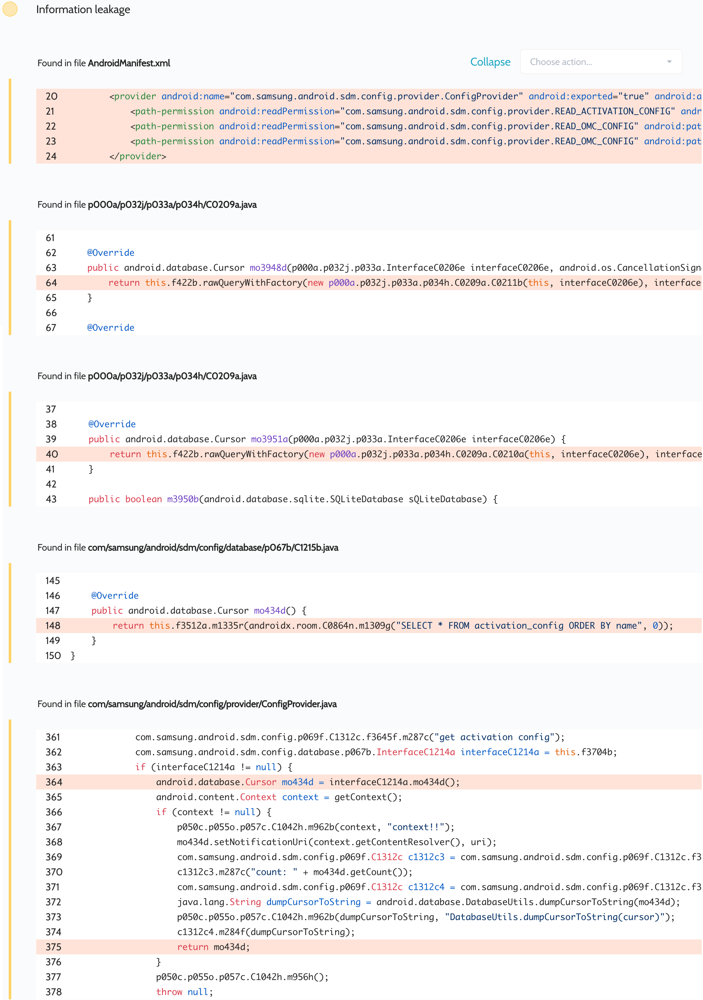

# Details

<table>
    <tr>
        <td>Name</td>
        <td>Configuration update</td>
    </tr>
    <tr>
        <td>Package name</td>
        <td><code>com.samsung.android.sdm.config</code></td>
    </tr>
    <tr>
        <td>Reported date</td>
        <td>2022.03.27</td>
    </tr>
    <tr>
        <td>Fixed date</td>
        <td>2022.09.07</td>
    </tr>
    <tr>
        <td>Severity</td>
        <td>Low</td>
    </tr>
    <tr>
        <td>Handle</td>
        <td>No CVE (SVE-2022-0768)</td>
    </tr>
    <tr>
        <td>Reward</td>
        <td>$330</td>
    </tr>
</table>

# Description

Oversecured found in the app the ability to access a permission-protected resource:


This provider had the following declaration:
```xml
<permission android:name="com.samsung.android.sdm.config.provider.READ_ACTIVATION_CONFIG" android:protectionLevel="signature|system" />
```
```xml
<provider android:name="com.samsung.android.sdm.config.database.ConfigProvider" android:exported="true" android:authorities="com.samsung.android.sdm.config.provider">
    <path-permission android:readPermission="com.samsung.android.sdm.config.provider.READ_ACTIVATION_CONFIG" android:path="/activation_config" />
    <path-permission android:readPermission="com.samsung.android.sdm.config.provider.READ_OMC_CONFIG" android:path="/omc" />
    <path-permission android:readPermission="com.samsung.android.sdm.config.provider.READ_OMC_CONFIG" android:path="/version" />
</provider>
```

The permission `com.samsung.android.sdm.config.provider.READ_OMC_CONFIG` was also declared with `signature|privileged` in one of the pre-installed apps.

But all these checks could be bypassed, because internally provider checked URI with class `UriMatcher`:
```java
f3569d = new UriMatcher(-1);
f3569d.addURI("com.samsung.android.sdm.config.provider", "activation_config", 2);
f3569d.addURI("com.samsung.android.sdm.config.provider", "omc", 3);
f3569d.addURI("com.samsung.android.sdm.config.provider", "version", 4);
```
```java
@Override
public Cursor query(Uri uri, String[] strArr, String str, String[] strArr2, String str2) {
    int match = f3569d.match(uri);
    if (match == 2) {
        return ...;
    } else if (match == 3) {
        return ...;
    } else if (match == 4) {
        return ...;
    } else {
        throw new IllegalArgumentException("Unknown URI: " + uri);
    }
}
```

The `UriMatcher` class itself performs matching using [`Uri.getPathSegments()`](https://android.googlesource.com/platform/frameworks/base/+/master/core/java/android/content/UriMatcher.java#223), which trims empty segments. For example, for the URI `/test/` the result is `["test"]`. However, the Android server-side matcher checks the URI for [full match](https://android.googlesource.com/platform/frameworks/base/+/master/core/java/android/os/PatternMatcher.java#184) of the declaration.

Thus, the `path-permission` mapping with fixed path and `UriMatcher` is not safe and is bypassed with additional slashes.

**Proof of Concept**

```java
Uri uri = Uri.parse("content://com.samsung.android.sdm.config.provider/activation_config/");
Cursor cursor = getContentResolver().query(uri, null, null, null, null);
```

## References

- [Oversecured Blog. Common mistakes when using permissions in Android](https://blog.oversecured.com/Common-mistakes-when-using-permissions-in-Android/)

## Conclusion

Mobile app security is more critical than ever in today's digital landscape. As we have shown through our research, even the most reputable brands are not immune to the threat of cyberattacks. 

At Oversecured, we are committed to help our clients stay ahead of the curve with our industry-leading mobile app vulnerability scanning technology. With our comprehensive approach to mobile app security, you can trust that your brand and your users are protected from data breaches and other security threats.

Don't wait until it's too late. [Get a free consultation](https://oversecured.com/contact-us?utm_source=github&utm_medium=article&utm_campaign=samsung2022) and find out how we can help secure your mobile apps. Together, we can build a safer digital world.