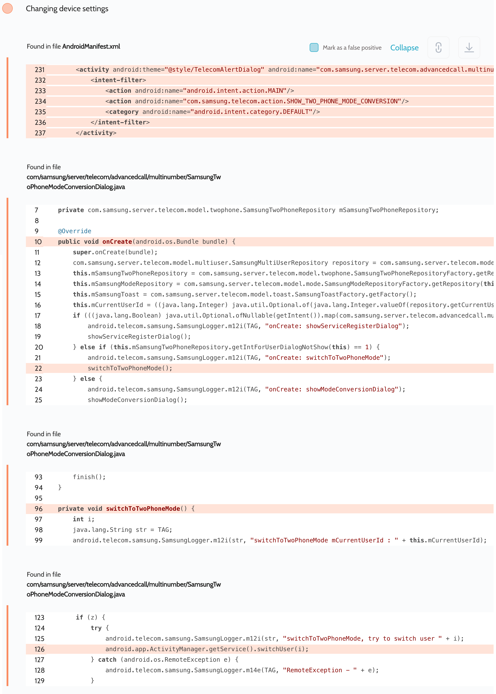

# Details

<table>
    <tr>
        <td>Name</td>
        <td>Phone calls</td>
    </tr>
    <tr>
        <td>Package name</td>
        <td><code>com.android.server.telecom</code></td>
    </tr>
    <tr>
        <td>Reported date</td>
        <td>2022.09.14</td>
    </tr>
    <tr>
        <td>Fixed date</td>
        <td>2022.12.06</td>
    </tr>
    <tr>
        <td>Severity</td>
        <td>Low</td>
    </tr>
    <tr>
        <td>Handle</td>
        <td>N/A</td>
    </tr>
    <tr>
        <td>Reward</td>
        <td>$200</td>
    </tr>
</table>

# Description

Oversecured report:


Oversecured found in the Phone calls app in the file `com/samsung/server/telelecom/advancedcall/multinumber/SamsungTwoPhoneModeConversionDialog.java` an automatic switch between `0` and `-10000` user profiles when the user picks not to show the dialog anymore.

If the attacker bothers the user by displaying this system screen, sooner or later the user will select this option, making the exploit possible.

**Proof of Concept**

```java
startActivity(new Intent("com.samsung.telecom.action.SHOW_TWO_PHONE_MODE_CONVERSION"));
```

## References

- [Oversecured Blog. Discovering vendor-specific vulnerabilities in Android](https://blog.oversecured.com/Discovering-vendor-specific-vulnerabilities-in-Android/)

## Conclusion

Mobile app security is more critical than ever in today's digital landscape. As we have shown through our research, even the most reputable brands are not immune to the threat of cyberattacks. 

At Oversecured, we are committed to help our clients stay ahead of the curve with our industry-leading mobile app vulnerability scanning technology. With our comprehensive approach to mobile app security, you can trust that your brand and your users are protected from data breaches and other security threats.

Don't wait until it's too late. [Get a free consultation](https://oversecured.com/contact-us?utm_source=github&utm_medium=article&utm_campaign=samsung2022) and find out how we can help secure your mobile apps. Together, we can build a safer digital world.