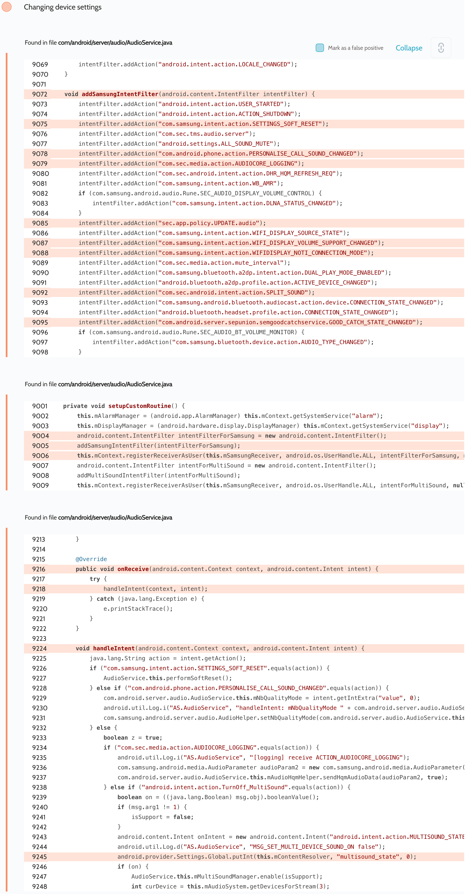

# Details

<table>
    <tr>
        <td>Name</td>
        <td>Samsung Android Framework</td>
    </tr>
    <tr>
        <td>Library path</td>
        <td><code>/system/framework/services.jar</code></td>
    </tr>
    <tr>
        <td>Reported date</td>
        <td>2022.09.03</td>
    </tr>
    <tr>
        <td>Fixed date</td>
        <td>2023.01.04</td>
    </tr>
    <tr>
        <td>Severity</td>
        <td>Low</td>
    </tr>
    <tr>
        <td>Handle</td>
        <td>N/A</td>
    </tr>
    <tr>
        <td>Reward</td>
        <td>$250</td>
    </tr>
</table>

# Description

Oversecured report:


Oversecured found in the file `com/android/server/audio/AudioService.java` the registration of an unprotected dynamic receiver. When receiving the `android.intent.action.TurnOff_MultiSound` action, it automatically disables the device multisound.

**Proof of Concept**

```java
sendBroadcast(new Intent("android.intent.action.TurnOff_MultiSound"));
```

## References

- [Oversecured Blog. Discovering vendor-specific vulnerabilities in Android](https://blog.oversecured.com/Discovering-vendor-specific-vulnerabilities-in-Android/)

## Conclusion

Mobile app security is more critical than ever in today's digital landscape. As we have shown through our research, even the most reputable brands are not immune to the threat of cyberattacks. 

At Oversecured, we are committed to help our clients stay ahead of the curve with our industry-leading mobile app vulnerability scanning technology. With our comprehensive approach to mobile app security, you can trust that your brand and your users are protected from data breaches and other security threats.

Don't wait until it's too late. [Get a free consultation](https://oversecured.com/contact-us?utm_source=github&utm_medium=article&utm_campaign=samsung2022) and find out how we can help secure your mobile apps. Together, we can build a safer digital world.