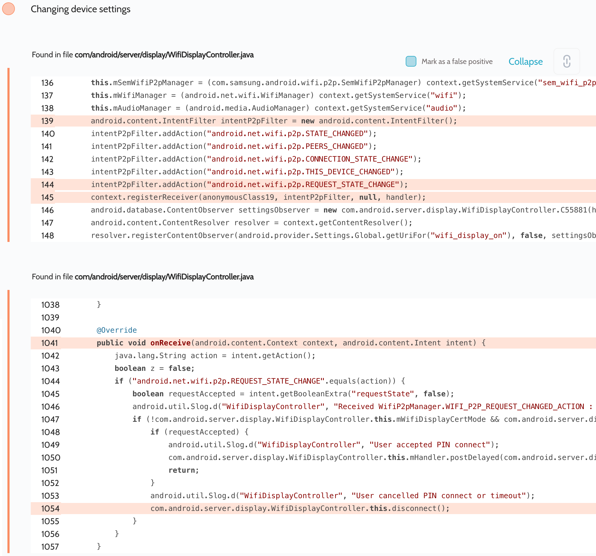

# Details

<table>
    <tr>
        <td>Name</td>
        <td>Samsung Android Framework</td>
    </tr>
    <tr>
        <td>Library path</td>
        <td><code>/system/framework/services.jar</code></td>
    </tr>
    <tr>
        <td>Reported date</td>
        <td>2022.09.04</td>
    </tr>
    <tr>
        <td>Fixed date</td>
        <td>2023.01.04</td>
    </tr>
    <tr>
        <td>Severity</td>
        <td>Low</td>
    </tr>
    <tr>
        <td>Handle</td>
        <td>N/A</td>
    </tr>
    <tr>
        <td>Reward</td>
        <td>$980</td>
    </tr>
</table>

# Description

Oversecured report:


Oversecured found in the `com/android/server/display/WifiDisplayController.java` file the unprotected dynamic receiver registration. Samsung added its additional action `android.net.wifi.p2p.REQUEST_STATE_CHANGE` which is missing in AOSP. As you can see in the vulnerability screenshot, Oversecured didn't highlight the use of other actions such as:
- `android.net.wifi.p2p.STATE_CHANGED`
- `android.net.wifi.p2p.PEERS_CHANGED`
- `android.net.wifi.p2p.CONNECTION_STATE_CHANGE`
- `android.net.wifi.p2p.THIS_DEVICE_CHANGED`

Because they are declared as `protected-broadcast`. Unprivileged apps can't send broadcasts with these actions, but they can receive them. The `android.net.wifi.p2p.REQUEST_STATE_CHANGE` action was not added to this list, so an attacker could send such a broadcast and disable Wi-Fi display.

**Proof of Concept**

```java
Intent i = new Intent("android.net.wifi.p2p.REQUEST_STATE_CHANGE");
i.putExtra("requestState", false);
sendBroadcast(i);
```

## References

- [Oversecured Blog. Discovering vendor-specific vulnerabilities in Android](https://blog.oversecured.com/Discovering-vendor-specific-vulnerabilities-in-Android/)
