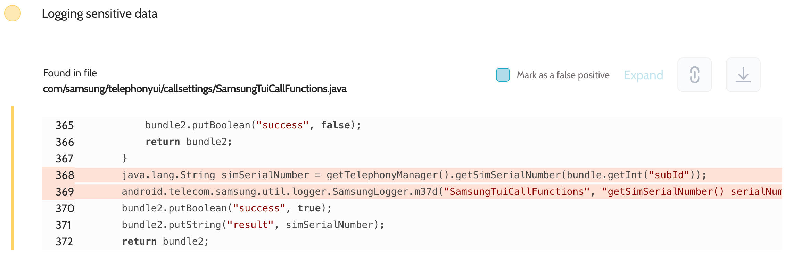

# Details

<table>
    <tr>
        <td>Name</td>
        <td>Phone</td>
    </tr>
    <tr>
        <td>Package name</td>
        <td><code>com.android.phone</code></td>
    </tr>
    <tr>
        <td>Reported date</td>
        <td>2022.09.15</td>
    </tr>
    <tr>
        <td>Fixed date</td>
        <td>2023.01.04</td>
    </tr>
    <tr>
        <td>Severity</td>
        <td>Low</td>
    </tr>
    <tr>
        <td>Handle</td>
        <td>N/A</td>
    </tr>
    <tr>
        <td>Reward</td>
        <td>$300</td>
    </tr>
</table>

# Description

Oversecured found in the Phone app in the file `com/samsung/telephonyui/callsettings/SamsungTuiCallFunctions.java` logging of SIM serial number:


**Proof of Concept**

```
adb logcat | grep SamsungTuiCallFunctions
```

## References

- [Oversecured Blog. Discovering vendor-specific vulnerabilities in Android](https://blog.oversecured.com/Discovering-vendor-specific-vulnerabilities-in-Android/)
