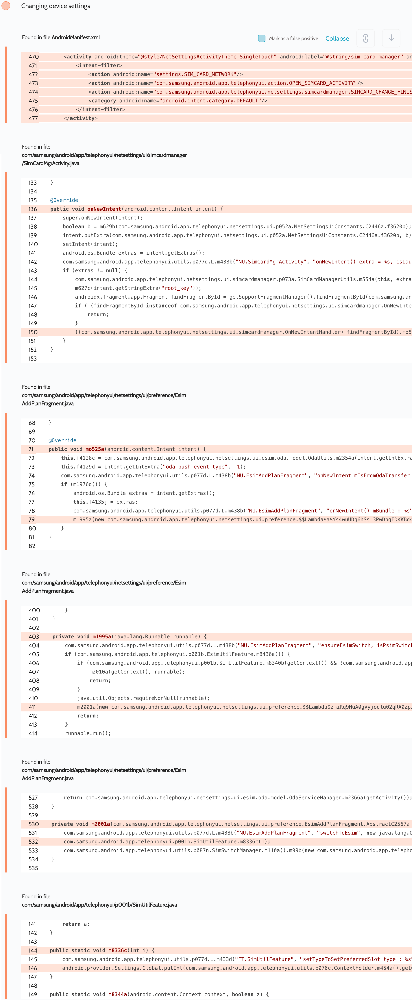

# Details

<table>
    <tr>
        <td>Name</td>
        <td>Call settings</td>
    </tr>
    <tr>
        <td>Package name</td>
        <td><code>com.samsung.android.app.telephonyui</code></td>
    </tr>
    <tr>
        <td>Reported date</td>
        <td>2022.09.19</td>
    </tr>
    <tr>
        <td>Fixed date</td>
        <td>2023.01.04</td>
    </tr>
    <tr>
        <td>Severity</td>
        <td>Low</td>
    </tr>
    <tr>
        <td>Handle</td>
        <td>N/A</td>
    </tr>
    <tr>
        <td>Reward</td>
        <td>$250</td>
    </tr>
</table>

# Description

Oversecured report:


Oversecured found in the Call settings app in the `com/samsung/android/app/telephonyui/netsettings/ui/simcardmanager/SimCardMgrActivity.java` file processing of different UIs through the `root_key` parameter. If the attacker provides the `SIMCARD_ESIM_ADD_MOBILE_PLAN` value, the fragment `com.samsung.android.app.telephonyui.netsettings.ui.preference.EsimAddPlanFragment` will be launched. At launch, it will automatically switch the device to use eSIM if it's present on the device.

**Proof of Concept**

```java
Intent i = new Intent("settings.SIM_CARD_NETWORK");
i.putExtra("root_key", "SIMCARD_ESIM_ADD_MOBILE_PLAN");
i.putExtra("DOWNLOAD_REQUEST_FROM", 1);
startActivity(i);
```
