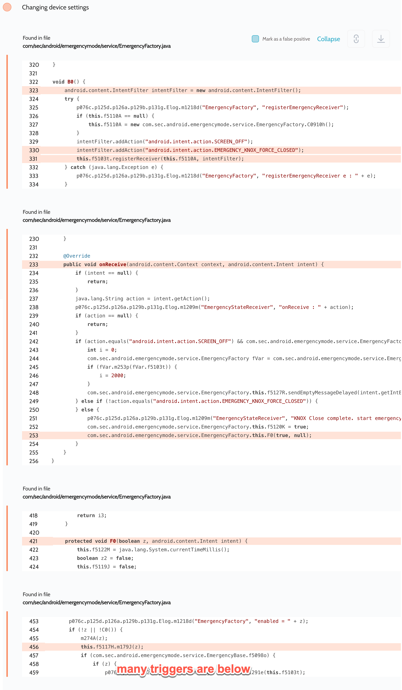

# Details

<table>
    <tr>
        <td>Name</td>
        <td>EmergencyManagerService</td>
    </tr>
    <tr>
        <td>Package name</td>
        <td><code>com.sec.android.emergencymode.service</code></td>
    </tr>
    <tr>
        <td>Reported date</td>
        <td>2022.09.16</td>
    </tr>
    <tr>
        <td>Fixed date</td>
        <td>2023.02.07</td>
    </tr>
    <tr>
        <td>Severity</td>
        <td>Low</td>
    </tr>
    <tr>
        <td>Handle</td>
        <td>N/A</td>
    </tr>
    <tr>
        <td>Reward</td>
        <td>$250</td>
    </tr>
</table>

# Description

Oversecured report:


Oversecured found in the EmergencyManagerService app in the `com/sec/android/emergencymode/service/EmergencyFactory.java` file a dynamic registration of an unprotected broadcast receiver. When it receives the `android.intent.action.EMERGENCY_KNOX_FORCE_CLOSED` action, it automatically enables emergency mode. However, the user must open the emergency mode screen to trigger to the code activating this broadcast receiver.

**Proof of Concept**

```java
sendBroadcast(new Intent("android.intent.action.EMERGENCY_KNOX_FORCE_CLOSED"));
```

## Conclusion

Mobile app security is more critical than ever in today's digital landscape. As we have shown through our research, even the most reputable brands are not immune to the threat of cyberattacks. 

At Oversecured, we are committed to help our clients stay ahead of the curve with our industry-leading mobile app vulnerability scanning technology. With our comprehensive approach to mobile app security, you can trust that your brand and your users are protected from data breaches and other security threats.

Don't wait until it's too late. [Get a free consultation](https://oversecured.com/contact-us?utm_source=github&utm_medium=article&utm_campaign=samsung2022) and find out how we can help secure your mobile apps. Together, we can build a safer digital world.