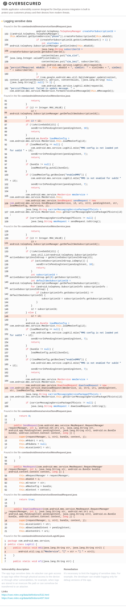

# Details

<table>
    <tr>
        <td>Name</td>
        <td>MmsService</td>
    </tr>
    <tr>
        <td>Package name</td>
        <td><code>com.android.mms.service</code></td>
    </tr>
    <tr>
        <td>Reported date</td>
        <td>2022.12.03</td>
    </tr>
    <tr>
        <td>Fixed date</td>
        <td>2023.02.07</td>
    </tr>
    <tr>
        <td>Severity</td>
        <td>Low</td>
    </tr>
    <tr>
        <td>Handle</td>
        <td>N/A</td>
    </tr>
    <tr>
        <td>Reward</td>
        <td>$460</td>
    </tr>
</table>

# Description

Oversecured found that the MmsService app logs IMSI value in the `com/android/mms/service/SendRequest.java` file:


This file was created in AOSP, but patched in Samsung. The original code from AOSP doesn't log this.

**Proof of Concept**

Send an MMS message and run the command:
```
adb logcat | grep simImsi
```

## References

- [Oversecured Blog. Discovering vendor-specific vulnerabilities in Android](https://blog.oversecured.com/Discovering-vendor-specific-vulnerabilities-in-Android/)

## Conclusion

Mobile app security is more critical than ever in today's digital landscape. As we have shown through our research, even the most reputable brands are not immune to the threat of cyberattacks. 

At Oversecured, we are committed to help our clients stay ahead of the curve with our industry-leading mobile app vulnerability scanning technology. With our comprehensive approach to mobile app security, you can trust that your brand and your users are protected from data breaches and other security threats.

Don't wait until it's too late. [Get a free consultation](https://oversecured.com/contact-us?utm_source=github&utm_medium=article&utm_campaign=samsung2022) and find out how we can help secure your mobile apps. Together, we can build a safer digital world.